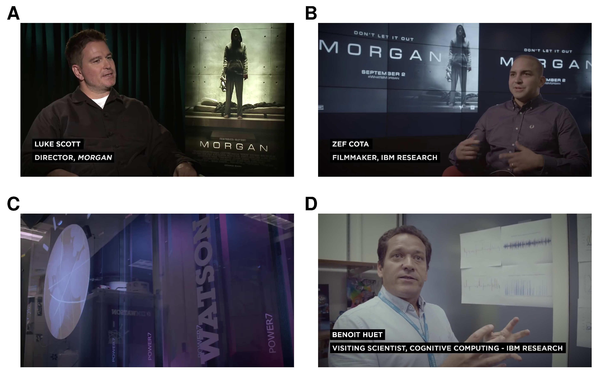

# Preface

## Who (or what) is a filmmaker?

Computer science has contributed to film production for fifty years since digital image processing was first used in *Westworld* (Michael Crichton, 1973) to [pixelate frames](https://www.newyorker.com/tech/annals-of-technology/how-michael-crichtons-westworld-pioneered-modern-special-effects#:~:text=It%20began%20in%201973%2C%20with,cursing%20mouth—was%20the%20unlikely) from the point-of-view of the gunslinger android. Digital technologies are now involved in every aspect of film production, from images and sounds captured by computers, which we still call 'cameras' and 'recorders,' to the use of specialised software for writing screenplays, editing, visual effects, and music composition. Animated films are now produced solely using computers. Films are distributed by computers through streaming services or as digital cinema packages that can be read by the computers in theatres (that we still call 'projectors'). In the home, audiences watch films on computers, which may be smart televisions, desktop/laptop pcs, tablets, and even on mobile phones. The result of half a century's innovation in computer science in the film industry is that filmmaking is now a computer-based art form.

The application of [artificial intelligence](https://en.wikipedia.org/wiki/Artificial_intelligence) (AI) tools informed by data analysis of motion pictures is the next step in the technological development of the cinema.

AIs are being used to generate original screenplays for films. In 2018, Visual Voice utilised IBM's [Watson](https://www.ibm.com/analytics/data-ai-platform) suite of AI tools and applications to develop the screenplay a sixty-second promotional for Lexus by training a [neural network](https://en.wikipedia.org/wiki/Artificial_neural_network) on fifteen years' worth of luxury adverts, with the advert itself directed by Kevin Macdonald [@Ibrahim2018llas]. Benjamin, a [long short-term memory](https://en.wikipedia.org/wiki/Long_short-term_memory) [recurrent neural network](https://en.wikipedia.org/wiki/Recurrent_neural_network) machine intelligence trained on screenplays of science fiction films from the 1980s and 1990s, generated an original screenplay for *Sunspring* (2016), an experimental short science fiction film directed by Oscar Sharp (Video [1.1](#vid11)). In 2017, Benjamin collaborated with a team of human writers to produce the script for another short film, [*It's No Game*](https://www.youtube.com/watch?v=5qPgG98_CQ8) (2017); and wrote, directed, performed, and scored a third short, [*Zone Out*](https://www.youtube.com/watch?v=vUgUeFu2Dcw) (2018), by editing footage from public domain films, face-swapping the human actors from the filmmaker's database into that footage, inserting spoken voices to read Benjamin's script, and writing the music for the film [@machkovech2018twaf].

***

[ ]{#vid11} 
<center><iframe width="560" height="315" src="https://www.youtube.com/embed/LY7x2Ihqjmc" title="YouTube video player" frameborder="0" allow="accelerometer; autoplay; clipboard-write; encrypted-media; gyroscope; picture-in-picture" allowfullscreen data-external="1"></iframe></center>

<p class="caption">
Video 1.1: *Sunspring* (2016) is a science fiction film with an original script created by the Benjamin artificial intelligence. `r emo::ji("point_up")`
</p>
***

Editing was one of the first filmmaking practices to benefit from the introduction of digital technologies with the [EditDroid](https://www.lucasfilm.com/news/lucasfilm-originals-the-editdroid/) from Lucasfilm released in 1984 and is one of the key areas of automation in filmmaking. In 2016 the producers of [*Morgan*](https://en.wikipedia.org/wiki/Morgan_(2016_film)), a science fiction-horror film about a 'hybrid biological organism with the capacity for autonomous decision making and sophisticated emotional responses', approached IBM for their support in making a trailer for the film using the Watson artificial intelligence system. Video [1.2](#vid12) shows this trailer along with interviews with the filmmakers and researchers involved. The researchers at IBM trained a model using machine learning on trailers for 100 horror films by segmenting the trailers into individual scenes and performing audio-visual analyses to each scene in order to understand its associated sentiments and aesthetics (e.g., lighting, framing, location, etc.). The results were then used by Watson to select ten scenes from *Morgan* that closely matched the features of scenes from the training set of trailers. These scenes were then handed to a filmmaker to be turned into the trailer.

***

[ ]{#vid12} <center><iframe width="560" height="315" src="https://www.youtube.com/embed/gJEzuYynaiw" title="YouTube video player" frameborder="0" allow="accelerometer; autoplay; clipboard-write; encrypted-media; gyroscope; picture-in-picture" allowfullscreen data-external="1"></iframe></center>

<p class="caption">
Video 1.2: the *Morgan* trailer produced by and IBM. `r emo::ji("point_up")`
</p>
***

The team at IBM concluded that their systems 'eliminated the need for the decision process for which scenes should be selected in the first place which would have taken considerable time and effort. This expedited the process substantially' [@smith2017hafa]. However, the actual piecing together of the *Morgan* trailer was done by a filmmaker who made a further set of decisions about what to include in the trailer, pacing, transitions, and other aesthetic features. To this extent, the impact of data science on the workflow of trailer production was significant; but the impact on the actual filmmaking process was limited.

In 2017, a team of researchers from Stanford University and Adobe, the developers of the non-linear editing software Premiere Pro, demonstrated an idiomatic editing software capable of making aesthetics decisions about how a film is edited [@leake2017cvef]. This software allows filmmakers to build customised editing styles by controlling a range of visual and timing parameters (such as maintaining the visibility of the speaker, avoiding jump cuts, mirroring the screen positions of actors, intensifying emotion, etc.) that determine the desired style and that are then applied to a collection of takes of a scene to generate dialogue scenes in a handful of seconds. Video [1.3](#vid13) demonstrates the application of this approach to the editing of a scene.

***

[ ]{#vid13} <center><iframe width="560" height="315" src="https://www.youtube.com/embed/tF43Zqoue20" title="YouTube video player" frameborder="0" allow="accelerometer; autoplay; clipboard-write; encrypted-media; gyroscope; picture-in-picture" allowfullscreen data-external="1"></iframe></center>

<p class="caption">
Video 1.3: The Stanford/Adobe idiomatic editing system. `r emo::ji("point_up")`
</p>
***

This editing system uses data science in a variety of ways. [Computer vision](https://en.wikipedia.org/wiki/Computer_vision) techniques are used to identify the screen positions of actors and the scale of shot, with the [OpenFace](https://cmusatyalab.github.io/openface/#overview) algorithm employed to detect and track faces within shots; while audio levels are modelled using the average [root mean square](https://en.wikipedia.org/wiki/Root_mean_square) of the energy of the soundtrack. Edited sequences are generated using [Hidden Markov Models](https://en.wikipedia.org/wiki/Hidden_Markov_model) that represent different idioms, and which maximise the likelihood of the [conditional probability distributions](https://en.wikipedia.org/wiki/Conditional_probability_distribution) of a set of matrices that define the [state space](http://www.scholarpedia.org/article/State_space_model) of the model based on the parameters selected by the filmmaker. This system also incorporates the results of data-driven research on film style into its models: for example, the default settings of the parameter controlling the overlap of audio and image tracks for [J- and L-cuts](https://www.studiobinder.com/blog/what-is-a-j-cut-in-film/) incorporated into this software is based on Barry Salt's research on editing practices and the relationship between sounds and images [@salt2011rtht].

The problem-solution model of film style takes filmmakers to be rational agents who make decisions about how to tell a story, how to symbolically convey abstract themes to the viewer, how to emotionally affect the viewer, or how to deploy stylistic devices as pure decoration, drawing on craft traditions that preserve favoured sets of practices, practices filmmakers can replicate, revise, or reject [@bordwell2005ftil: 34-35, 254-257]. Innovations in style arise when filmmakers encounter new problem situations that require novel solutions; while stylistic continuities are stabilised because filmmakers must repeatedly solve the same problems or because particular solutions prove to be valuable over time. Solutions emerge 'not from a metaphysical *Kunstwollen* or the drive of cyclical historical forces but from patterns in the situations in which artists make decisions that result in the traits of the works they produce' [@burnett2008anla: 139], with the resulting form of a motion picture arising from the 'ensemble of choices' intended to achieve the objectives of the filmmaker [@carroll1998ffaa]. New technologies create new opportunities for filmmakers to create new craft traditions. As the above examples illustrate, the application of data science to filmmaking is already generating new workflows for producers, writers, and editors, and will only expand in the future to impact other creative roles.

As data science comes to play a greater role in film production, the stylistic decisions made by filmmakers will increasingly be focused on which model to select or what parameter values to set to achieve their desired objectives. Alternatively, as the time taken to generate an edited sequence is reduced to a matter of a few seconds, filmmakers may produce multiple versions of a scene and select the one the feel best meets their objectives or select elements from different versions to be combined into a final edit. For example, Kristen Stewart's short film [*Come Swim*](https://en.wikipedia.org/wiki/Come_Swim) (2017) employed [Neural Style Transfer](https://en.wikipedia.org/wiki/Neural_style_transfer) to map the style of an impressionistic painting by the director onto a video image, redrawing scenes in the desired style and controlled by a set of parameters used to realise the 'un-realness' of the image the filmmakers desired and which itself became quantified as the parameter *u* [@joshi2017bitl]. 

The range of models from which filmmakers can select will, in turn, depend on the decisions of data scientists about which models are potentially useful to filmmakers and the parameters available for manipulation and on the technological decisions of the computer scientists who will design and implement algorithms that run those models as part of the filmmaking technologies available to filmmakers. As the example of the Stanford/Adobe editing system demonstrates, the development of data-driven filmmaking technologies explicitly codifies a set of existing aesthetic norms for editing dialogue scenes as idioms and makes those norms available to filmmakers as a set of choices. These factors will shape the evolution of style over time as new models are added to or dropped from filmmaking technologies. 

The introduction of AI-powered editing also creates new possibilities for editing scenes that are presently inconceivable to filmmakers. In 2016 [AlphaGo](https://deepmind.com/research/case-studies/alphago-the-story-so-far), a computer program employing [advanced search trees](https://en.wikipedia.org/wiki/Search_tree) with [deep neural networks](https://en.wikipedia.org/wiki/Deep_learning), defeated a leading human player at [Go](https://en.wikipedia.org/wiki/Go_(game)), a highly complex boardgame originating in China 3000 years ago [@koch2016htcb]. Some of the moves made by AlphaGo surprised leading human Go players (notably, move 37 in game two), going against centuries of traditional thinking, and appearing to be in error before being revealed to part of a coherent and successful strategy. The ways in which an AI-powered editing system will interpret a set of aesthetic norms, potentially expanding or constricting the ensemble of choices available to filmmakers, remain to be discovered.

@grodal2005ixxx [: 7] write that, 'if an author is defined as a creative human agency, a given film may be produced by many different agencies: authors, directors, scriptwriters, actors, cinematographers, et al.' operating within a given craft tradition and set of constraints. New data-driven filmmaking technologies mean that this network of collaborative agents must be expanded to include new categories of filmmakers -- that is, data and computer scientists -- involved in making decisions about the style of a film. Furthermore, with the application of AI technologies to filmmaking, any understanding of authorship in the cinema must also include the role played by *non-human* agents in making decisions about which takes to use and how to combine those shots into a sequence. Our idea of *who* or *what* is a filmmaker must therefore expand beyond our traditional concepts of creative agents, here represented by *Morgan* director Luke Scott and filmmaker Zef Cota, to include computers like Watson and the researchers, like Benoit Huet, who will develop the models that those computers will run (Figure \@ref(fig:preface-who-image-morgan)).

```{r preface-who-image-morgan, echo = FALSE, out.extra='class=\"zooom\"', out.width = "90%", fig.align = "center", fig.cap = paste("Our idea of what a filmmaker looks like will have to evolve beyond how we have traditionally conceived filmmakers (A & B) to include artificially intelligent machines (C) and the data scientists (D) who develop models for filmmakers and artificial intelligence systems. ", emo::ji("point_up"))}

```

## Computational analyses of film form and style

As cinema becomes an increasingly data-driven art form, so will studies of the art of film. 

Since 2010 there has been an increase in the number of studies utilising quantitative and computational methods to analyse form and style in the cinema driven by the availability of a range of software tools, including Cinemetrics [@tsivian2009cpot], VIAN [@halter2019vava], ELAN [@wittenburg2006eapf], ANVIL [@kipp2014atva], and Advene [@aubert2005aart], and packages and modules for programming languages such as Python and R, such as the Distant Viewing Toolkit [@arnold2020dvta] or chromaR [@R-chromaR]. There are however significant obstacles to be addressed when looking to the future of computational film analysis.

@burghardt2020fava present computer-aided analysis of moving images as an interdisciplinary dialogue that builds bridges between researchers from computer science and media informatics, Film and Media Studies, and film archivists. However, data-driven analyses of film form and film style can be broken down into two groups conducted by two largely distinct groups of researchers, with little overlap between the topics they study and the methods they use. On the one hand, there are film scholars, who apply statistical methods to shot length and shot scale data; and, on the other, there are digital humanists, who apply computational methods to analysing colour and texts (e.g., subtitles, screenplays, etc.). It is even possible to make a distinction between where these groups are located, with quantitative films scholars largely based in English-speaking countries, while digital humanists studying motion pictures tend to be based in continental Europe.

Quantitative methods have been applied to questions of film style for over 50 years. @salt1992fsat [: 18] cites the example of Elias Boudinot Stockton who discussed the structure of motion pictures in quantitative terms the 1910s and @thompson2005hlgt [: 117] reports that German critic Georg Otto Stindt published an analysis of shot length data in the 1926. In 1962, Herbert Birett [-@birett1962fxxx] proposed that the the study of film should be placed on a more scientific footing and suggested some features of film style, such as shot lengths or shot types, that could be analysed statistically, following up this proposal in @birett1988affa and @birett1993mpas. Salt's 1974 article 'Statistical style analysis of motion pictures' [@salt1974ssao] introduced quantitative analyses of shot lengths and shot types into the mainstream of Film Studies, also with the goal of placing the analysis of film style on a more objective and scientific basis than the subjective hermeneutics of contemporary film theory.

Despite its long history, applications of quantitative methods to questions of film style within Film Studies remain limited to a narrow range of formal elements, focusing almost exclusively on editing and cinematography to analyse shot lengths and shot scales. There has been little methodological innovation in nearly half a century of research and the quantitative analysis of film style in 2022 looks a lot like it did in 1974, with few authors going beyond quoting average shot lengths. What methodological innovation has occurred in the past decade has largely been driven by researchers from disciplines other than Film Studies, such as archaeology (Mike Baxter), psychology (James Cutting), linguistics (Peter Grzybek), and computer science and information engineering (Michele Svanera, Sergio Benini, Mattia Savardi, and Alberto Signoroni).

For studies employing quantitative and computational methods to elements of film style beyond shot lengths, such as colour and texts [@burghardt2016bslu], it is necessary to look at research on audio-visual media coming from the [digital humanities](https://en.wikipedia.org/wiki/Digital_humanities). Applications of computational tools to questions of film form and style within the digital humanities have a much shorter history and still lag those areas that have traditionally been the focus of this field given its origins in literary and linguistic computing [@sittel2017dhid]. However, it is no longer accurate to state that the digital humanities have ignored the cinema [@burghardt2020fava; @pustu2020avca]. It is important to recognise that digital humanists have a very different perspective to film scholars regarding the computational analysis of film. Digital humanists do not share the goal of making humanities disciplines such as Film Studies *scientific* (however that may be defined), though this is often a charge laid against them [see, for example, @konnikova2012haas]. Rather, they seek to integrate quantitative analysis with existing qualitative methods to better analyse motion pictures and, while this is often presented as interdisciplinary research, remain grounded in the humanities, sharing the principles and perspectives of non-digital humanist researchers while embracing the methodological opportunities of computer-assisted analysis.

Although there are two groups of researchers applying quantitative and computational methods to the study of film, some aspects of film style remain almost entirely overlooked. Neither film scholars nor digital humanists have devoted much attention to the analysis of sound in the motion pictures. The only sustained body of work in this area is my own, and even that comprises only a handful articles and presentations [@redfern2015ttcp; @redfern2020qaos; @redfern2020sihf; @redfern2021tsot; @redfern2022caof]. Similarly, studies of movement in the cinema -- movement in the frame or camera movement -- are few and far between [see @cutting2016teop for one of the few studies to include motion as a variable].

```{block, type = "rmdtip"}
**Computational media aesthetics and multimedia content analysis**

Beyond the humanities there is a considerable body of literature in fields such as computational media aesthetics [@adams2003wdcm; @dorai2002btsg] and multimedia content analysis [@gong2007mlfm; @hanjalic2006mcam; @li2013vcau; @wang2000mcau] applying computational methods to analyse low-level formal elements (colours, textures, shapes, motion, etc.) extracted from multimedia texts; develop models that bridge the [semantic gap](https://en.wikipedia.org/wiki/Semantic_gap) between those elements and the semantic content of a text; and to apply those models to classify existing texts and facilitate the production of new media artefacts. However, this research has had little impact on understanding of the cinema or the development of methods and tools for computational and quantitative studies in Film Studies and the digital humanities. For example, the research that underpins multimedia recommender systems capable of suggesting films based on an analysis of the features extracted directly from the text [@deldjoo2020rslm; @yadav2020aufo] has had no impact on genre theory in Film Studies even though viewers interact daily with such systems as customers and users of Netflix, YouTube, and other content providers. Similarly, affective video content analysis [@baveye2018avca; @hanjalic2005avcr; @yazdani2013mcaf; @yi2020avca], which aims to automatically extract the emotions elicited by videos and to assess how effectively a film creates the desired emotion in the audience, is ignored by cognitive film theorists studying emotion in the cinema.
```

Despite its long history and growing body of research, @heftberger2018dhaf [: 62] argues that computational analysis of film form and film style is still in its infancy. The long-standing antipathy between the [two cultures](https://en.wikipedia.org/wiki/The_Two_Cultures) of the sciences and the humanities sustains the perceived incompatibility of computational methods with humanities research, making progress slow despite the increasing importance of data-driven methods in the film industry. There is little knowledge of quantitative and computational methods among scholars in Film Studies specifically and in the humanities in general. Statistical literacy is not a part of film education and so the vast majority of film scholars lack the ability to understand the concepts, methods, and results of computational studies when presented to them so that editors and reviewers are unable to adequately evaluate research for publication and readers are unable to read research critically. Fewer still possess the required levels of statistical competence necessary to design and conduct research using quantitative methods [@redfern2013fsas].

Lev Manovich argues that 

>We want humanities scholars to be capable of using data-analysis and visualisation software in their daily work, in order to be able to combine quantitative and qualitative methods in their work [quoted in @heftberger2018dhaf: 14]. 

However, opportunities for humanities scholars to develop such capabilities are rare. Film Studies degrees rarely include computational film analysis in their syllabi, and, because they lack the skills to contribute to the daily business of research, film scholars rarely find a home in digital humanities research centres. Even though the number of studies employing computational methods is growing, they comprise only a small part of research on the cinema, both within Film Studies and without.

At the most basic level, there is a lack of materials to support those who would like to learn to how to apply computational methods from first principles. The existing instructional texts on are not suitable to the task. @buckland2002scaf contains [basic errors](https://nickredfern.wordpress.com/2011/01/13/bar-chart-or-histogram/) in its presentation of statistical terms and methods to such a degree that it should be completely avoided lest the reader become thoroughly confused about elementary concepts such as *variable*, *bar chart*, or *normal distribution*. Mike Baxter's *Notes on Cinemetric Data Analysis* [@baxter2014nocd] is now almost a decade old and while it is still useable, much of the code is old-fashioned and does not demonstrate some key features of contemporary practices in R, such as projects, tidy data, relative paths, or pipes. Baxter provides extensive discussions of topics related to analysing shot length and shot scale data, in keeping with the traditional focus of statistical analyses in Film Studies but does not address sound, colour, and text.

The aim of this book is to provide an accessible introduction for researchers, teachers, and students who would like to learn and teach computational film analysis, presenting a modern introduction to the computational analysis of film form and film style that covers a wide range of formal and stylistic elements of motion pictures, demonstrating what these methods can contribute to our understanding of the cinema and how to implement them using the statistical programming language R [@R-base].

## Outline

I start by introducing computational film analysis as an empirical approach to understanding form and style in the motion pictures.

-   **Chapter \@ref(CFA)** defines computational film analysis and describes the common features of a computational film analysis project, while also placing CFA in relation to the digital humanities and the study of film.

Absolute beginners are strongly recommended to read Chapter \@ref(tools) before attempting subsequent chapters, but those with a working knowledge of R can pick and choose from the rest of the book according to their needs and interests.

-   **Chapter \@ref(tools)** introduces the three key tools used in this this book: R, RStudio, and FFmpeg. It provides the basic knowledge needed to understand how to use these tools in subsequent chapters.

The rest of the book demonstrates computational analyses of different aspects of style in the cinema through a series of case studies that introduce analytical concepts and methods in context. The examples used in this book include previously unpublished analyses, along with case studies drawn from my published research that demonstrate the concepts underpinning that work.

-   **Chapter \@ref(audio)** covers methods for analysing sound in the cinema, including the spectrogram, normalised amplitude power envelope, and covers practical issues about how to format audio files for analysis.
-   **Chapter \@ref(colour)** shows how to perform analyses of colour in the cinema, including frame extraction, colour spaces and models, and cluster analysis.
-   **Chapter \@ref(editingI)** explores different methods for analysing editing data, from the description and comparison of shot length distributions.
-   **Chapter \@ref(editingII)** explores methods for time series analysis of shot length data and analysing cutting rates in motion pictures.
-   **Chapter \@ref(categorical)** demonstrates some ways of analysing shot scale data, including multivariate analysis of shot type data.
-   **Chapter \@ref(texts)** introduces the analysis different of cinema's lexical texts (such as screenplays or subtitles) in the cinema, including sentiment analysis and cluster analysis.
