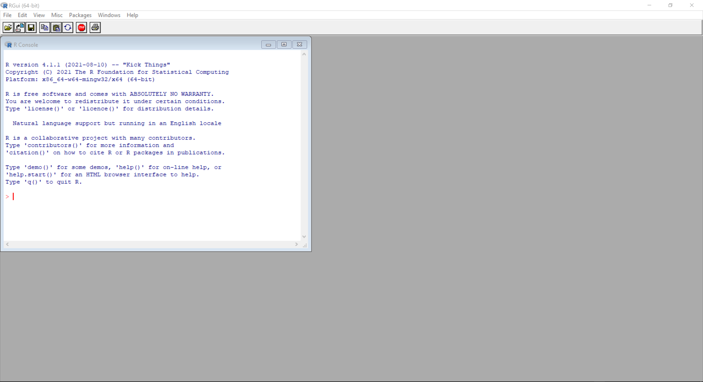
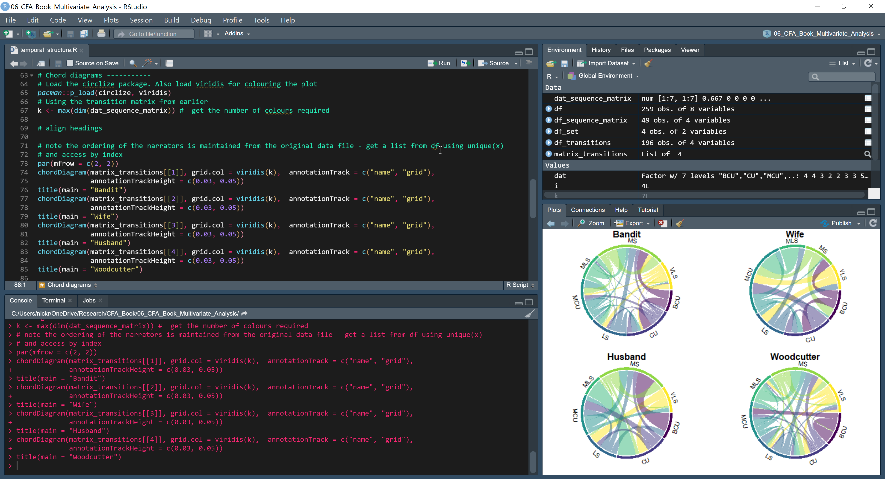
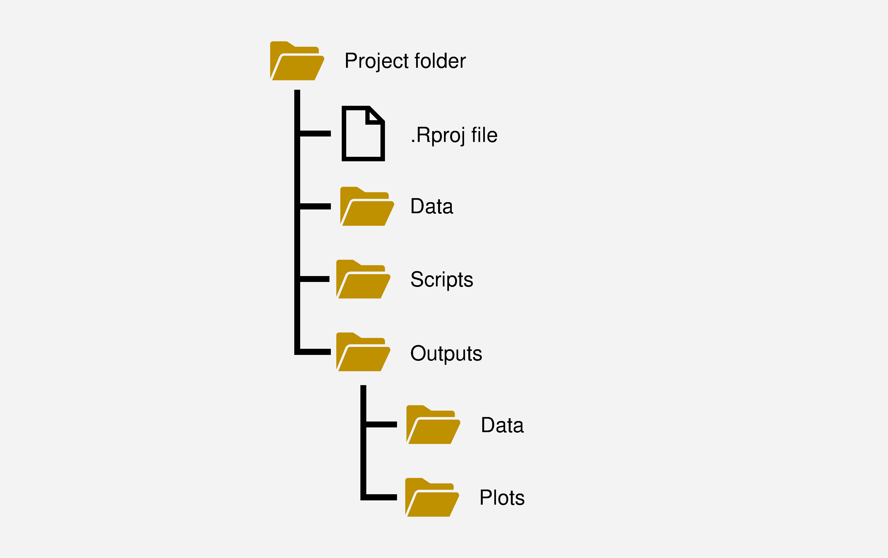

# Tools {#tools}

<br>
This chapter presents a brief overview of the three tools we will use to analyse films computationally – R, RStudio, and FFmpeg. This chapter is intended only to provide enough knowledge about these tools so that when we come to apply them in subsequent chapters we can focus on analysing films and learning key methods in an applicable framework rather than overloading the reader with information without context.

There are numerous other excellent guides to using these technologies that provide comprehensive tuition for the reader who wants to delve deeper. The website [R Tutorial](http://www.r‑tutor.com) is a good place to start if you have never used R before, and [R-Bloggers](https://www.r-bloggers.com) has excellent bite size tutorials. Hadley Wickham and Garrett Grolemund’s *R for Data Science* [@wickham2017r4ds] provides a comprehensive overview of the `tidyverse` suite of packages (of which we will make extensive use in this book) and good practice when using R; it can be accessed online at [https://r4ds.had.co.nz](https://r4ds.had.co.nz).

## R
[R](https://www.r-project.org) is a free and open-source environment for statistical computing and graphics and a programming language available for Windows, Linux, and MacOS. 

R was created for statistical computing and data analysis by statisticians and data analysts and is the principal software used in many areas of data science and academia. It was not designed for software development. Consequently, R’s underlying logic is that of the statistician and the data analyst rather than the software developer. Using R, I find that I spend less time writing code to analyse data and more time thinking about the question I am trying to answer because it better fits my analytical workflow compared to using other tools that were designed as a programming language (such as [Python](https://www.python.org) or [Julia](https://julialang.org)) and which have a different underlying logic. (I'm sure that those whose background is in programming rather than data science would prefer to use Python rather than R for the same reasons). This does not mean that R is the only tool suitable for computational film analysis, and there are some areas where other tools are optimal due to their availability and their broad support base. For example, Python is the preferred language for computer vision and machine learning tasks, both of which are relevant to computational film analysis. Part of designing a computational film analysis project is to choose how the methods employed will be computationally operationalised. The choice of analytical tool depends on the researcher, their project goals, and how they like to work.

There are several reasons why R is a desirable choice. R is *freely available* across a range of platforms, making it easy to share code and replicate research without worrying about licenses or replicating workflows based on point-and-click selections from menus. R is *highly extensible* with thousands of packages. R is *flexible*, and can be used for data visualisation, exploratory data analysis, and statistical modelling; data mining and machine learning; web scraping; and to create and publish documents (such as handouts, articles, or books -- including this one), interactive notebooks, websites, and applications. The extensibility and flexibility of R mean that it is often the only tool required at each stage of our workflow, including data cleaning and analysis, producing publication-quality visualisations, and creating research outputs, thereby greatly simplifying the management of a research project. Learning to analyse data by writing code forces the researcher to think more deeply about what they want to do and how they will achieve their goals than software that requires them only to point-and-click an item from a menu. Consequently, learning to use R results in *a greater knowledge* gain of both quantitative methods and using data analysis tools. It will also enable you to learn more about the data you have and what it can tell you about the world. Finally, the ability to share the R code used in a research project promotes *reproducibility* and *accountability* in research, allowing other researchers to understand how an analyst arrived at the conclusions of their CFA project and to reproduce the analysis.

### Installing R
R can be downloaded from the Comprehensive R Archive Network (CRAN) at [https://cran.r‑project.org](https://cran.r‑project.org). The installation process varies from platform to platform (Windows, Linux, and MacOS) but is in no case difficult and the CRAN website has clear instructions for all operating systems. Once the installation process is completed you will have the R scripting language, the R environment and console (Figure \@ref(fig:tools-R-image-env)), and the base set of data analysis packages ready for use.

```{r tools-R-image-env, out.extra='class=\"zooom\"', echo=FALSE, fig.align = "center", out.width = "90%", fig.cap=paste("The R environment and console. Code is entered at the command prompt `>`.", emo::ji("point_up"))}

```

### Using R
In this section, I cover some basic concepts required to make sense of code written in R. Other key concepts (such as control flow, vectorisation, and accessing elements) will be introduced in the contexts in which they are applied to make their meaning and use clear.

R can be used simply as a calculator to perform mathematical operations, entering values at the command prompt (`>`) in the console, and pressing <kbd>Enter</kbd>.

```{r tools-R-code-add}
2 + 3
```

In the above case, R prints the answer but does not store the result for later use. To store the answer, we need to assign the output of a command to an object using the *assignment operator* `<-`, which combines a less than sign (`<`) with a dash (`-`) and is used to name objects, assign values to variables, to evaluate expressions, or apply functions and pass the value to an object.

```{r tools-R-code-assign}
# Store the result of a sum in the variable answer
answer <- 2 + 5

# Call the variable by typing the name of the object
answer

# Use the object answer for another sum
answer + 5
```

The *names* of objects are case‑sensitive: for example, the objects `answer` and `ANSWER` are different objects. Names can contain letters, numbers, underscores, and periods, but should start with a letter. (Names can start with a period followed by a letter, but this is to be avoided in general). Names cannot start with a number or an underscore. Names assigned to objects can be formed in several ways:

- all one word in lowercase: `objectname`
- separating words with a period: `object.name`
- separating words with an underscore: `object_name`
- [camel case](https://en.wikipedia.org/wiki/Camel_case) beginning with lower case: `objectName`
- camel case beginning with upper case: `ObjectName`

There is no right or wrong choice, but *consistency is a source of sanity when coding*. I prefer using the underscore method because names written using this format are easier to read. Finally, names cannot use any of the [reserved words](https://www.datamentor.io/r-programming/reserved-words/) used by R (e.g., `TRUE`, `FALSE`, `NULL`, etc.).

*Objects* in R include [data structures](https://data-flair.training/blogs/data-structures-in-r/) (such as lists, vectors, matrices, data frames, etc.), variables, functions, and packages. The [workspace](https://www.statmethods.net/interface/workspace.html) comprises the collection of objects currently active in an R session. The workspace and the objects it contains will be permanently lost when a session is closed unless saved as a `.RData` file. We can save either the whole workspace or individual objects in the workspace.

```{r tools-R-code-saveimage, eval=FALSE}
# Save the workspace and the objects it contains
save.image("TodaysWork.RData")

# Save the object answer in a .RData file
save(answer, file = "answer.RData") 
```

To restore a workspace and/or objects to an active R session, use the `load()` function.

```{r tools-R-code-loadimage, eval=FALSE}
# Load saved objects into an R session
load("answer.RData")
```

### Comments
In R, *comments* are human readable descriptions of the purpose of a piece of code and begin with a hashmark (`#`). Anything after `#` on a line of code is not run. 

```{r tools-R-code-comments, eval=FALSE}
# Comments can be on a single line
# or multiple lines
answer <- 2 + 5  # Inline comments can also be added to a line of code
```

Comments do not excuse poorly written code and meaningful names should be used whenever possible; but they are essential to producing good code:

- Comments make code *navigable*: a long script is easy to use if you can find your way around it and comments make valuable signposts.
- Comments make code *shareable*: someone else should be able to understand the code you have written without having to decipher the code itself.
- Comments make code *maintainable*: the ability to re-use code over time depends on your ability to understand what you were thinking when you originally wrote that code because you *will* forget.

*Header comments* at the top of a script should describe who wrote the code, why it was written, and what it should do. Functions should be commented to describe their purpose and parameters. Inline comments should be used to make what a piece of code does obvious if it is not already – comments do not need to duplicate code. 

### Functions
A *function* is a self-contained piece of code that performs a defined task, taking some sort of data as an input, processing it, and returning a result (such as a model, a plot, or a data structure). 

Functions take the form of the function name followed by parentheses: `function_name()`. The input(s) to a function are its *arguments*, and includes

- the data we wish to apply the function to; and
-	any control parameters that determine how the function behaves (e.g., should the function return a plot or not).

Arguments are optional and some functions may have no arguments: for example, to get the current working directory we do not need to add any arguments to the call `getwd()`, but we do need the parentheses. Arguments may have *default* values that will be used if we do not explicitly specify that argument: for example, a function that returns a plot may have the default argument `plot = TRUE` and will automatically return a plot by default unless we set `plot = FALSE`. To get a list of the arguments for a function we can use `args(function_name)`.

Part of the flexibility of R is that it allows users to create their own functions as objects in the workspace using the `function()` function. All functions have the same basic form, comprising a function name, a set of arguments, and a function body.

```{r tools-R-code-function, eval=FALSE}
function_name <- function(arg_1, arg_2, …){
	function_statements
}
```

As an object in the workspace a function should have a name that is short but informative – we should have a sense of what a function does from its name. As noted above, arguments are the inputs of a function to which we want to apply operations. Those operations are implemented in the function statements wrapped by the curly braces. For example, to create a function to add two numbers together and return their sum, we create a function named `addition()` that takes two arguments (a and b) and adds them together.

```{r tools-R-code-addition}
# A simple function to add two numbers together
addition <- function(a, b){
	a + b
}

# Use addition() to add 2 and 3
addition(2, 3)
```

Functions can take other functions as their arguments and can be nested: for example, `addition(addition(2, 3), addition(4,2))` is a perfectly valid (if ugly) application of the above `addition()` function and will return the correct result of `11`.

If you find yourself repeatedly using the same piece of code in a project or across a set of projects it makes sense to put it into a function and then call that function when needed rather than clutter your project through repetition. Functions can be stored in files with the extension `.R`: for example, we could save the `addition()` function in the file `addition.R`. This creates a script file that can be loaded whenever we wish to apply the function, making code *reusable* across projects, *shareable* with other users, and *easier to maintain* because you only need to manage one chunk of code rather than several instances of the same code in a project. The `source()` function loads the functions stored in a `.R` script into the workspace.

```{r tools-R-code-source, eval=FALSE}
source("addition.R")
```

A script may contain multiple functions, *all* of which will be called into the workspace when the file is sourced. However, as scripts containing multiple functions become larger and more complicated it is preferable to have a single script for each function and to store and use those functions as a package.

### Packages
*Packages* comprise sets of functions, data, and documentation that extend the functionality of R. R has an enormous collection of libraries (18000+) covering an enormous range of functions. If an analytical method for your data exists, then there is at least one R package for applying that method. Packages are stored in online repositories and can be downloaded and installed directly within R. The Comprehensive R Archive Network (CRAN) is the official repository for R packages and publishes packages that meet its policies for package development, but packages (and individual functions) can also be accessed from GitHub (NB: this requires the devtools or pacman packages).

A package’s functions are only available to use if the required package is installed on a computer and the package has been loaded into the current workspace. We can check which packages are currently loaded into an R session using `sessionInfo()`, which will print out information about R, the operating system, and any packages loaded in the workspace. Loading a package means that every function in that package is available in the namespace. If we want to use an individual function without loading the whole package, we can call the function as `package_name::function_name()` if the package is installed on a computer.

Packages and functions are objects in the workspace and so their names are case‑sensitive: for example, `tuner::readwave()` will *not* load a wave file into R because the names of the package and the function are `tuneR::readWave()`.

#### pacman

The [pacman](http://trinker.github.io/pacman/vignettes/Introduction_to_pacman.html) package is an R package management tool comprising a useful set of functions to streamline the process of install packages and loading them into the workspace. To install pacman we use the base `install.packages()` command.

```{r tools-R-code-install, eval=FALSE}
# Note the quote marks around the package name
install.packages("pacman") 
```

Using the `pacman::p_load()` function, it is now possible to load multiple packages with a single command, separating the package names with commas. To install but *not* load a package, we use `pacman::p_install()`. For example, to load the tuneR and seewave packages we will use in Chapter \@ref(audio) we use the following code:

```{r tools-R-code-pacman, eval=FALSE}
# Quote marks are not needed using p_load()
pacman::p_load(tuner, seewave)
```

`pacman::p_load()` will automatically install any packages not already installed on your computer (NB: an internet connection is required). Packages can be unloaded once they are no longer needed using `pacman::p_unload()` and can be updated using `pacman::p_update()`.

#### tidyverse
The most common call we will make using pacman is to load the [tidyverse](https://www.tidyverse.org) package (@wickham2019wttt). 

The tidyverse package is not really a package; it suite of packages for data science that share a common approach to processing and visualising data, and which are designed to have a single workflow that streamlines the analytical process. Almost all the general tasks of data analysis -- data inspection and summarisation, [data wrangling](https://en.wikipedia.org/wiki/Data_wrangling), [data cleaning](https://en.wikipedia.org/wiki/Data_cleansing), and [data visualisation](https://en.wikipedia.org/wiki/Data_and_information_visualization) -- can be done using the tidyverse suite.

Installing the tidyverse package will install the following individual packages:

- [readr](https://readr.tidyverse.org): read and parse data files (`.csv`, `.tsv`) into R's workspace. Loading a file using `readr::read_csv()` will automatically load the data into a data frame (see [below](#df)). To read Excel files use the [readxl](https://readxl.tidyverse.org) package. To work with googlesheets use [googlesheets4](https://googlesheets4.tidyverse.org).
- [dplyr](https://dplyr.tidyverse.org): manipulate data in tabular format. The functions `select()`, `filter()`, `arrange()`, `mutate()`, `summarise()`, and `group()` are the ones you will use most when analysing data.
- [tidyr](https://tidyr.tidyverse.org): reshape and tidy data frames based on the concept of *tidy data*.
- [stringr](https://stringr.tidyverse.org): work with strings (text data).
- [forcats](https://forcats.tidyverse.org): work with categorical data as factors.
- [tibble](https://tibble.tidyverse.org): an alternative to the data frame data structure in R.
- [purrr](https://purrr.tidyverse.org): apply functions to data frames.
- [ggplot2](https://ggplot2.tidyverse.org): plot your data and customize just about any aspect of a plot you can think of. There are numerous extensions that add functionality to ggplot2 while maintaining a consistent aesthetic across visualisations.

The tidyverse has a selection of [cheat sheets](https://www.rstudio.com/resources/cheatsheets/) to help you use the packages efficiently.

Loading the tidyverse package will load all the packages in the suite, though each package in the suite can be loaded individually if desired. For example, if you have already prepared your data and want to create a plot then you can load just the ggplot2 package by calling that package only.

```{r tools-tidyverse-code-load, eval=FALSE}
# Load the full suite of packages in the tidyverse
pacman::p_load(tidyverse)

# Load ggplot2 only
pacman::p_load(ggplot2)
```

A key concept underpinning the tidyverse is *tidy data* [@wickham2014tdxx]. In tidy data

- every column is variable.
- every row is an observation.
- every cell is a single value.

For example, when we come to analyse colour in Chapter \@ref(colour) we will calculate the average colour of a frame of a short film. This data will be stored in a data frame in which will be store the following information in the tidy data format:

- each column is a variable in the data set that identifies the frame (`frame number`, `frame_id`), the time at which the frame occurs in the film (`time`), and the colour parameters of a frame in a colour space (`L`, `A`, `B`, `C`, `H`, `S`, `r`, `g`, `b`).
- the observational unit of the data is a frame and each row represents a frame from the film.
- each cell is the value of a variable for a frame.

Table \@ref(tab:tools-tidyverse-table-tidy) illustrates the arrangement of this data in tidy data format.

```{r tools-tidyverse-table-tidy, results='asis', echo=FALSE}
pacman::p_load(dplyr, DT)

df_tidy <- readr::read_csv(here::here("Data", "fuelled.csv"))

df_tidy <- df_tidy %>% select(1:12) %>% filter(frame > 100 & frame < 111) %>%
  mutate(across(4:12, ~ sprintf("%.2f", round(.x, 2)))) %>%
  mutate(time = sprintf("%.1f", round(time, 1))) 

datatable(df_tidy, rownames = FALSE, class = "cell-border stripe", extensions = 'FixedColumns', 
          options = list(dom = 't',
                         scrollX = TRUE, 
                         scrollCollapse = TRUE, 
                         paging = FALSE,
                         autoWidth = TRUE,
                         fixedColumns = TRUE,
                         columnDefs = list(
                           list(className = 'dt-right', targets = 0),
                           list(className = 'dt-right', targets = 2:11),
                           list(className = 'dt-center', targets = 1)),
                         initComplete = JS("function(settings, json) {",
                                           "$(this.api().table().header()).css({'font-size': '12pt'});", "}"))) %>%
  formatStyle(columns = colnames(df_tidy), fontSize = '10pt')

cat("<table width=100%>", paste0("<caption>", "(#tab:tools-tidyverse-table-tidy)", "Colour data for frames fom a film arranged in tidy format. ", "&#9757;", "</caption>"),"</table>", sep = "\n")
```

The tidy data approach provides a standard way to think about data is arranged that makes it quicker and easier to process. The need to rearrange the data into other messy formats is reduced (but not eliminated). The different packages in the tidyverse all expect data to be arranged the same way and so it is easier to move through the different stages of data analysis with tidy data. I find that once I have loaded the tidyverse package I use functions from several of the packages in the tidyverse suite together seamlessly, rarely thinking about which specific packages I am using. This reduces the amount of time I need to spend wrangling data so that I can spend more time thinking about the questions of film form and film style we are trying to answer.

### The pipe operator
The pipe operator `%>%` from the [magrittr](https://cran.r-project.org/web/packages/magrittr/vignettes/magrittr.html) and [dplyr](https://dplyr.tidyverse.org) packages makes it easy to chain together commands. 

Use of the pipe operator makes code easier to read and edit because there is no need for nested function calls. Commands flow left-to-right and top-to-bottom rather than inside-out, while the need for intermediary variables cluttering the workspace and using up memory is reduced (though not eliminated -- long chains of piped commands can become unwieldy to troubleshoot). For example, the three code chunks below perform the same operations of (1) taking the [exponent](https://r-lang.com/r-exp-function-with-example/) of each value in the vector `num`, (2) summing the exponents, (3) taking the logarithm of that sum, and (4) then rounding the result to one decimal place and (5) storing the result in the object `num_output`; but one is logically simpler and more efficient than the others. 

```{r tools-R-code-pipe}
# Set the seed of R's random number generator for reproducibility
set.seed(1) 
# Create a vector of 10 random numbers from a uniform distribution
num <- runif(10)

# Example 1: using nested functions
num_output_ex1 <- round(log(sum(exp(num))), 1)

num_output_ex1

# Example 2: using intermediary variables
num_exponents <- exp(num)
num_exponents_sum <- sum(num_exponents)
num_exponents_sum_log <- log(num_exponents_sum)
num_output_ex2 <- round(num_exponents_sum_log, 1)

num_output_ex2

# Example 3: using the pipe operator
pacman::p_load(dplyr) # call the dplyr package to use the pipe operator
num_output_ex3 <- num %>% 
  exp() %>%
  sum() %>%
  log() %>% 
  round(1)

num_output_ex3
```

R has other pipe operators to perform the same task, but we will only use `%>%` in this book because it is the operator used most widely.

### Data frames {#df}
A [data structure](https://en.wikipedia.org/wiki/Data_structure) is a way of storing information in a computer. R has many different types of data structures, but the data structure we will use extensively throughout this book is the [data frame](http://www.r-tutor.com/r-introduction/data-frame).

A data frame is a two-dimensional data structure -- a table -- that can store *different* types of data, including numerical data, logical values (i.e., `TRUE` and `FALSE`), or text. Other R data structures, such as a vector or a matrix, can only store a single type of data. This makes data frames a highly flexible data structure.

To get the structure of a data frame we can use dplyr's `glimpse()` function. For example, to see the structure of the Early Hitchcock editing data set we will use in chapters \@ref(editingI) and \@ref(editingII), we load the `.csv` file containing the shot length data using `readr::read_csv()` to create a data frame `df_hitchcock` and call `dplyr::glimpse(df_hitchcock)`.

```{r tools-dataframes-code-glimpse}
df_hitchcock <- readr::read_csv(here::here("Data", "early_Hitchcock.csv"), show_col_types = FALSE)

# Inspect the data set
dplyr::glimpse(df_hitchcock)
```

The output tells us that the object `df_hitchcock` has 1056 rows and 9 columns. Then we get a list of the columns in the data set listing their names, indicating their type  as `<dbl>` (which is short for [double-precision floating-point format](https://en.wikipedia.org/wiki/Double-precision_floating-point_format and is used to represent numbers with decimal points)), and showing the first few values in each column of the data frame. The `head()` function also let's us see the top few rows of the `df_hitchcock` data frame, which makes it easy to grasp the structure of a data frame in the tidy format.

```{r tools-dataframes-code-head}
head(df_hitchcock)
```

We can access the individual columns of a data frame using the `$` operator. To see the first few rows of the `Blackmail (1929)` column only in the `df_hitchcock` data frame, we use ````head(df_hitchcock$`Blackmail (1929)`)````. Note that we need backticks (`` ` ``) around the column name because it includes a space. 

```{r tools-dataframes-code-headSL}
head(df_hitchcock$`Blackmail (1929)`)
```

The columns in a data frame *must* have equal numbers of rows and so R will populate any empty cells with `NA` to ensure that all columns are the same length. We can get a complete summary of a data frame using the `summary()` function. For columns storing numeric data, this will return a summary of each column in a data frame including the [five-number summary](https://en.wikipedia.org/wiki/Five-number_summary), the mean value, and the number of `NA` values in a column.

```{r tools-dataframes-code-summary}
summary(df_hitchcock)
```

`NA` values will need to be removed before using the data in a column using the `na.omit()` function. Applying this process to the shot length data for *Blackmail* (1929), we see that the `Blackmail (1929)` column in the `df_hitchcock` data frame has 1056 values. However, we see from the above summary that 618 of these are `NA` values. After omitting the `NA` values we see that there are actually 438 shots in the film for which we have data.

```{r tools-dataframes-code-NA}
# Check the length of the column storing the Blackmail 
# shot length data in the df_hitchcock data frame
length(df_hitchcock$`Blackmail (1929)`)

# Create a new object storing the Blackmail shot length 
# data having removed NA values
blackmail <- na.omit(df_hitchcock$`Blackmail (1929)`)

# Check the length of the new object blackmail
length(blackmail)
```

We will designate data frames in the workspace with the prefix `df_` so that we are always aware what type of object we are working with. We will occasionally use other data structures, such as a matrix, but whenever possible we will ensure our data is structured as a data frame that is as tidy as possible.

## RStudio
RStudio is a cross-platform [integrated development environment](https://en.wikipedia.org/wiki/Integrated_development_environment) (IDE) that is more user‑friendly than the base R console, though it is not necessary to install an IDE to use R. The installer for RStudio can be downloaded at [https://www.rstudio.com/products/rstudio/download/](https://www.rstudio.com/products/rstudio/download/). RStudio Cloud makes a browser-based version of the IDE available though in this book I will assume you are using the desktop version.

Using RStudio means that many of the tasks we encounter using R can be automated to save time. For example, rather than type out the assignment operator `<-` every time we can use the keyboard shortcut <kbd>ALT</kbd> + <kbd>-</kbd>. We can set RStudio to save an `.RData` file of the workspace on exiting the IDE and to load that file on start-up if we wish to do so. RStudio also features [*code completion*](https://support.rstudio.com/hc/en-us/articles/205273297-Code-Completion-in-the-RStudio-IDE) for packages, functions and arguments, and objects in the workspace to speed up the process or writing code and reduce the potential for errors arising through typos; [*syntax highlighting*](https://en.wikipedia.org/wiki/Syntax_highlighting) to more easily distinguish between functions, strings, values, and other objects; and [*bracket matching*](https://en.wikipedia.org/wiki/Bracket_matching) to save time when writing and troubleshooting code.

### The RStudio interface
Opening the RStudio interface presents us with a set of panes, some of which contain a set of tabs to access specific information in an R session.

-	The *Console* pane contains the standard R console, where code is entered and run, and where the results are returned.
-	The *Files* pane contains tabs that let you explore files in the current working directory and navigate to other directories on your computer (Files); display and export plots (Plots); see which packages are available and currently loaded into the workspace (Packages); and access help on R in general, specific packages, or functions (Help).
-	The *Environment* pane contains tabs that let you see what objects are in the workspace in the current R session (Environment); and see the history of commands that have been sent to R (History).
-	The *Source* pane lets you inspect objects in the workspace (data frames, lists, etc.) and to write code in scripts.

In the console, a line of code is evaluated interactively when we presses <kbd>Enter</kbd>. This is fine for single lines of code to be executed immediately but is cumbersome if we have a longer piece of code that requires several steps to be executed in sequence. It is therefore preferable to write code as a script in the Source pane, where a single command can run across multiple lines and/or a series of commands can be written and run together. A new script file can be created using `File > New File > R Script` or using the shortcut <kbd>Ctrl</kbd> + <kbd>Shift</kbd> + <kbd>N</kbd>. Unlike the console, pressing <kbd>Enter</kbd> does not cause a line of code to be evaluated; it adds a new line to the script. To run a chunk of code in a script, highlight the desired lines (for single lines of code placing the cursor at the beginning or end of the line is sufficient) and press <kbd>Ctrl</kbd> + <kbd>Enter</kbd>. To run all the code in a script, press <kbd>Ctrl</kbd> + <kbd>Shift</kbd> + <kbd>Enter</kbd>. Running the code from a script sends it to the console to be evaluated, where the results will also be returned. A script can be saved using `File > Save As…` and naming the script with the `.R` extension.

Opening the Global Options menu (`Tools > Global Options…`) lets the us customize the appearance of RStudio to suit their preferences. See Figure \@ref(fig:tools-rstudio-image-layout) for my customised layout for RStudio. 

-	On the Pane Layout page, we can change the location of the panes in the interface to suit their preference and to assign tabs to panes. For example, I have moved the Files tab to the same pane as the Environment tab for my customisation of RStudio.
-	The Appearance page lets us select the RStudio theme, editor font and font size, and the editor theme (background colour and syntax highlighting) to suit their needs and preferences.

A particularly useful feature available in RStudio is the use of Rainbow parentheses to make it easier to match up parentheses, brackets, and braces when writing code. Mismatching or missing out brackets is a common source of errors when coding but by turning on Rainbow parentheses the colour coding of items in a script makes it easier to spot where errors occur. To turn on Rainbow parentheses open the `Global options` dialogue box from the `Tools` menu and select `Code` followed by `Display`. Check the `Rainbow parentheses` box. Note that this will only work when coding a script in the source window. It does *not* apply when coding in the console, where text will *always* be monochrome. This is another reason to write R scripts in the Source pane rather than the console.

```{r tools-rstudio-image-layout, out.extra='class=\"zooom\"', echo=FALSE, fig.align = "center", out.width = "90%", fig.cap=paste("My customised layout of the RStudio interface. Text in the Source pane (top left) is highlighted using a customised version of the Monokai editor theme and uses rainbow parentheses. Text in the Console (bottom left) is monochrome. The Environment pane (top right) lists the objects currently in the workspace. The Plots pane (bottom right) displays the visualisations I am creating for this book. ", emo::ji("point_up"))}

```

### Projects
A key advantage of using RStudio is that it simplifies the process of managing projects. 

The *working directory* is the folder where R looks for data to import and scripts to source, and is the destination for any outputs created. A widespread practice is to set the working directory with an absolute path explicitly at the head of a script using the `setwd()` function. 

```{r tools-projects-code-setwd, eval=FALSE}
setwd("C:/Users/Nick/Documents")
```

This is *not* advisable. Setting the working directory in this way makes code easy to break and hard to share. An absolute path to a working directory works only as long the directory structure of the computer running the script does not change. If the script file containing the code is moved, the directory structure changes over time, or if code is shared to be run on a different machine, then the path to the working directory is no longer valid. Every `setwd()` command in every script in a project must be changed to make new valid paths to the working directory, which is tedious and unnecessary.

A better approach is to employ a robust workflow using projects in RStudio and the here package.

By starting a new project in RStudio (`File > New Project…`) the working directory for that project is set to the project folder, which can be created when starting a new project in RStudio or associated with an existing folder. An `.Rproj` file, which stores the settings for that project, is linked to the project folder. Opening an existing project in RStudio (`File > Open Project`) starts a new R session and automatically sets the working directory for that session to the project folder and loads any `.RData` and `.RHistory` files, plus any other project settings.

Once the project folder has been created and associated with an `.Rproj` file, it is time to create the folders that will organise the source data for analysis, the scripts that contain the code we create, and the outputs produced. The organisation of an R project depends on the nature of the research project, but Figure \@ref(fig:tools-projects-image-folders) illustrates a basic folder structure for an R project as a starting point for thinking about projects. The `.Rproj` file is at the top level of the project so that the working directory is set to the project folder and all paths to folders and files within the project are *relative* to the project folder. Using paths relative to the project folder means that code will work even if the location of the project folder changes.

```{r tools-projects-image-folders, echo=FALSE, fig.align = "center", out.width = "90%", fig.cap="A basic structure for an R project."}

```

#### here

The [here](https://here.r-lib.org/index.html) package makes working with relative paths easy to manage. `here::here()` gets the file path to the project folder of the current project (which it determines by the presence of the `.Rproj` file) and lets us create paths relative to that folder. For example, to read a `.csv` file from the Data folder in the project folder we wrap the file information in a `here()` command within the call to read the file (`readr::read_csv()`) and list the folders within the project folder ("Data") and the files ("data.csv") in order.

```{r tools-projects-code-read, eval=FALSE}
# Install the tidyverse (which includes the readr package) and 
# here packages if you have not already done so
pacman::p_load(here, tidyverse)

df <- readr::read_csv(here::here("Data", "data.csv"))
```

Similarly, to write a data frame to a `.csv` file in the `Outputs > Data` folder we build a path by listing the folders and file name in order.

```{r tools-projects-code-write, eval=FALSE}
readr::write_csv(df, here::here("Outputs", "Data", "data_output.csv"))
```

An advantage of using the here package is that we no longer need to worry about how to enter paths on different platforms. On MacOs and Linux, paths are written using single forward slashes to separate folders (<kbd>/</kbd>), while on Windows machines paths to files use single backlashes (e.g., `C:\Users\Nick\Documents`). However, because backslashes are used to escape characters in strings, R will not recognise the path on a Windows machine as a path and so it is necessary to edit the location of a folder to use either double backslashes (`C:\\Users\\Nick\\Documents`) or single forward slashes (`C:/Users/Nick/Documents`). This is tedious and another way in which code can be broken. This problem is easily eliminated by using the here package, which does not require us to enter back- or forward slashes.

#### A script for the folder structure of a project
Once we have created our project folder and associated it with an `.Rproj` file we can create a function called `project_folders()` using the here package and the `dir.create()` function that will create the basic folder structure we need for a project.

```{r tools-projects-code-loops, eval=FALSE}
project_folders <- function(){  # no arguments are required
  
  # Load the here package
  pacman::p_load(here)
  
  # Name the folders and sub-folders for the project
  folders <- c("Data", "Scripts", "Outputs")
  Outputs_sub_folders <- c("Data", "Plots")
  
  # Loop over the folders to create them in the project directory
  for (f in folders){dir.create(f)}
  
  # Loop over the sub-folders to create them in the Outputs directory
  for (s in Outputs_sub_folders){dir.create(here("Outputs", s))}
  
}

# To run the function
project_folders()
```

A `for` loop repeats a specific piece of code a set number of times, iterating over the values in a sequence. For example, in the above code the function `dir.create()` is applied once for every item (`f`) in the list `folders`. Using the here package we can specify in which folder the sub-folders will be created and run another loop to create sub-folders within the Outputs directory. `for` loops save time by removing the need to repeatedly execute the same piece of code but they are often one of the slowest ways of executing code in R. However, in this book we will use `for` loops so we can see what the code we are using does at each step -- our aim is understanding rather than speed. Once you feel you understand the code, you can experiment with putting the content of a loop into a function and then using R’s [family of apply functions](https://www.learnbyexample.org/r-apply-functions/), such as `lapply()` and `sapply()`, to run code efficiently.

We can save the `project_folders()` function as a script -- let’s call it `project_folders.R` -- that we can source and run at the beginning a new project. Make sure you make a note of where you save this script, as creating the folder structure will be one of the first tasks in every chapter in this book: we simply copy the script to the project folder, source the function using `source("project_folders.R")` and run the function.

### Accessing help
Help on packages and functions can be accessed directly within RStudio. Vignettes describing packages and illustrating how to use their functions can be accessed using `browseVignettes()`. For example, to see the vignettes for the seewave package we use

```{r tools-help-code-vignettes, eval = FALSE}
browseVignettes(package = "seewave")
```

This will open a list of vignettes in a web browser (NB: an internet connection is required). Not all R packages have vignettes, though many do. To get `help` with a function from any package currently loaded in the workspace, type help followed by the name of the function in parentheses. For example, to get help with the `spectro()` function in the seewave package use `r help(spectro)`. This will open the documentation for that function in the help tab of RStudio. 

RStudio also has a Tutorial tab for learning about how to use R and which requires the [learnr](https://rstudio.github.io/learnr/) package.

## FFmpeg
To process audio and video we will need FFmpeg, a free command-line based utility for decoding, encoding, and converting media files that is the workhorse of several packages across different languages for media processing. FFmpeg can be used to encode/decode/transcode and mux/demux multimedia files. It can be used for blurring and denoising, colour conversion, letterboxing, extracting individual frames, and adding or removing subtitles from video files.

On MacOS, FFmpeg is easily installed as a package from [Homebrew](https://formulae.brew.sh/formula/ffmpeg#default). On Linux it can be installed via a package manager. FFmpeg does not require installation on Windows, but it is necessary to set an environment path to FFmpeg so that commands addressed to it are executed. 

---

<details><summary style="font-size:16px; font-weight: bold;">`r emo::ji("point_left")` Click here to learn how to set FFmpeg as an environment variable in Windows</summary>

```{block, type = "rmdimportant"}
<h3 style="margin-top: -5px;">Setting FFmpeg as an environment variable in Windows</h3>

The following steps will allow you to download FFmpeg and set it as an environment variable in the operating system.

1. Go to [https://ffmpeg.org/download.html](https://ffmpeg.org/download.html) and select the Windows logo to get a list of download options for Windows. Click on **Windows\ builds\ from\ gyan.dev** to go to the Codex FFmpeg repository.
2. Select the latest *full* build: `ffmpeg-git-full.7z`. This will begin downloading FFmpeg as a compressed zip file to your default **Downloads** folder.
3. Open your default **Downloads** folder, right-click on the file you have just downloaded and select **Extract here**. This will unpack the compressed file to a new folder. Rename this folder **FFmpeg**.
4. Cut-and-paste this folder from your **Downloads** folder to the root directory of your PC (C:\\\\).
5. Open the Windows search box (<kbd>Windows</kbd> + <kbd>s</kbd>) and type **Environment variables** into the search box. Select**Edit the system environment variables** to open the **System Properties** dialogue box.
6. In the **System Properties** dialogue box click the **Environment variables...** button in the bottom right-hand corner to open the **Environment variables** dialogue box.
7. In the **User variables for \<username\>** panel, select **Path** and click **Edit**.
8. Click **New** and type `C:\\FFmpeg\\bin` at the prompt. Click **OK** to set the path.
9. Click **OK** in the **Environment variables** dialogue box to save your changes. Click **OK** to exit the **System Properties** dialogue box.

FFmpeg should now be set as a environment variable in Windows. To check this, open the Windows search box (<kbd>Windows</kbd> + <kbd>s</kbd>), type **PowerShell**, and select **Windows PowerShell** from the results. Once the window has opened, enter `ffmpeg` at the prompt and press <kbd>Enter</kbd>. If FFmpeg has been set as an environment variable correctly PowerShell will display a summary of the version of FFmpeg you have now set up on your PC.

```

</details>

---

FFmpeg can be used via the [command line](https://en.wikipedia.org/wiki/Command-line_interface) or it can be called by passing system commands from R to the operating system. To streamline our workflow, we will work within a single environment and enter FFmpeg commands via R using the av package to simplify code when possible. For example, to convert a `.webm` file to an `.mp4` file without re-encoding the data using FFmpeg within R we pass the following command to the system:

```{r tools-ffmpeg-code-system, eval=FALSE}
system("ffmpeg -i input_video.webm output_video.mp4")
```

Breaking this down:

-	 the `system()` function passes a command to the OS as a string – note the use of quote marks around the command.
-	 `ffmpeg`: tells the OS we are entering a command for FFmpeg
-	 `-i input_video.webm`: `-i` indicates this is an input command and is followed by the exact name of the video file to be converted
-	 `output_video.mp4`: sets the name of the output file. The name of the output can be prefaced with `-vcodec libx264` to control the encoding of the output file.

This process can be simplified using the av package for R, which provides an R wrapper for common FFmpeg operations. To convert a .webm file to .mp4 using `av::av_video_convert()`, we enter

```{r tools-ffmpeg-code-av, eval=FALSE}
# Load the av package
pacman::p_load(av)

av::av_video_convert("input_video.webm", output = "output_video.mp4")
```

This command performs the exact same conversion as the FFmpeg code at the command line but is more readable.

```{block, type = "rmdtip"}
*Programming Historian* has a [comprehensive guide](https://doi.org/10.46430/phen0077) [@rodriguez2018itat] to using FFmpeg for those who would like to learn more.
```

## Summary

The analytical and presentational tools required for a computational film analysis project will vary according to the demands of that project. R is an excellent choice because it can be used with many different types of data and in subsequent chapters we will use R to analyse sound, colour, editing, shot data, and textual data, working directly with audio files, images, and subtitiles, or `.csv` files containing numerical data derived from films.
