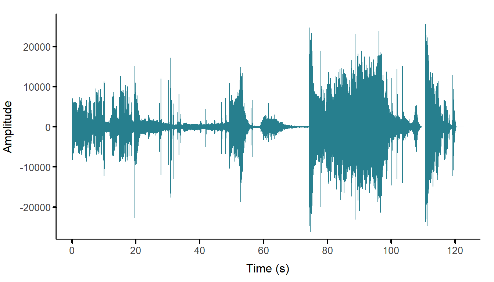
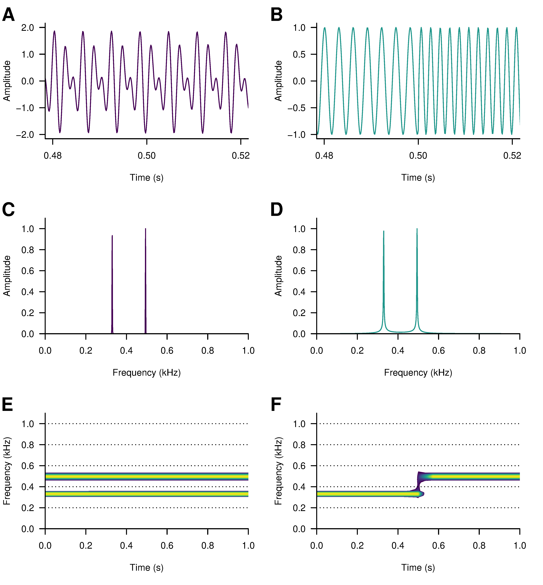
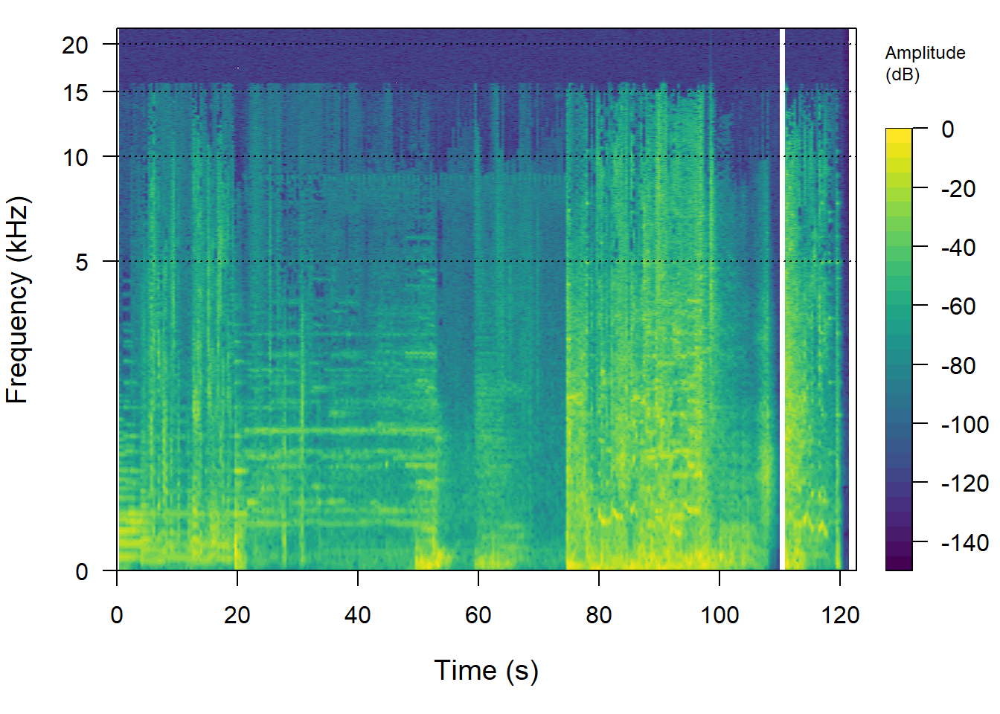
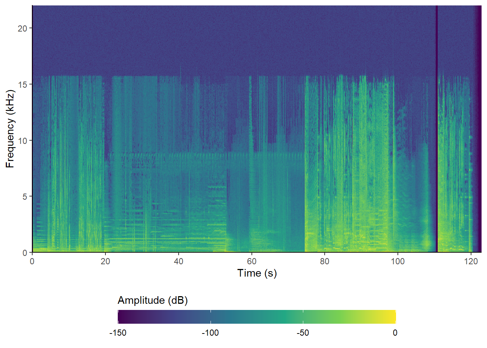
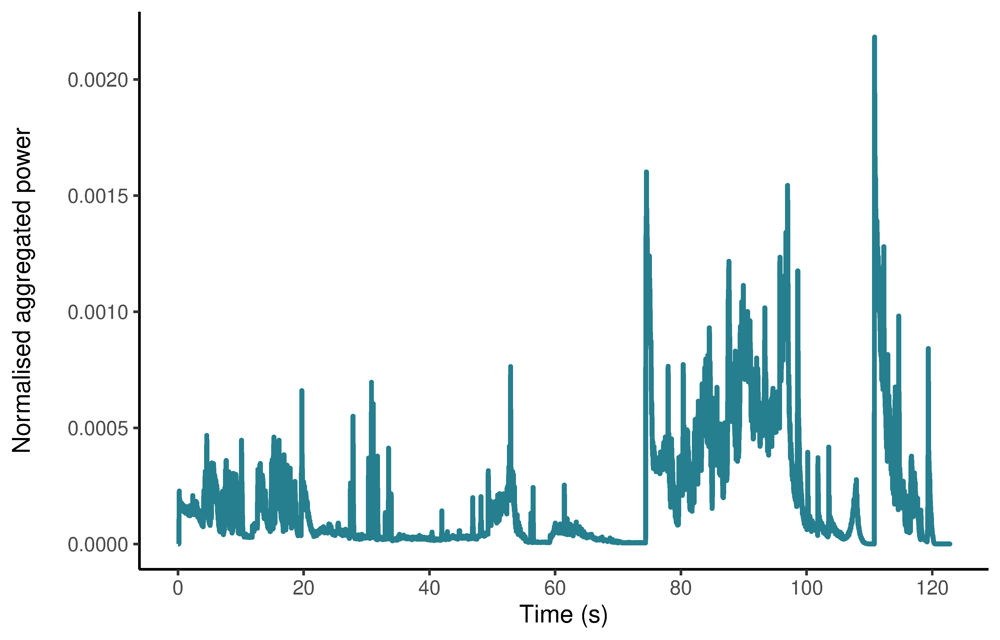
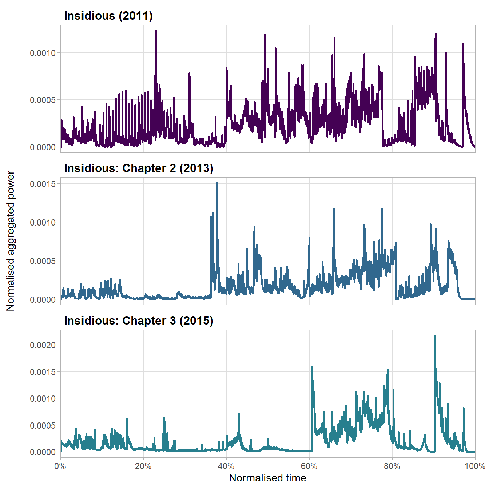
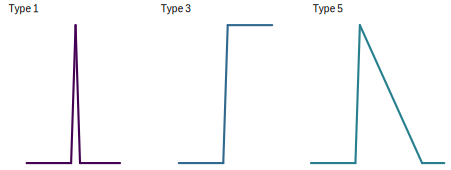
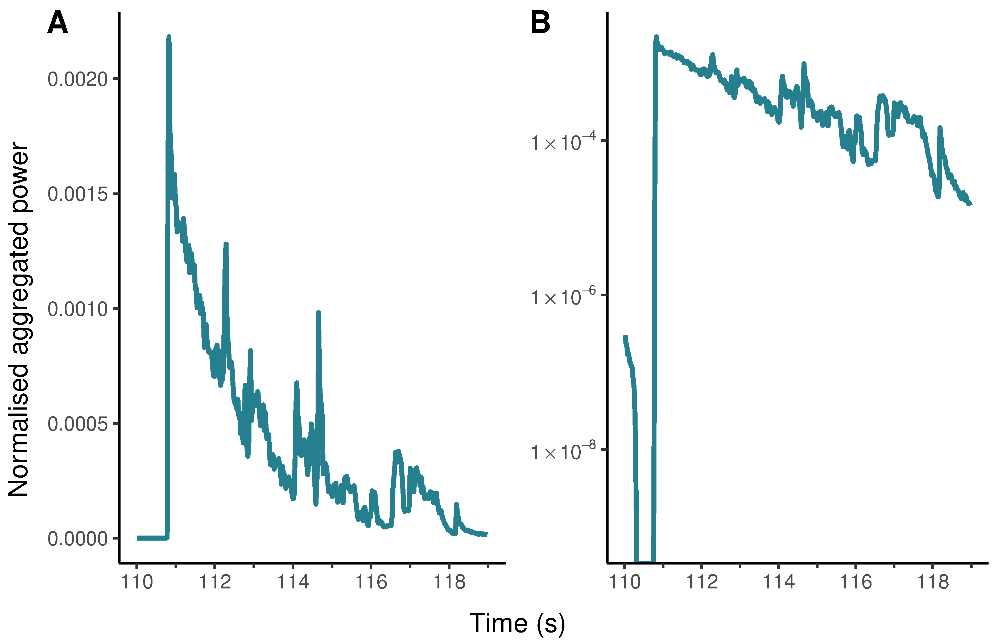
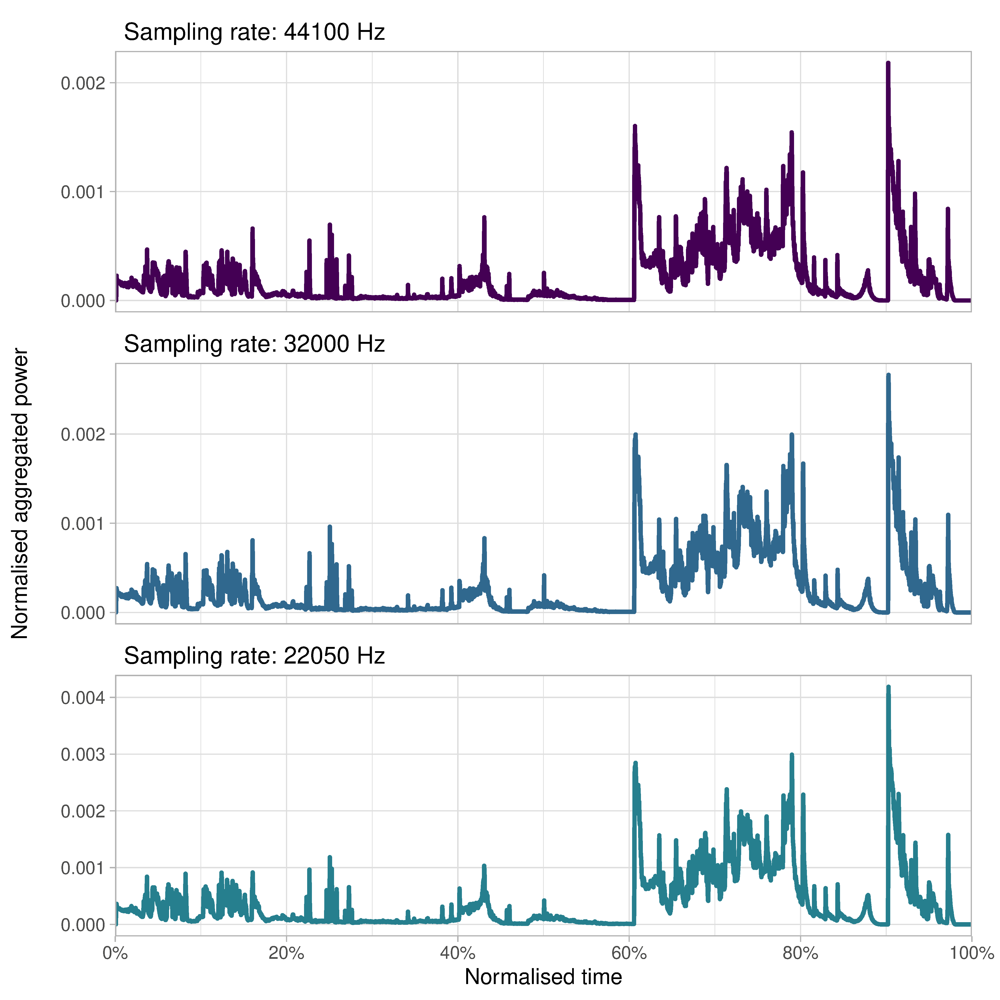

# Analysing film audio {#audio}

```{r audio-head-load-packages, echo = FALSE}
pacman::p_load(tidyverse, seewave, tuneR, here, ggpubr)
```

In the cinema, the different elements of film audio -- dialogue, music, sound effects, ambient noises, and silence -- are organised into a soundtrack that contributes to viewers’ experiences of motion pictures in multiple ways. Soundtracks convey narrative information and emotions; define the mood of a film; shape the pace of action and the tempo of a film; contribute to the realism (or hyperrealism) of a movie; establish location and historical period; carrying thematic content across a film; and organise viewers’ direct experience of a film by smoothing out cuts between shots and enabling transitions between scenes, locations, and different times. Sound adds to the visual content of a scene, often drawing attention to what is important on the screen and can modify how we perceive what we are witnessing on the screen. Audio content is therefore a rich source of information about narrative structure, action, and emotion in motion pictures.

Timmy Chih-Ting Chen describes [sound design](https://en.wikipedia.org/wiki/Sound_design) as an analytic concept that 

>helps us describe the aesthetic and stylistic construction of all elements of the soundtrack, attending to the sound mix comprising music, voice, sound effects, ambience, and silence in relation to the visual track. As the sonic counterpart to visual design, sound design draws audience’s attention to the neglected aural dimension of cinematic style [@chen2016sdxx: 34].

Computational analyses of film style have largely ignored the role of sound but there is a wide range of audio analysis tools that are freely available and that could be applied to understanding sound design in the cinema. In this chapter we will cover some methods for analysing sound in the cinema with R.

## A (brief) digital audio primer

The vibrations produced by a violin string, your vocal cords, or a speaker cone move the air molecules surrounding them causing the air pressure to rise slightly. In turn, these molecules move the air molecules next to them, which then move the molecules next to them, and so on, propagating the pressure wave through the air. When these vibrations arrive at our aural receptors we experience the [pressure wave as sound](https://en.wikipedia.org/wiki/Longitudinal_wave#Sound_waves).

The [*waveform*](https://en.wikipedia.org/wiki/Waveform) is the shape of the graph of the pressure wave comprising an audio signal. The [*amplitude*](https://en.wikipedia.org/wiki/Amplitude) of a waveform is the change in pressure from the peak of a wave to its trough. The *cycle* of a wave is the amount of time taken to go from one amplitude, all the way through a wave’s amplitude changes, to reach the same amplitude again and the [*frequency*](https://en.wikipedia.org/wiki/Frequency) of a wave is the number of cycles of a wave per second given in [Hertz](https://en.wikipedia.org/wiki/Hertz) (Hz). In Figure \@ref(fig:audio-primer-plot-waveform), the waveform goes through four complete cycles in a second and has a frequency of 4 Hz.

```{r audio-primer-plot-waveform, echo = FALSE, out.width = "90%", fig.height = 4, fig.align = "center", fig.cap = "The waveform of an audio signal with a frequency of 4 Hertz."}
x <- seq(0, 8*pi, length.out = 1000)
y <- sin(x)
df <- data.frame(t = x/max(x), y = y)

df %>% ggplot() +
  geom_hline(aes(yintercept = 0), colour = "#440154") +
  geom_line(aes(x = t, y = y), colour = "#277F8E", size = 1) +
  scale_x_continuous(name = "Time (s)", breaks = c(0, 1), labels = c(0, 1)) +
  scale_y_continuous(name = "Amplitude", 
                     limits = c(-1, 1), 
                     expand = c(0, 0),
                     sec.axis = sec_axis(name = NULL, 
                                         trans =~.*1, 
                                         breaks = c(0), 
                                         labels = c(0))) +
  theme_classic() +
  theme(axis.line.x = element_blank(),
        axis.text.x = element_text(colour = "#454545"),
        axis.ticks.x = element_blank(),
        axis.title.x = element_text(colour = "#454545"),
        axis.line.y.left = element_line(colour = "#454545", 
                                   arrow = grid::arrow(length = unit(0.2, "cm"), 
                                                       ends = "both", type = "closed")),
        axis.line.y.right = element_blank(),
        axis.text.y.left = element_blank(),
        axis.ticks.y.left = element_blank(),
        axis.title.y = element_text(colour = "#454545"))
```

A sound wave can be captured, stored on a medium, and reproduced. [Analog media](https://en.wikipedia.org/wiki/Analog_signal) represent the waveform of a sound directly as a continuous voltage that its analogous to the sound wave, whereas [digital audio](https://en.wikipedia.org/wiki/Digital_signal) is converted by an [analog-to-digital converter](https://en.wikipedia.org/wiki/Analog-to-digital_converter) to be represented as discrete numbers (digits) in a computer readable form.

In digital audio, the amplitude values of a sound’s waveform are captured at evenly spaced time points (Figure \@ref(fig:audio-primer-plot-digital)). The [*sampling rate*](https://en.wikipedia.org/wiki/Sampling_(signal_processing)) is the number of samples per second and is given in Hertz (Hz) or kilohertz (kHz). For film audio, the standard sampling rate is 48000 Hz or 48 kHz. The amplitude of the waveform in a single sample is represented by a number, with the amplitude rounded off to the nearest [integer](https://en.wikipedia.org/wiki/Integer). This process is called [*quantisation*](https://en.wikipedia.org/wiki/Quantization_(signal_processing)). The range of numbers used to represent a sound is determined by its [*bit depth*](https://en.wikipedia.org/wiki/Audio_bit_depth). For example, in 4-bit quantisation of an audio file there are sixteen possible values that can be used to represent the amplitude of a sample because $2^{4}=16$. For 16-bit quantisation, there are  $2^{16} = 65536$ possible values. Conventionally, the possible amplitude values are arranged symmetrically around zero. The [*bit rate*](https://en.wikipedia.org/wiki/Bit_rate) is the number of binary digits per second used to represent an audio signal measured in kilobits per second (kbps) and is equal to the product of the sampling rate, the exponent of the bit depth, and the number of [channels](https://www.wildlifeacoustics.com/resources/faqs/what-is-an-audio-channel). For example, a stereo signal with a sampling rate of 48000 Hz and a bit-depth of $2^{16}$ has a bit rate of 48000 × 16 × 2 = 1536000 or 1536 kpbs.

```{r audio-primer-plot-digital, echo = FALSE, fig.align = "center", out.width = "90%", fig.cap="An analogue audio waveform, digitally sampled at 32 kHz with 4-bit quantisation."}
# time
t <- 1:32000
t <- t/32000

# create wave
wave_1 <- synth(f = 32000, d = 1, a = 3, cf = 329.63) # E4
wave_2 <- synth(f = 32000, d = 1, a = 3, cf = 493.88) # B4
wave <- wave_1 + wave_2
# as data frame and limit to first 0.01 seconds
df_wave <- cbind.data.frame(t, wave)
df_wave <- df_wave %>% filter(t <= 0.01)

# sample data points from df_wave
df_point <- df_wave %>% filter(row_number() %% 5 == 1)
df_point <- df_point %>% mutate(wave_r = round(wave, 0))

ggplot() +
  geom_line(data = df_wave, aes(x = t, y = wave, colour = "#277F8E"), size = 1) +
  geom_point(data = df_point, aes(x = t, y = wave_r), colour = "#440154", size = 0.8) +
  geom_segment(data = df_point, aes(x = t, xend = t, y = 0, yend = wave_r, colour = "#440154")) +
  scale_x_continuous(name = "Time (s)", 
                     limits = c(0, 0.01), 
                     breaks = c(0, 0.01), 
                     labels = c("0.00", "0.01")) +
  scale_y_continuous(name = "Amplitude", 
                     limits = c(-8, 7), 
                     breaks = seq(-8, 7, 1), 
                     labels = seq(-8, 7, 1)) +
  scale_colour_manual(name = NULL, guide = "legend",
                      values =c("#277F8E" = "#277F8E", "#440154" = "#440154"), 
                      labels = c("Analogue", "Digital")) +
  theme_minimal() +
  theme(panel.grid.major.x = element_blank(),
        panel.grid.minor = element_blank(),
        legend.position = "bottom",
        legend.box = "horizontal")
```

Together the sampling rate, the bit depth, and the bit rate determine the quality of a digital audio recording: increasing either the sample rate or the bit depth will improve the quality of the sound, but this will also increase the size of the audio file. This has implications for the processing power required for analysis of film audio and I discuss the practical considerations involved in the selection of sample rates [below.](#samprate) Throughout this chapter we will use audio with a bit depth of 16-bits, as this provides a good level of [dynamic range](https://en.wikipedia.org/wiki/Dynamic_range#Audio) (96 dB) with manageable file sizes.

## Setting up the project

### Create the project
Having created a project in RStudio from a new directory using the `New project...` command in the `File` menu, we can run the script `projects_folders.R` we created in Chapter \@ref(tools) to create the folder structure required for the project.

### Packages
In this project we will use the packages listed in Table \@ref(tab:audio-packages-table-packages).

```{r audio-packages-table-packages, results="asis", echo = FALSE}
packages <- read_csv(here("Data", "packages.csv"))

packages %>% 
  filter(chapter == "audio") %>%
  select(-chapter) %>%
  arrange(Package) %>% 
  knitr::kable(caption = "Packages for analysing audio data.") %>%
  kableExtra::kable_styling(bootstrap_options = c("striped"), font_size = 14)
```

There are other packages that we could use to analyse audio files in R, including soundgen [@anikin2019saos] and warbleR [@arayasalas2017warp]. Some of the functions in these packages make use of the seewave package, while adding new methods for acoustic analysis. warbleR is designed for working with multiple files and could be useful when working with data sets comprising a large number of audio files.

### Data

The *Insidious* franchise comprises four supernatural horror films released between 2011 and 2018. In this chapter, we will look at the trailers for *Insidious* (2011), *Insidious: Chapter 2* (2013), and *Insidious: Chapter 3* (2015). A fourth film in the franchise, [*Insidious: The Last Key*](https://en.wikipedia.org/wiki/Insidious:_The_Last_Key), was released in 2018. I leave it as an exercise for the reader to analyse the soundtrack of this trailer to see how it compares to the results presented here.

The first two films in the franchise focus on the Lamberts, a family haunted by malevolent spirits from an astral plane called "The Further".  In the first film, [*Insidious*](https://en.wikipedia.org/wiki/Insidious_(film)) (Video [4.1](#vid41)), the son, Dalton, falls into a coma and begins travelling to "The Further" and becomes possessed by the same tortured soul who had possessed his father, Josh, as a young boy. With the help of demonologist Elise Rainier, Josh travels into "The Further" to rescue his son but the spirit of the evil woman who had possessed him as a child returns with him and drives him to kill Elise. 

***

[ ]{#vid41} 
<center><iframe width="560" height="315" src="https://www.youtube.com/embed/zuZnRUcoWos" title="YouTube video player" frameborder="0" allow="accelerometer; autoplay; clipboard-write; encrypted-media; gyroscope; picture-in-picture" allowfullscreen data-external="1"></iframe></center>

<p class="caption">
Video 4.1: The trailer for *Insidious* (2011) `r emo::ji("point_up")`
</p>
***

The second film in the franchise, [*Insidious: Chapter 2*](https://en.wikipedia.org/wiki/Insidious:_Chapter_2) (Video [4.2](#vid42)), takes place after the events of the first film, with the police investigating the death of Elise and the Lambert family trying to defeat the ghosts seeking to harm them. This time, Dalton enters "The Further" to save his possessed father with the spirit of Elise, destroying the "Woman in White" who has haunted Josh throughout his life. 

***

[ ]{#vid42} 
<center><iframe width="560" height="315" src="https://www.youtube.com/embed/fBbi4NeebAk" title="YouTube video player" frameborder="0" allow="accelerometer; autoplay; clipboard-write; encrypted-media; gyroscope; picture-in-picture" allowfullscreen data-external="1"></iframe></center>

<p class="caption">
Video 4.2: The trailer for *Insidious: Chapter 2* (2013) `r emo::ji("point_up")`
</p>
***

The third film in the franchise, [*Insidious: Chapter 3*](https://en.wikipedia.org/wiki/Insidious:_Chapter_3) (Video [4.3](#vid43)), is a prequel set seven years before the events of the first two films and centers on teenager Quinn Brenner, who becomes possessed by the "Man Who Can't Breathe" after trying to contact her dead mother in seance with Elise. 

***

[ ]{#vid43} 
<center><iframe width="560" height="315" src="https://www.youtube.com/embed/7DNXUvHm-S8" title="YouTube video player" frameborder="0" allow="accelerometer; autoplay; clipboard-write; encrypted-media; gyroscope; picture-in-picture" allowfullscreen data-external="1"></iframe></center>

<p class="caption">
Video 4.3: The trailer for *Insidious: Chapter 3* (2015) `r emo::ji("point_up")`
</p>
***

Rather than repeat the process for each trailer, I will illustrate the processing of the audio for the trailer for *Insidious: Chapter 3* only and only include the ouputs for other trailers once we come to analysing their sound design.

#### Extracting the audio

Having downloaded the trailers as `.mp4` files from YouTube and placed them in our Data folder, we need to process them to remove any MPAA rating tag screens and to extract the soundtracks as an audio file. This can be done in a variety of ways, including using editing software to trim the video file and export the audio in the required format. Here we will use the av package, which functions as a wrapper for FFmpeg. We can get a summary of the `.mp4` file we downloaded from YouTube using `av::av_media_info()`.

```{r audio-extract-code-info, eval=FALSE}
pacman::p_load(here, av)

av_media_info(here("Data", "insidious_chapter_3.mp4"))
```

```{r audio-extract-code-summary}
## $duration
## [1] 129.7763
## 
## $video
##   width height codec frames framerate  format
## 1  1280    720  h264   3111  23.97602 yuv420p
## 
## $audio
##   channels sample_rate codec frames bitrate layout
## 1        2       44100   aac   5589  125588 stereo
```

From the file info we see that this video file has a soundtrack with a sampling rate of 44.1 kHz, which is not the standard sampling rate for film audio but which is typical for YouTube videos. A version of the soundtrack with a sampling rate of 48 kHz can be downloaded from YouTube using [youtube-dl](https://youtube-dl.org) as a `.webm` file, but here we will proceed with the version of the soundtrack that we have to hand. The impact of sampling rates on the analysis is discussed [below](#samprate).

To extract the audio from the `.mp4` file we will use `av::av_audio_convert()` to create a `.wav` file that we will write to our Data folder. At the same time we will trim the first seven seconds of the trailer by setting `start_time = 7`. This section of the `.mp4` file comprises the [MPAA green band](https://screenrant.com/red-band-trailer-meaning-history/) trailer tag screen followed by a black screen with no accompanying audio. Not all trailers will have a tag screen, while the duration of this screen will vary from trailer to trailer.  A common practice is to put an announcement title at the beginning of a trailer, essentially trailing the trailer in the same video (see [here](https://www.youtube.com/watch?v=iKCw-kqo3cs) for an example), while some YouTube channels will add additional promotional material after a trailer. It is important therefore to check how much material is to be trimmed from the top and tail of trailer before analysis.

```{r audio-extract-code-convert, eval=FALSE}
av_audio_convert(here("Data", "insidious_chapter_3.mp4"), 
                 output = here("Data", "insidious_chapter_3.wav"), 
                 start_time = 7)
```

One consequence of extracting the audio in this way is that the timings of the will be different from the original trailer on YouTube. This needs to be taken into account when associating events in the trailer with features we have identified through analysis.

#### Loading and pre-processing an audio file

To load an audio file into R we use the tuneR package, which can load `.wav` and `.mp3` files using the `tuneR::readWave()` and `tuneR::readMP3()` functions, respectively. Audio files loaded using tuneR in this way are `Wave-class` objects with [attributes](https://www.r-bloggers.com/2020/10/attributes-in-r/) that can be accessed using the `@` operator. We can get a summary of the audio file by calling the object `audio` we created when we loaded the file. This confirms that the duration of the soundtrack is now seven seconds shorter than the original `.mp4` file.

```{r audio-load-code-readwave, eval=FALSE}
pacman::p_load(tuneR)
audio <- readWave(here("Data", "insidious_chapter_3.wav"))

# Get a summary of the audio object
audio
```

```{r audio-load-code-summary}
## Wave Object
## 	Number of Samples:      5415936
## 	Duration (seconds):     122.81
## 	Samplingrate (Hertz):   44100
## 	Channels (Mono/Stereo): Stereo
## 	PCM (integer format):   TRUE
## 	Bit (8/16/24/32/64):    16 
```

At this stage, the audio we are working with is stereo. Moving forward, it will be easier to work with a mono audio object as we will have a single audio object to work with (see [below](#monovstereo) for a discussion of using mono versus stereo). To convert a soundtrack from stereo to mono, we use the `tuneR::mono()` function, which lets us extract either the left or right channel or average the two channels. We will choose this latter option and set `which = "both"`. To check `audio` is now a mono `Wave` object we can access the `stereo` attribute, which now returns the value `FALSE`.

```{r audio-load-code-mono, eval=FALSE}
audio <- mono(audio, which = "both")

# Check that audio is no longer a stereo object
audio@stereo
```

```{r audio-load-code-monosum}
## [1] FALSE
```

We can plot the audio file simply by calling R's `base::plot()` function directly on the wave object `audio`. We can also pass other arguments to change the plot's appearance to be consistent with the style of plots produced by the ggplot2 package.

```{r audio-load-code-waveform, eval=FALSE}
# Set the parameters of the plot
par(mgp = c(1.5, 0.4, 0),  # Set the position of the axis labels
    tcl = -0.25,           # Set the length of the tick marks
    cex.axis = 0.85,       # Set the size of the axis labels
    col.axis = "#444444",  # Set the colour of the axis
    mar = c(3, 4, 1, 1))   # Set the margins of the plot space: bottom, left, top, right

plot(audio, bty = "n",  xaxt = "n", yaxt = "n", 
     col = "#277F8E", xlab = "Time (s)")
box("plot", bty = "l", lwd = 2, col = "#444444")
axis(side = 1, lwd = 0, lwd.ticks = 2, mgp = c(1.5, 0.2, 0))
axis(side = 2, lwd = 0, lwd.ticks = 2, las = 2)
mtext("Amplitude", side = 2, line = 3)
```

```{r audio-load-plot-waveform, echo=FALSE, out.width="90%", fig.align='center', fig.cap="The mono waveform of the soundtrack of the *Insidious: Chapter 3* trailer after trimming."}

```

## Visualising the soundtrack

While many structural features of a soundtrack are readily apparent in the plot of its waveform, such as the presence of quiet and loud sections or the abrupt onset of audio events it is much harder to describe the features of these sections and events at different scales. In this section we will create some visualisations of the trailer soundtracks that will show their dynamic structure more clearly.

### The spectrogram

The next stage applies the *short-time Fourier transform* ([STFT](https://en.wikipedia.org/wiki/Short-time_Fourier_transform)) to the mono wave file to produce a 2D time-frequency representation of the signal called a *spectrogram*. See @goodwin2008tssm and @muller2015fomp [: 40-57] for detailed discussions of these methods and their mathematical underpinnings.

Any audio signal can be represented as the sum of a series of [sine waves](https://en.wikipedia.org/wiki/Sine_wave). The [*Fourier transform*](https://en.wikipedia.org/wiki/Fourier_transform) is a mathematical function that decomposes a signal into its component sine waves at different frequencies, with the amplitude of each sine wave representing the amount of [power](https://en.wikipedia.org/wiki/Sound_power) or [energy](https://en.wikipedia.org/wiki/Sound_energy) present in the signal at that frequency. By analogy, the Fourier transform is to sound as a prism is to light, splitting the signal to reveal the spectrum of frequencies that make up a sound wave. This can be done no matter how complex the audio signal in which we are interested. A limitation of the Fourier transform is that assumes a signal is [stationary](https://en.wikipedia.org/wiki/Stationary_process) –- that is, it assumes the statistical properties of a signal do not alter with time. Applying the Fourier transform to the soundtrack of a trailer will give us a spectrum representing the overall frequency content of the soundtrack averaged over the duration of the entire signal time but it will not tell us anything about how the soundtrack evolves over time. The STFT overcomes this limitation by dividing the signal into a series of [windows](https://www.audiolabs-erlangen.de/resources/MIR/FMP/C2/C2_STFT-Window.html) and calculating the Fourier transform for each window. The result is a Fourier transform of the signal localised in time that depends on the [shape](https://en.wikipedia.org/wiki/Window_function) (rectangle, Hanning, etc.), size (the number of samples within a window, which should be a power of 2), and the overlap of the windows of successive local Fourier transforms. In this example, the successive Fourier transforms are overlapped by 50% to produce a smoother spectrogram that more accurately reflects the structure of the continuous audio signal.

Calculating the STFT of a signal will give us a [matrix](https://en.wikipedia.org/wiki/Matrix_(mathematics)), in which columns are the time windows, the rows are the frequency bands, and the cell values are the amplitude of the signal in that time window for that band of frequencies. The STFT is visualised as a [spectrogram](https://en.wikipedia.org/wiki/Spectrogram). The spectrogram describes how the magnitudes of the individual frequencies (shown on the y-axis) comprising a signal vary over time (which is represented on the x-axis), with the amplitude of a signal in a time-frequency window indicated by colour.

Figure \@ref(fig:audio-spectrogram-plot-demo) displays segments of two signals of one-second in duration with frequency components at 329.63 Hz and 493.88 Hz corresponding to the notes E4 and B4, respectively. The waveform of Figure \@ref(fig:audio-spectrogram-plot-demo).A is a superposition of both frequencies, with both notes present throughout the duration of the signal. The waveform in Figure \@ref(fig:audio-spectrogram-plot-demo).B has the same frequency components, but they are not present at the same time: this waveform shifts frequency from E4 to B4 after 0.5 seconds. Figures \@ref(fig:audio-spectrogram-plot-demo).C and D show the spectra of these waves with amplitude peaks at their component frequencies. From this example it is evident that a Fourier transform cannot distinguish between stationary and non-stationary signals; that is, it cannot see the difference between a stationary signal in which the statistical properties of the signal are consistent over time (Figure \@ref(fig:audio-spectrogram-plot-demo).A) and a non-stationary signal with components at the same frequencies but whose statistical properties vary with time (Figure \@ref(fig:audio-spectrogram-plot-demo).B).

The spectrogram describes how the magnitudes of the individual frequencies comprising a signal vary over time. Time is displayed on the x-axis, frequency on the y-axis, and the amplitude of a given frequency band within a time window is represented as colour. Figures \@ref(fig:audio-spectrogram-plot-demo).E and F present the spectrograms and shows how the two signals have different temporal structures. The size of the window determines the temporal and frequency resolution of the spectrogram. The temporal resolution is equal to the size of the window divided by the sampling rate and the frequency resolution is the sampling rate divided by the window size. Overlapping the windows produces a smoother spectrogram and a more accurate representation of the continuous evolution of the frequencies of a signal.

```{r audio-spectrogram-plot-demo, echo = FALSE, fig.align = "center", fig.height = 7, out.width = "90%", fig.cap="Segments of two sounds with the notes E4 (329.63 Hz) and B4 (493.88 Hz) arranged as a composite wave (A), with both notes played continuously for one second, and a sequential wave (B), changing pitch from E4 to B4 after 0.5 seconds. Despite the different waveforms of these sounds the periodograms for the composite wave (C) and the sequential wave (D) have the same power spectral density. These differences between the sounds are clear to see in the spectrograms: both notes are present for the duration of the composite wave (E), while the transition from the E4 note to B4 in the sequential wave halfway through the time window is clear to see (F)."}

```

The temporal resolution of the STFT is equal to the window length (in this example, 2048) divided by the sampling rate: 2048/48000 = 0.0426 seconds per window. The frequency resolution is equal to the sampling rate divided by the window length: 48000/2048 = 23.44 Hz per band. It is clear that by reducing the window size we could improve the temporal resolution but only at the expense of poorer frequency resolution; and that increasing the window length will improve frequency resolution at the expense of temporal resolution. This is because time and frequency are a [conjugate variables](https://en.wikipedia.org/wiki/Conjugate_variables) and are subject to an [uncertainty principle](https://en.wikipedia.org/wiki/Uncertainty_principle): it is not possible to localize both time and frequency with absolute precision. There exists a trade-off between time and frequency resolution that needs to be addressed during the design of the analysis in order to ensure the resulting spectrogram is a meaningful representation of a signal relative to what we want to discover about a film's sound design.

There are two ways of producing a spectrogram using the seewave package. The `spectro()` function uses R's base plotting functions, whereas the `ggspectro()` function uses ggplot2. Each has its advantages. Using `spectro()` it is easier to plot the frequency axis of the spectrogram on a log scale in order to see more easily what is happening at lower frequencies. A limitation of this approach is that calculating the STFT this way introduces some matrix entries with a value of `-Inf` whenever the soundtrack encounters silence and these values will be transparent in the spectrogram. This can be avoided by exporting the audio directly from editing software or by processing the audio file using an audio editor (e.g., [Audacity](https://www.audacityteam.org) or [Wavosaur](https://www.wavosaur.com)) and then loading the file plotting the spectrogram using the same code demonstrated here.

```{r audio-spectrogram-plot-spectro, eval=FALSE}
pacman::p_load(seewave, viridis)

spectro(audio,
        f = audio@samp.rate,           # the sampling rate
        wl = 2048,                     # window length in samples
        wn = "hanning",                # the shape of the window
        ovlp = 50,                     # overlap of the windows
        norm = TRUE,                   # amplitude is normalised to 0.0 dB
        fastdisp = TRUE,               # draws the plot quicker
        flog = TRUE,                   # plot frequencies on a log scale
        collevels = seq(-200, 0, 10),  # the range of the amplitude scale
        palette = viridis,             # colour palette selection
        axisX = FALSE)                 # suppress the x-axis

# Label the x-axis every 20 seconds from 0 to 120 seconds
axis(1, at = seq(0, 120, 20), labels = seq(0, 120, 20))
```

```{r audio-spectrogram-plot-spectroinclude, echo=FALSE, out.width="90%", fig.align='center', fig.cap="The spectrogram of the soundtrack of the trailer for *Insidious: Chapter 3* using `seewave::spectro()`. The frequency axis is plotted on a log-scale."}

```

Using `ggspectro()` we can take advantage of ggplot2's wide range of commands to customise the appearance of a plot that, as a `ggplot()` object, can be combined with other plots to create single figures. The `ggspectro()` function replaces the `ggplot()` function when creating a plot with ggplot2, but all other ggplot2 commands remain the same. The seewave [documentation](https://www.rdocumentation.org/packages/seewave/versions/2.2.0/topics/ggspectro) for `ggspectro()` includes examples that rely on the `geom_tile()` function to draw the spectrogram, but `geom_raster()` is quicker and uses less memory to produce a better quality image. 

```{r audio-spectrogram-plot-ggspectro, eval=FALSE}
pacman::p_load(tidyverse)

ggspectro(audio, wl = 2048, wn = "hanning", ovlp = 50) + 
  geom_raster(aes(fill = amplitude), interpolate = TRUE) +
  scale_x_continuous(expand = c(0, 0), breaks = seq(0, 120, 20)) +
  scale_y_continuous(expand = c(0, 0), breaks = seq(0, 20, 4)) +
  scale_fill_viridis_c(name="Amplitude (dB)", na.value = "#440154") + 
  guides(fill = guide_colourbar(barwidth = 20, 
                                barheight = 1, 
                                title.position = "top")) +
  theme_classic() +
  theme(legend.position = "bottom")
```

```{r audio-spectrogram-plot-ggspectroinclude, echo=FALSE, out.width="90%", fig.align='center', fig.cap="The spectrogram of the soundtrack of the trailer for *Insidious: Chapter 3* using `seewave::ggspectro()`."}

```

Some STFT values still take on a value of `-Inf` (the STFT matrix is the same as that produced using `spectro()` when using the same parameters), but by setting `na.value = "#440154"` these values will take on the minimum value of the amplitude scale when using the viridis palette and so they will not appear as transparent.

---

<details><summary style="font-size:16px; font-weight: bold;">`r emo::ji("point_left")` Click here to learn about the ggplot2 package</summary> 

```{block, type = "rmdimportant"}
<h3 style="margin-top: -5px;">The ggplot2 package</h3>

The ggplot2 package maps aesthetic attributes to a data set to produce highly-customisable publication-ready visualisations based on Leland Wilkinson's *The Grammar of Graphics* [@wilkinson2005tgog]. Hadley Wickham's *ggplot2: Elegant Graphics for Data Analysis* [-@wickham2016gegf] presents a detailed introduction to the ggplot2 package. The online version is available [here](https://ggplot2-book.org/index.html).

ggplot2 accepts data frames *only*. If the data is not stored as a data frame it will need to be converted to a data frame prior to plotting. 

A `geom` determines the geometry of how data is visualised as a line (`geom_line`), a cloud of points (`geom_point`), a bar (`geom_bar` or `geom_col`), text (`geom_text`), or any of the many other different ways of visualising data. Plots are built up as layers, with the geom listed first after the plot is created as the bottom layer. Subsequent geoms will overlay this layer and each other in the order they are called. Note that this means higher layers may obscure features of lower layers and so it is necessary to consider the order in which geoms is plotted to ensure the data is visualised effectively.

The aesthetics of a geom are set by mapping on to variables in a data frame listed in the `aes()` command, and includes which variables from a data frame will be set on the x and y axes, the grouping of data, and the variables to be associated with a scale by colour, fill, and shape. (Note that ggplot2 works with both English and American spellings of 'colour'). 

The appearance of a plot can be controlled by formatting the axes, applying colour schemes to variables, applying a coordinate system (such as Cartesian or polar co-ordinates), splitting a data set into its subsets based on a variable (called facets), and applying a theme to modify the non-data elements of a plot (such as titles, axis labels, plot margins, legends, etc.).

In this book we will always construct plots using ggplot2 the same way.

1. We will create a a plot using the `ggplot()` function with data for the plot typically passed to the function at this stage.
2. Geoms are added to the plot in the order that they need to be layered. If different geoms require different data, they will be passed to their respective geoms at this stage. Aesthetics will typically be mapped when geoms are created.
3. Features of the plot are set, including the formatting of axes and guides, the coordinates of the plot in the place of the graphic window, and the use of facets to visualise subsets as small multiples.
4. Finally, we will select a theme and format the appearance of the plot by setting the parameters of the theme. See [here](https://ggplot2.tidyverse.org/reference/ggtheme.html) for a gallery of the themes in the ggplot2 package.

It is not necessary to plot these features in this order. We could create an R object containing a plot (`p`) using ggplot2 and then additional geoms or add or modify the themes later: for example, `p + theme_dark()` will apply the dark theme to the object `p`.

There are many R packages extending the functionality of ggplot2, adding new geoms to expand the range plots we can produce, adding new features to control how data is displayed (e.g., controlling the overlap of data labels, adding marginal plots, interactivity, new themes, etc.), and combining multiple plots together to make a single figure.
```

</details>

---

### The normalised aggregated power envelope

A limitation of visualising the soundtrack using the spectrogram is that it can be difficult to characterise the temporal evolution of specific features. Additionally, it is not possible to see relationships between different elements of the soundtrack at different scales.

The *normalised aggregate power envelope* (nape) plots the evolution of the power of the soundtrack, making it easier to see the structure of the soundtrack, relationships between various parts of the soundtrack at different scales, and the shape of local features. It is also easier to compare soundtracks using this visualisation than the waveform or the spectrogram.

To calculate the normalised aggregated power envelope for the *Insidious: Chapter 3* trailer we use the `acoutsat()` function in the seewave package, keeping the settings we used to produce the spectrogram. The envelope is simply the sum of the columns of the matrix comprising the STFT that has been [normalised](https://en.wikipedia.org/wiki/Normalization_(statistics)) to a unit area [@cortopassi2006aarm].

To obtain the time contour produced by `acoustat()`, we use the `$` [operator](https://r-lang.com/dollar-sign-in-r-with-example/) to access an element from the list of results returned by a function. This will return a two column matrix containing the times of the individual spectra comprising the spectrogram and the aggregate of the amplitude values of those spectra. We will set `plot = FALSE` so that we can draw our own plot of the data using `ggplot2::ggplot()`.

```{r audio-nape-code-nape, eval=FALSE}
insidious_chapter_3_nape <- acoustat(audio, 
                                     wl = 2048, 
                                     wn = "hanning", 
                                     ovlp = 50, plot = FALSE)$time.contour

head(insidious_chapter_3_nape)
```

```{r audio-nape-code-napedisplay}
##            time      contour
## [1,] 0.00000000 0.000000e+00
## [2,] 0.02322874 0.000000e+00
## [3,] 0.04645748 0.000000e+00
## [4,] 0.06968622 0.000000e+00
## [5,] 0.09291495 0.000000e+00
## [6,] 0.11614369 4.582695e-09
```

`ggplot2::ggplot()` expects data to be `data.frame` and so we need to convert the object `insidious_chapter_3_nape`, which is currently of class 'matrix' to a data frame using `as.data.frame()`. We will name this object `df_insidious_chapter_3_nape` to make it clear that it is a data frame. 

[]{#class}

---

<details><summary style="font-size:16px; font-weight: bold;">`r emo::ji("point_left")` Click here to learn how to check the class of an object</summary> 

```{block, type = "rmdimportant"}
<h3 style="margin-top: -5px;">The `class()` function</h3>

In R everything is an object and each object belongs to a **class** that serves as a blueprint of an object. The class of an object determines if and how functions will interact with that object, and most functions require objects to belong to a particular class. 

To check the class of an object in R we use the `class()` function.

<script src="https://gist.github.com/DrNickRedfern/1ee875c5c085e25882d37a87a89bf110.js"></script>

Here we see that `insidious_chapter_3_nape` is of class `matrix` and class `array`. This is because in R, the `matrix` class is a subset of the class `array`; specifically, a `matrix` class object is an array with two dimensions.

To change the class of an object we prefix the target class to which an object is to be coerced with `as.`. For example, to convert a data frame to a matrix we would use `as.matrix(x)`, where `x` is the name of the data frame to be converted.

The `typeof()` function can be used to obtain additional information about an object.

```

</details>

---

We can save the data frame containing the normalised aggregated power envelope for this trailer to our data folder as a `.csv` file using the `write_csv()` function from the readr package, which is part of the tidyverse suite of packages that we loaded earlier. We can then read this file using `readr::read_csv()` rather than have to repeat the whole analytical process from scratch.

```{r audio-nape-code-df, eval=FALSE}
# Convert the matrix to a data frame
df_insidious_chapter_3_nape <- as.data.frame(insidious_chapter_3_nape)

# Save as a csv file using readr::write_csv()
write_csv(df_insidious_chapter_3_nape, here("Data", "insidious_chapter_3_nape.csv"))

# To read the csv file using readr::read_csv()
df_insidious_chapter_3_nape <- read_csv(here("Data", "insidious_chapter_3_nape.csv"))
```

Now lets plot the normalised aggregated power envelope of the soundtrack of the trailer for *Insidious: Chapter 3* (Figure \@ref(fig:audio-nape-plot-napedisplay)).

```{r audio-nape-plot-nape, eval=FALSE}
# Plot the normalised aggregated power envelope
ggplot(data = df_insidious_chapter_3_nape) +
  geom_line(aes(x = time, y = contour), colour = "#277F8E") +
  scale_x_continuous(name = "Time (s)", breaks = seq(0, 120, 20)) +
  # Add an extra line after the axis title to move it away from the tick labels with \n
  scale_y_continuous(name = "Normalised aggregated power\n") +
  theme_classic()
```

```{r audio-nape-plot-napedisplay, echo=FALSE, out.width="90%", fig.align='center', fig.cap="The normalised aggregated power envelope of the soundtrack of the trailer for *Insidious: Chapter 3*."}

```

## Sound design in trailers for the *Insidious* franchise

### Structure
In @redfern2020sihf I showed that trailers for US horror films can typically be divided into three sections:

- *narrative*: establishing character, locations, time-frames, and plot
- *emotional*: creating of monomaniac version of the film characterised by heightened emotional intensity
- *marketing*: during which the key promotional information about a trailer (title, release date, social media information, etc.) is presented to the audience. 

This pattern is clear in the plots of the normalised aggregated power envelopes of the three trailers in Figure \@ref(fig:audio-structure-plot-napes). Although these trailers have different running times (*Insidious*: 102.21s; *Insidious: Chapter 2*: 140.18s; *Insidious: Chapter 3*: 122.81s), they are structurally similar and normalising the running time to the range [0-100%] brings out these commonalities.

```{r audio-structure-plot-napes, echo=FALSE, out.width="90%", fig.align='center', fig.cap="The normalised aggregated power envelope of the soundtracks of trailers in the *Insidious* franchise"}

```

There is an thirty-eight second difference in the running time of the trailers for *Insidious* and *Insidious: Chapter 2* but the increase in power in the soundtracks of both trailers occurs approximately ~38% of the way through the trailer as each trailer shifts from its narrative phase into its emotional phase. For the first part of this emotional phase the power of the soundtracks shows no trend in either trailer, but both show a linear increase in power from ~60% to ~78%, at which point both trailers move from their emotional phase and into their marketing phase. 

The trailers for *Insidious* and *Insidious: Chapter 2* relate the haunting of the Lambert family, but the third film in the franchise is a prequel set several years before the events of the first two movies and so it must establish its own place within the franchise. Consequently, the trailer for *Insidious: Chapter 3* devotes a greater proportion of its running time to narrative, blending this narrative function with an increasing level of anxiety before fully giving itself over to the emotional intensity of the trailer. The emotional phase of the trailer in which the power of the soundtrack increases steadily over time looks the same as the corresponding section in the other trailers albeit compressed into a much shorter section and just like the other trailers, this point at which the soundtrack’s power increases linearly occurs 60% of the way through the trailer. 

### Acoustic startle events

Acoustic startle events generate a startle response in the audience through the abrupt onset of a loud sound [@sbravatti2019asih]. Different types of affective events have different [audio envelopes](https://en.wikipedia.org/wiki/Envelope_(music)) (Figure \@ref(fig:audio-ase-plot-schemas)): Type-1 events are characterised by step-edge attack, no sustain, and step-edge release creating a jump scare for the audience; Type-3 events by step-edge attack, long sustain, and unspecified release stage, also jolting the audience but maintaining a heightened emotional intensity for a period of time; and Type-5 events by step-edge attack, no sustain, and a long release in which the power of the startle event falls away as characters react to the shock they (and the audience) have just experienced. (Type 2 and Type 4 affective events have a slope attack and so do not generate a startle repsonse; see @redfern2020sihf for a discussion of the different types of affective events in horror film trailers).

```{r audio-ase-plot-schemas, echo=FALSE, out.width="90%", fig.align='center', fig.cap="Schematic representations of acoustic startle events."}

```

Plotting the timing and type of acoustic startle events in these trailers (Figure \@ref(fig:audio-ase-plot-events)) we see that there is a clear pattern in their timing and functions. First, acoustic startle events do not occur during the narrative phase of a trailer. Second, Type-1 events occur during the emotional phase and are classic examples of the basic jump scare in horror cinema [@baird2000tsei]. The two Type-1 events in the trailer for *Insidious: Chapter 2* both make the audience jump, marking turning points in the trailer, first when there is a shift from the narrative stage to the horror stage, and second when the soundtrack begins to increase in power as the emotional content of the trailer intensifies. Interestingly, there are no Type-1 events in the last 20% of any of the trailers. Third, Type-3 and Type-5 events occur later in these trailers and are associated with the marketing functions of the trailers, all occurring in the final fifth of a trailer. The use of acoustic startles in the marketing phase is attentional rather than emotional, and the sustain or slope decay of the envelope of these events exploits the fact that human beings have evolved to enter a state of hypervigilance for three to ten seconds following the sudden redirect of attention following a loud, abrupt, and intrusive sound into our environment sound [@dreissen2012esex]. The attack of the startle event draws our attention to the screen and that attention is sustained while we are told information about the film's release that we will need to remember if we are to watch the film when it is released.

```{r audio-ase-plot-events, echo=FALSE, out.width="90%", fig.align='center', fig.cap="The onsets of acoustic startle events in trailers for films in the *Insidious* franchise.."}
knitr::include_graphics("Images/audio-ase-plot-events.png")
```

The multiple functions of acoustic startle events are illustrated by second acoustic startle event in the trailer for *Insidious: Chapter 3*. This Type-5 startle event occurring 110.7 seconds presents the audience with an abrupt transition from silence to a loud noise with an abrupt increase in power across the full range of frequencies of the soundtrack, but the slope decay of the envelope means that the power of the soundtrack drops quickly at first but then slows as the soundtrack transitions from the intense, abrasive rapid onset of the acoustic startle to the tune of ‘Tiptoe Through The Tulips’ that plays out over the title cards announcing the title of the film and its upcoming release. Mixing these different sounds into a single event allows the trailer to seamlessly bridge the non-sequitur of the cut away from the action to the title card but also to hold the audience’s attention over time so that they are looking at the screen when marketing information is presented. This startle is frightening -- it makes you jump -- but its primary function is attentional and serves not to convey narrative information about the film or to create an emotional experience for the viewer in isolation from presenting marketing information to the viewer. It employs sound design to fulfil the trailer’s primary function of selling the movie.

### Non-linear mixing

In earlier computational analyses of film audio, I showed that *exponential growth and decay* (see [Computational film analysis can save your life](#expbox) below) are a key part of the sound design of horror films and trailers [@redfern2020qaos; @redfern2021tsot], and the ability to recognise and interpret these features is a key part of applying computational analysis to film audio. Figure \@ref(fig:audio-nonlinear-nape-ase) plots the envelope of the final affective event from the *Insidious: Chapter 3* trailer on linear (Figure \@ref(fig:audio-nonlinear-nape-ase).A) and logarithmic (Figure \@ref(fig:audio-nonlinear-nape-ase).B) axes. The log-scaled version shows us what is really happening as the power of the soundtrack decays after startling the audience and reveals that exponential decay is a part of the sound design of the trailer. 

```{r audio-nonlinear-nape-ase, echo = FALSE, fig.align = "center", out.width = "90%", fig.cap="The evolution of an affective event in the trailer for *Insidious: Chapter 3* with normalised aggregated power plotted on (A) linear and (B) logarithmic axes."}

```

The shape of the decay in Figure \@ref(fig:audio-nonlinear-nape-ase).B raises an interesting question: how did the sound designer and editor put this part of the soundtrack together? The base level of the log-scaled version of the event appears almost perfectly straight and it would be interesting to discover the extent to which this type of non-linear sound mixing is intentional on the part of the filmmakers. Are filmmakers consciously designing features with exponential rates of growth and decay into soundtracks? If so, are they producing these features by controlling the parameters of an audio envelope by ‘hand’? Or are such features the result of software components (e.g., spline curves, plug-ins, etc.) of digital audio workstations used by filmmakers who are not necessarily aware of the exponential evolution of such an affective event? Adobe Audition, for example, allows users to select several types of fades, including linear, logarithmic, and cosine fades [@adobe2021vfac]. This raises further questions about when such features first appeared in horror film audio. Has non-linear sound mixing always been a part of horror film soundtracks? Or did these features appear with the introduction of digital audio workstations into the practice of film sound? The normalised aggregated power envelope can be thought of as the trace of a set of aesthetic practices and provides a basis for exploring the ways in which filmmakers produce soundtracks.

[]{#expbox}
```{block, type = "rmdtip"}
<h3 style="margin-top: -5px; font-weight: bold;">Computational film analysis can save your life</h3>

In my 2013 article, 'Film studies and statistical literacy', I wrote that

>… statistics are to be found in every area of research on the cinema and that statistical literacy comprises a set of skills and attitudes all film scholars ought to possess in order to comprehend and evaluate this research;that there is nothing for Film Studies to fear in looking beyond
the humanities; and that by introducing statistical literacy into the curriculum we better prepare students (and lecturers) for work and life [@redfern2013fsas: 67-68].

The need to ensure students to acquire statistical literacy has never been more apparent than during the coronavirus pandemic that began in 2019.

During the pandemic, the phrase [*exponential growth*](https://en.wikipedia.org/wiki/Exponential_growth) became a part our everyday vocabularies. However, it has long been known that, in general, people have difficulty understanding the nature and implications of exponential growth, exhibiting a strong and systematic bias towards linear growth that leads them to underestimate how processes (such as interest rates, memes, viruses, etc.) evolve over time [@levy2016egba]. 

The statistically illiterate do not perceive the phenomenon of exponential growth correctly, failing to grasp that exponential growth proceeds slowly at first before growing rapidly, while the statistically literate interpret the chart below correctly as showing exponential growth throughout.

<p align="center">

</p>

It is much easier to identify phenomena characterised by exponential growth if we plot the y-axis on a logarithmic scale, which causes the non-linear growth curve to appear as a straight line. It is clear from the below chart that the curve describes a phenomenon that grows exponentially and that the distinct stages are part of a single phenomenon with a single interpretation. 

<p align="center">

</p>

@lammers2020cmoe found that during the coronavirus pandemic people exhibited an [exponential-growth bias](https://www.bbc.com/future/article/20200812-exponential-growth-bias-the-numerical-error-behind-covid-19), tending to view the growth of the virus in linear terms and thereby underestimate the scale and evolution of the pandemic. They also found that correcting misconceptions about exponential growth lead to a reduction in exponential-growth bias resulting in increased levels of support for virus-mitigation strategies such as social distancing. 

Faced with a highly-transmissible virus, comprehending the concept of exponential growth becomes a matter of life and death.

As we have seen, exponential growth and decay is a part of the sound design of horror film trailers and being able to recognise and interpret these features is a key part of applying computational film analysis to audio texts. Teaching the methods used in this chapter and demonstrated in my research on sound design in horror cinema [@redfern2020sihf; @redfern2020qaos; @redfern2021tsot] would have introduced students to the concept of exponential growth, allowing them to obtain a level of statistical literacy with urgent real-world applications.

In 2012, the British Academy reported that

>In higher education, almost all disciplines require quantitative capacity, but students are often ill-equipped to cope with those demands. They then leave university with skills inadequate to the needs of the workplace –- be it in business, public sector or academia [@ba2012scqs: 2]. 

Film educators must address the failure to teach quantitative skills as a part of the study of film, ensuring that students graduate with the confidence and ability to work with quantitative data and methods, and recognise that the consequences of failing to embed statistical literacy within film education are not trivial. They may be a matter of life and death.
```

## Practical considerations
In this section, I address some of the practical considerations for audio analysis relating to the use of mono or stereo tracks, the sampling rate, and the normalisation of audio files. 

### Mono versus stereo {#monovstereo}
To calculate the spectrogram and the normalised aggregated power envelope we converted the stereo soundtrack of the trailers to mono. This inevitably results in some loss of information, but it is easier to work with a single channel of audio and there is little purpose in analysing both the left and right channels of a stereo signal if there is no additional information to be gained. We could analyse the spectrograms and normalised aggregated power envelopes of both channels of the original stereo soundtrack, but this will increase the amount of work involved in analysing the audio without necessarily adding to our understanding of a film's sound design. 

There will be times when it is desirable to work with stereo audio files, such as when the left and right channels contain directional information that would be lost by mixing and rendering to a mono track, resulting in an analysis that failed to address a key component of the sound design. 

The decision to use mono or stereo soundtracks will depend on the design of the analysis.

### Sampling rate {#samprate}
To assess the impact of sampling rates on the outcomes of our analysis, we can compare the mono soundtrack of the trailer for *Insidious: Chapter 3* at sampling rates of 44.1 kHz, 32 kHz, and 22.05 kHz. 

We can [downsample](https://en.wikipedia.org/wiki/Downsampling_(signal_processing)) an audio object using the `tuneR::downsample()` function. Once we have downsampled the audio files, we can produce the spectrograms and normalised aggregated power envelopes using the same code we employed earlier using `seewave::ggspectro()`.

```{r audio-sampling-code-downsample, eval=FALSE}
# Load the original audio file and convert to mono
audio <- readWave(here("Data", "insidious_chapter_3.wav"))
audio <- mono(audio, which = "both")

# Create an object from the original audio to identify
# that it has a sampling rate of 44100 Hz
audio_44100 <- audio

# Downsample to 32000 Hz
# Note that tuneR::downsample() expects the sampling rate in Hertz
audio_32000 <- downsample(audio, 32000)

# Downsample to 22050 Hz
audio_22050 <- downsample(audio, 22050)
```

Figure \@ref(fig:audio-sampling-plot-spectograms) plots the spectograms of the three versions of the soundtrack, with the same parameters used in each case (i.e., hanning windows of 2048 samples overlapped by 50%). The range of frequencies that can be plotted is different in each spectogram because the range of maximum frequency that can be represented is equal to half the sampling rate in accordance with the [Nyquist-Shannon sampling theorem](https://en.wikipedia.org/wiki/Nyquist–Shannon_sampling_theorem). Thus for `audio_44100`, with a sampling rate of 44.1 kHz, the [Nyquist frequency](https://en.wikipedia.org/wiki/Nyquist_frequency) is equal to 22.05 kHz; whereas for `audio_22050`, which has a sampling rate of 22.05 kHz, the Nyquist frequency is 11.025 kHz. 

```{r audio-sampling-plot-spectograms, echo=FALSE, out.width="90%", fig.align='center', fig.cap="The spectograms of the sound track of the trailer for *Insidious: Chapter 3* at three different sampling rates"}
knitr::include_graphics("Images/audio-sampling-plot-spectograms.png")
```

Downsampling audio files inevitably results in a loss of information. Downsampling from 44.1 kHz to 32 kHz, we will lose all the information at frequencies above 16 kHz, but this does not appear to be a concern here. We see from Figure \@ref(fig:audio-sampling-plot-spectograms).A that there is relatively little information above 16 kHz in the audio we extracted from the original `.mp4` file and so downsampling to a rate of 32 kHz (Figure \@ref(fig:audio-sampling-plot-spectograms).B) means we will not lose much data. This is because despite the normal range of human hearing being 20 Hz to 20 kHz, most people cannot hear sounds above 16 kHz and so shelving sounds above this frequency reduces file sizes without affecting perception of the soundtrack. 

Downsampling to 22.05 kHz (Figure \@ref(fig:audio-sampling-plot-spectograms).C) means we will lose even more information, but we are still able to adequately represent the information in the soundtrack. Figure \@ref(fig:audio-sampling-plot-napes) shows that the normalised aggregated power envelopes at the three different sampling rates are similar. Using a sampling rate lower than 48 kHz or 44.1 kHz would not lead us to overlook or mis-characterise any key features of the soundtrack of this trailer. Halving the sampling rate from 44.1 kHz to 22.05 kHz reduces the number of short-time spectra in the spectrogram by half but when the envelope is plotted the y-axis of is re-scaled and the resolution of the time axis remains sufficiently high that even though there is some loss of temporal precision relative to the original version.

```{r audio-sampling-plot-napes, echo=FALSE, out.width="90%", fig.align='center', fig.cap="The normalised aggregated power envelope of the sound track of the trailer for *Insidious: Chapter 3* at three different sampling rates"}

```

The decision about which sampling rate to use involves a trade-off between the amount of information that will be lost relative to the increase in processing speed gained. Working with trailer soundtracks that are only a couple of minutes in duration there is no reason to reduce the sampling rate of the soundtrack because the computational gains achieved are not significant. Analysing the soundtrack of a 120-minute feature will require substantially more computational resources (e.g., memory, processing time, etc.) and downsampling to a lower sampling rate is one strategy for reducing those demands while still allowing us to represent the soundtrack with a sufficient level of quality for analysis. 

### Normalisation
Some of the R functions employed here have default settings that apply peak normalisation to an audio file. [Peak normalisation](https://en.wikipedia.org/wiki/Audio_normalization#Peak_normalization) applies a constant amount of gain to a signal to bring the peak amplitude to a target level, which in the examples above is 0.0 dB. The time contour plot for a soundtrack is calculated as the sum of the energy in each spectra of a spectrogram and this will be identical if peak normalisation is used or not because normalisation will rescale the amplitude without altering the dynamic range of a soundtrack as the same amount of gain is applied to the entire signal. Normalising the soundtrack will therefore have no impact on the outcome of the analysis.

## Summary
Mark Kerins has argued that studies of sound in the cinema must find ways to go beyond a reliance on methods and vocabulary of musicology to establish ‘a collective vocabulary that moves beyond the classical terms of music to encompass the rich variety and texture of sounds used in the cinema and other audio-visual media’ [@kerins2008asos: 11]. 

The methods demonstrated in this chapter here go some way to addressing Kerins’s call for a vocabulary that allows us to speak about soundtracks in an integrated way, using a graphical approach that adopts methods from bioacoustics. As a vocabulary of film analysis, the graphical methods demonstrated here have descriptive, analytical, and communicative power. The normalised aggregated power envelope makes it easy to visualise the soundtrack of a film, to pick out features of interest, and to share that information. It allows us to achieve an integrated understanding of sound design in the cinema by letting us look at the evolution of the soundtrack in time and to see relationships between audio features at different scales, enabling us to see simultaneously the global structure of a soundtrack and to focus on individual features at a local level. Furthermore, it is a graphical language shared by the sound engineers, mixers, and designers who create film soundtracks: the waveform, Fourier transform, frequency analysers, and spectrogram are features of digital audio workstations that are used in film production. As much audio production now takes place on a computer, it is, to a significant degree, a visual practice and it makes sense for the analysis of film sound to use the same visual vocabulary as those who produce the sounds we analyse.
