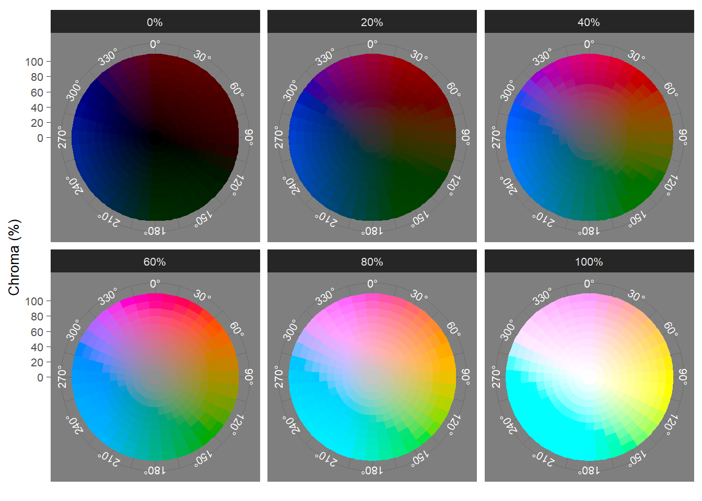

# Analysing film colour {#colour}

```{r colour-top-code-load, echo=FALSE}
pacman::p_load(here, tidyverse, farver, imager)
```

Like sound design, colour shapes our experience of the cinema in many different ways. Different genres are associated with different colour schemes and with different levels of brightness and saturation [@chen2012ccui; @redfern2021cpiu] so that we can identify a genre the its use of warm and cool colours, the level of the lightness of the image, and the level of saturation [@bellantoni2005iips]. Colours within a film carry meanings determined by the local economy of the individual text, associated with narratively significant objects, characters, locations, and themes, that nonetheless exist within the culturally codified of meanings colour shared by audiences belonging to a particular culture. Colour acts as a unifying factor, fusing together different aspects of film style including production design, costume design, lighting, cinematography, and post-production colour processing to create a coherent world for the viewer [@rotem2003tsro]. Changes in the dominant colour of a film often mark changes in mood, location, and the evolution of characters. Colour organises our attention as viewer, separating the foreground and background and drawing our attention to what is most important within a frame. Colour sets the mood of a film, conveying emotional information about the internal lives of characters and the state of the on-screen world while also eliciting emotional repsonses from the viewer, influencing both what we feel and the intensity of those emotions [@detenber2021tiof].

In this chapter we will cover how to use R to analyse colour in motion pictures. We will learn how to sample frames from a film using the av package to pass commands to FFmpeg; how to calculate the average colour and colourfulness of a frame; how to create a colour palette for a film using cluster analysis; and how to analyse at the temporal structure of colours in a film using movie barcodes.

## Colour models and spaces

A [colour model](https://en.wikipedia.org/wiki/Color_model) is a mathematical model describing the ways a colour can be represented as an ordered, immutable list of numbers or [tuple](https://en.wikipedia.org/wiki/Tuple).

A [colour space](https://en.wikipedia.org/wiki/Color_space) is a geometrical model that maps a colour model onto to actual colours to define the range of colours capable of being represented as determined by its [gamut](https://en.wikipedia.org/wiki/Gamut) (the range of a colour space's chromaticity), [gamma](https://en.wikipedia.org/wiki/Gamma_correction) (the non-linear distribution of luminance values), and [whitepoint](https://en.wikipedia.org/wiki/White_point) (a standard illuminant that defines the colour temperature of white within a colour space).

In this chapter we will work with three colour models and colour spaces: RGB, L\*a\*b\*, and LCH(ab).

### RGB
The [RGB colour model](https://en.wikipedia.org/wiki/RGB_color_model) (Figure \@ref(fig:colour-spaces-gif-rgb)) is an additive colour model in which colours are defined by the chromaticity of red, green, and blue primaries. Colours are specified as a tuple of RGB values with one number for each colour channel, with each channel represented on a scale of $[0, 1]$ or $[0, 255]$. For example, red has the maximum amount of red light but no green or blue light is given by the tuple $(1, 0, 0)$ or $(255, 0, 0)$, whereas magenta has the maximum amount of red and blue light but no green and is specified as $(1, 0, 1)$ or $(255, 0, 255)$. When all the values in an RGB tuple are equal then the specified colour is achromatic, ranging from black $(0, 0, 0)$ to white ($(1, 1, 1)$ or $(255, 255, 255)$), with greys lying between these extremes. For example, middle grey is $(0.5, 0.5, 0.5)$ or $(128, 128, 128)$. 

The different scales used to represent RGB colours are equivalent and it is easy to convert between them by multiplying or dividing by 255. There is no standard way to represent RGB colours in R. Some packages use the $[0, 1]$ scale while others us $[0, 255]$. For consistency, we will use the latter here because this is how RGB colours are expressed in image and video processing software.

RGB colours can also be specified using hex codes by converting the tuple of decimal numbers to [hexadecimal](https://en.wikipedia.org/wiki/Hexadecimal) format. This is typically how numbers are represented in R when plotting. Each channel is described by a two character hex code in the range $[00, FF]$ and respects the ordering of the RGB tuple to form a [hex triplet](https://en.wikipedia.org/wiki/Web_colors#Hex_triplet): $\#RRGGBB$. Thus, the hex code for red is $\#FF0000$ and the hex code for mid-gray is $\#808080$.

```{r colour-spaces-gif-rgb, echo=FALSE, fig.align='center', fig.cap="The RGB colour space (18-bit) (CC-BY-SA 4.0: 	Kjerish)"}

knitr::include_graphics("https://upload.wikimedia.org/wikipedia/commons/e/e8/18-bit_RGB_Cube.gif")
```

RGB is the most common colour model used for devices that project light, and so is the default colour space for televisions and computer monitors. Colour spaces using the RGB colour model include [sRGB](https://en.wikipedia.org/wiki/SRGB), which is the colour space of the world wide web; [Rec.709](https://en.wikipedia.org/wiki/Rec._709), the colour space used by high definition television; and [Rec.2020](https://en.wikipedia.org/wiki/Rec._2020), which is the colour space used by ultra-high definition television.

RGB is not a [perceptually uniform](https://programmingdesignsystems.com/color/perceptually-uniform-color-spaces/) colour model -- that is, the distances between two colours is *not* proportional to the [Euclidean distance](https://en.wikipedia.org/wiki/Euclidean_distance) between them and so differences in the RGB values do not reflect the differences that we perceive between colours. We will use RGB colour values in our project to display colours on screen, but when performing calculations or plotting the distribution of colours we will use perceptually uniform colour spaces.

### CIELAB

The [CIELAB colour model](https://en.wikipedia.org/wiki/CIELAB_color_space) or L\*a\*b\* is a perceptually uniform colour space defined by three attributes:

-  Lightness (L\*): the perceptual lightness of a colour in the range $[0\%, 100\%]$
-  a\*: the chromaticity of a colour on the green (-a\*) -- red(+a\*) axis
-  b\*: the chromaticity of a colour on the blue (-b\*) -- yellow (+b\*) axis

Achromaticity occurs when a\* = b\* = 0, ranging from black (L\* = 0%) to white (L\* = 100%), with greys lying between these limits. Figure \@ref(fig:colour-spaces-plot-lab) plots swatches from the CIELAB colour space for a range of lightness values.

```{r colour-spaces-plot-lab, echo=FALSE, out.width="90%", fig.align='center', fig.cap="Swatches from the CIELAB colour space for a range of lightness values."}
lab_data <- expand.grid(l = seq(0, 100, 20), a = seq(-120, 120, 20), b = seq(-120, 120, 20))
names(lab_data)[1:3] <- c("L", "A", "B")
lab_rgb <- convert_colour(lab_data, from = "lab", to = "rgb")
lab_plot <- cbind.data.frame(lab_data, lab_rgb)

l_labels <- c(`0` = "0%",
              `20` = "20%",
              `40` = "40%",
              `60` = "60%",
              `80` = "80%",
              `100` = "100%")

ggplot(data = lab_plot) +
  geom_rect(aes(xmin = A, xmax = A + resolution(A), ymin = B, ymax = B + resolution(B), 
                               fill = rgb(r, g, b, maxColorValue = 255)), colour = "white", size = 0.1) +
  facet_wrap(~L, labeller = as_labeller(l_labels)) +
  scale_x_continuous(name = "Green - Red (a*)", breaks = seq(-110, 130, 40), labels = seq(-120, 120, 40)) +
  scale_y_continuous(name = "Blue - Yellow (b*)", breaks = seq(-110, 130, 40), labels = seq(-120, 120, 40),
                     sec.axis = dup_axis(name = NULL)) +
  scale_fill_identity() +
  theme_dark() +
  theme(axis.title = element_text(size = 10),
        axis.text = element_text(size = 8),
        strip.text.x = element_text(size = 8))
```

The range of a\* and b\* is theoretically unlimited, though typically is clamped to the range $[-128, 127]$. Note that this is *not* true for the [colorspace](https://colorspace.r-forge.r-project.org) package, which clamps the range to $[-100, 100]$. Converting between colour spaces should be done with the same package in a project to avoid errors resulting from different ways of representing colours. For example, converting RGB colours to CIELAB using the colorspace package and then converting back to RGB with the farver package will *not* reproduce the original RGB colours because these packages express the ranges of a\* and b\* differently. Either package can be used for the purposes of analysis, but it is best to use only one package for colour conversion in a project. In this chapter we will use the farver package.

### LCH(ab)

The L\*a\*b\* colour space is perceptually uniform but it is not intuitive. LCH(ab) is a [polar representation](https://en.wikipedia.org/wiki/CIELAB_color_space#Cylindrical_model) of the L\*a\*b\* colour space that is much easier to understand. LCH(ab) has three colour attributes:

-  Lightness (L): this is identical to the L\* value defined for the L\*a\*b\* colour space above
-  Chroma (C): the saturation of a colour measured as the distance from the achromatic axis in the range $[0\%, 100\%]$
-  Hue (H): the basic colour represented as the angle on a colour wheel, where red = 0&deg;, yellow = 90&deg;, green = 180&deg;, and blue = 270&deg;.

Achromatic colours occur when C = 0%, and vary with lightness, from black (L = 0%) to white (L = 100%), with arbitrary values for hues. Figure \@ref(fig:colour-spaces-plot-lch) plots slices of the LCH(ab) colour space for a range of lightness values.

```{r colour-spaces-plot-lch, echo=FALSE, out.width="90%", fig.align='center', fig.cap="The LCH(ab) colour space sliced at a range of lightness values"}

```

We can calculate the [*saturation*](https://en.wikipedia.org/wiki/Colorfulness#CIELUV_and_CIELAB) of a colour from its lightness and its chroma:

$$
S_{ab} = 100 \times \frac{C_{ab}}{\sqrt{C_{ab}^{2} + L_{ab}^{2}}} ,
$$

where saturation represents the proportion of pure chromatic colour in the total colour experience. 

## Set up the project

### Create the project folder

The first tasks are to create a project in RStudio with a new folder called `Colour` that will be the working directory for this chapter and will contain the associated `.rproj` file. Once this step is completed, we can run the script `projects_folders.R` we created in Chapter \@ref(tools) to create the folder structure required for the project.

We will create some additional folders during the course of the project.

### Packages

In this chapter we will use the packages listed in Table \@ref(tab:colour-project-package-list).

```{r colour-project-package-list, results="asis", echo = FALSE}
packages <- read_csv(here("Data", "packages.csv"))

packages %>% 
  filter(chapter == "colour") %>%
  select(-chapter) %>%
  arrange(Package) %>% 
  knitr::kable(caption = "Packages for analysing colour data.") %>%
  kableExtra::kable_styling(bootstrap_options = c("striped"), font_size = 14)
```


### *Fuelled*

In this chapter our data set will be *Fuelled* (Video [5.1](#vid51)), a short animated film created by students at Sheridan College, Ontario, that premiered on YouTube in December 2021.

The film tells the story of Cathy, a cat widowed when a dog murders her husband, and who sets out to find the killer. When her car runs out of fuel in a forest and she finds that she has also run out of money, Cathy resorts to stealing from a gas station, leading her to assault the attendant leading to an explosion that destroys the gas station. Realising that she has become like the killer she is chasing, Cathy calls 911 and waits.

***

[ ]{#vid51} 
<center><iframe width="560" height="315" src="https://www.youtube.com/embed/uVzT6D-yhZg" title="YouTube video player" frameborder="0" allow="accelerometer; autoplay; clipboard-write; encrypted-media; gyroscope; picture-in-picture" allowfullscreen data-external="1">></iframe></center>

<p class="caption">
Video 5.1: *Fuelled* (2021) &#169; KilledtheCat Productions. `r emo::ji("point_up")`
</p>
***

We can download this film from YouTube and place it in our `Data` folder. Using `av::av_media_info()` we can get a summary of the video file, including the duration of the film in seconds and information about width, height, number of frames, and the frame rate  of the video and sampling and bit rates and the number of audio samples of the audio, as well as the video and audio codecs.

```{r colour-fuelled-code-summarise, eval=FALSE}
# Load the here and av packages
pacman::p_load(av, here)

# Get a summary of the video file fuelled.mp4
av_media_info(here("Data", "fuelled.mp4"))
```

```{r colour-fuelled-output-summary}
## $duration
## [1] 542.6735
## 
## $video
##   width height codec frames framerate  format
## 1  1280    536  h264  13024        24 yuv420p
## 
## $audio
##   channels sample_rate codec frames bitrate layout
## 1        2       44100   aac  23371  128004 stereo
```

#### Sample and reduce
Each frame of *Fuelled* is made up of 1280 by 536 pixels, with each pixel comprised of the three channels of the RGB colour space. Therefore, to represent the complete colour information of a single frame we will need $3 \times 1280 \times 536 = 2,058,240$ numbers. With a frame rate of 24 frames-per-second and a running time of 542.6735 seconds, there are a total of 13024 frames. To completely represent the colour information in *Fuelled* requires $2,058,240 \times 13,024 = 26,806,517,760$ data points. A data set comprising almost 27 billion data points is too large for analysis -- and this represents a *very small* dataset (how many data points would be needed for a for a two-hour long 4K Ultra HD film at 60fps?). Furthermore, much of this data will be redundant as frames in the same scene will be very similar to one another. 

All analyses of film colour are therefore based on the same two-stage process of in order to reduce the amount of data to a manageable level and to eliminate redundant data. First, frames are *sampled* from the film, selecting either every *n*-th frame or *n* frames per second. The second stage is to *reduce* the colour data in each sampled frame to a small set of values or a single value that represents the frame, such as the average colour of a frame, its colourfulness, or any of its colour attributes (such as lightness, chroma, saturation, etc.).

For example, [movie barcodes](https://moviebarcode.tumblr.com) are a popular way of representing colour information in a film and are constructed by selecting a set of frames from a film before either reducing that frame to a single pixels width or smoothing the data by averaging the colours within each of the selected frames. We will represent colour information in *Fuelled* as a [barcode](#barcode).

Other methods employed in computational analyses of film colour, including cinemetrics, z-projections, palettes, treemaps, Color_dT plots (see @flueckiger2020maat for an overview), all apply some version of the sample-and-reduce approach.

From the *Fuelled* `.mp4` file we want to extract a large enough number of frames that our sample will be representative of the film without oversampling redundant information that will only serve to slow down our processing of the data.

The function `av::av_video_images()` splits a video file into frames, with the number of frames sampled controlled by the `fps` argument. A sampling rate of $\frac{1}{1}=1$ will return one frame-per-second. Increasing the numerator will increase the sample rate -- a sampling rate $\frac{2}{1}=2$ will sample two frames every second; whereas a increasing the denominator will reduce the sampling rate -- a sampling rate of $\frac{1}{2}=0.5$ will sample one frame very two seconds. Sampling *Fuelled* at a rate of two frames-per-second will give us a data set of 1085 frames to analyse.

```{r av-fuelled-code-sample, eval=FALSE}
av_video_images(here("Data", "fuelled.mp4"), destdir = here("Data", "Frames"), 
                format = "jpg", fps = 2)
```

We can create a folder to store the frames within our `Data` folder directly within the call to `av_video_images()`. Sampled frames can be either `.jpg` or `.png` files, with the latter returning lossless images with larger file sizes.

---

<details><summary style="font-size:16px; font-weight: bold;">`r emo::ji("point_left")` Click here to find out how to collect colour data using the chromaR package</summary>

```{block, type = "rmdimportant"}
<h3 style="margin-top: -5px;">Collecting data using chromaR</h3>

As part of the chromaR toolkit for analysing colour in motion pictures, Tommaso Buonocore has provided a [MATLAB](https://www.mathworks.com/products/matlab.html) script that will create a `.csv` file containing the average colour in the sRGB colour space of *every* frame of video file. You can access the script (videoProcessing.m) on the GitHub repository for [chromaR](https://github.com/detsutut/chroma).

In order to run this script you will need to have access to MATLAB, which is much quicker than performing the same process of sampling frames and calculating the average colour in R. However, MATLAB is paid-for software and is *not* cheap.

For those who do not have access to MATLAB or cannot afford to purchase it, I have produced an alternative version of Buonocore's MATLAB script that will run in [Octave](https://www.gnu.org/software/octave/index), a freely-available open-source alternative to MATLAB. You can find this script and the instructions for using it on my GitHub repository: [VideoProcessingOctave](https://github.com/DrNickRedfern/VideoProcessingOctave).

The `.csv` file containing the RGB values of each frame created from this script can be used for colour analysis in chromaR or by the methods illustrated here instead of creating a data frame by sampling and processing frames from a film.
```

</details>

---

## Analysing *Fuelled*

```{r colour-analysing-code-data, echo=FALSE}
df_fuelled <- read_csv(here("Data", "fuelled.csv"))
df_average_colours <- df_fuelled %>% select(-M3)
df_M3 <- df_fuelled %>% select(frame, frame_id, time, M3, r, g, b)
```

### The average colour of a frame
One of the most common ways of reducing the colour data of an frame is to calculate the average colour, which is defined as the tuple of the average values of the individual attributes of a colour space. That is, to find the average colour of a frame in the CIELAB colour space we need to calculate the average of the L\*, a\*, and b\* attributes separately and form the tuple to from those averages. Typically, the average used is the mean, but the median and mode can also be used to determine the average colour of a frame [@plutino2021mbas].

First, we will get a list of all the images in the frames folder using the `list.files()` function. We want to include all the `.jpg` files so we set `pattern = "*.jpg$`, where `*` is a wildcard that will ignore the part of the filename before the extension `.jpg` and by adding `$` after the extension we tell R to find the pattern `jpg` at the *end* of the string that is the filename of the image.

```{r colour-average-code-list, eval=FALSE}
# get list of jpg files in the Frames directory
images <- list.files(here("Data", "Frames"), pattern = "*.jpg$")

head(images)
```

```{r colour-average-output-head}
## [1] "image_000001.jpg" "image_000002.jpg" "image_000003.jpg" "image_000004.jpg"
## [5] "image_000005.jpg" "image_000006.jpg"
```

To do this we will loop over all the frames sampled from *Fuelled* and extract the red, green, and blue colour channels of each image. The RGB values are multiplied by 255 for scaling. We will then convert these colour values using `farver::convert_colour()` to the CIELAB colour space and get the mean value of each parameter ($\widehat{L^{*}}$, $\widehat{a^{*}}$, $\widehat{b^{*}}$). Next, we convert the tuple of the mean colour in CIELAB to the LCH(ab) colour space and to RGB for plotting. It is important to remember that names in R are case-sensitive, and so we will name colour attributes in the CIELAB and LCH(ab) colour spaces using UPPERCASE letters and we will name the RGB attributes using lowercase letters. This will help us to avoid confusing the b\* attribute in L\*a\*b\* colour space with the blue channel of the RGB colour space, which will be named `B` and `b` respectively. `farver::convert_colour()` gives all attributes in all colour spaces lowercase names by default, so that b\* and blue are both represented by `b`, and without taking this into account we would overwrite the b\* attribute with the blue channel when we do the final conversion to RGB and lose some key data.

In this loop we will also do a couple of other tasks. We will calculate the time of each frame so that we can analyse how colour evolves over time. We will also calculate the saturation of a frame from its chroma (C) and lightness (L), taking care to ensure that the saturation is set to 0 for achromatic colours (i.e., when C = 0%) and avoiding `NA` values in the data frame. This is easily done using `dplyr::if_else`, which will check to see if C = 0 (NB: note that this requires double equal signs `==` to represent the logical version of `is equal to`) and return 0 when this condition is `TRUE` and calculate the saturation from C and L when it is `FALSE`. We will also tidy up as we go, using the function `rm()` to remove objects from the workspace once they are no longer required so that we don't have large objects hanging around when they are not needed.

```{r colour-average-code-get, eval=FALSE}
# Load the tidyverse and farver packages
pacman::p_load(tidyverse, farver)

# Create an empty data frame to store the result of each frame
df_average_colours <- data.frame()

# Set frame to zero; frame is used as an index and to calculate the time of a frame
frame <- 0

for (i in images){
  
  # Increment frame each time the loop starts
  frame <- frame + 1
  
  # Grab the name of each image to use as an identifier and drop the file extension
  frame_id <- gsub(pattern = ".jpg$", "", basename(as.character(i)))
  
  # Calculate the time of the frame
  time <- frame * 0.5
  
  # Load the i-th frame using imager::load.image()
  im <- load.image(here("Data", "Frames", i))
  
  # Separate R, G, B channels and gather as a data frame
  rgb <- cbind(R(im), G(im), B(im)) %>% as.data.frame %>% 
    rename(r = 1, g = 2, b = 3) %>%
    mutate(r = r * 255, g = g * 255, b = b * 255) # multiply by 255 to scale correctly
  
  # Remove the image from the workspace once we've collected the colour data
  rm(im)
  
  # Convert to RGB to CIELAB colour space using farver::convert_colour()
  lab <- convert_colour(rgb, from = "rgb", to = "lab")
  # Remove the rgb data frame as we no longer need it
  rm(rgb)
  
  # Calculate the mean values of each attribute in the L*a*b* colour space
  pix_lab <- data.frame(L = mean(lab$l), 
                        A = mean(lab$a), 
                        B = mean(lab$b))
  # Remove the lab data frame as we no longer need it
  rm(lab)
  
  # Convert to LCH(ab) colour space using farver::convert_colour()
  pix_lch <- convert_colour(pix_lab, from = "lab", to = "lch") %>%
    rename(L = l, C = c, H = h) # using uppercase letters for consistency
  
  # Calculate the saturation from the chroma and lightness:
  # if a colour is achromatic (i.e. C = 0) then the saturation is also 0 - 
  # this avoids NA values in the data frame
  pix_lch <- pix_lch %>% mutate(S = if_else(C == 0, 0, 100*(C/sqrt(C^2 + L^2))))
  
  # Drop the L parameter from pxi_lch because it is the same as the L parameter in pix_lab
  pix_lch <- pix_lch %>% select(C, H, S)
  
  # Convert the mean CIELAB values to RGB using farver::convert_colour() for plotting -
  # the RGB values will be identified by lowercase letters
  pix_rgb <- convert_colour(pix_lab, from = "lab", to = "rgb")
  
  # Collect all the results for a frame
  pix <- cbind.data.frame(frame, frame_id, time, pix_lab, pix_lch, pix_rgb)
  
  # Add the results to the data frame for export
  df_average_colours <- rbind.data.frame(df_average_colours, pix)

}
```

Table \@ref(tab:colour-table-average) displays the average colour for outputted by the `for` loop selected frames.

```{r colour-average-table-results, results='asis', echo=FALSE}
pacman::p_load(DT)

df_average_colours_dt <- df_average_colours %>% 
  select(-cluster) %>%
  mutate(across(4:12, ~ sprintf("%.2f", round(.x, 2)))) %>%
  mutate(time = sprintf("%.1f", round(time, 1)))

datatable(df_average_colours_dt[101:110,], rownames = FALSE, class = "cell-border stripe", extensions = 'FixedColumns', 
          options = list(dom = 't',
                         scrollX = TRUE, 
                         scrollCollapse = TRUE, 
                         paging = FALSE,
                         autoWidth = TRUE,
                         fixedColumns = TRUE,
                         columnDefs = list(
                           list(className = 'dt-right', targets = 0),
                           list(className = 'dt-right', targets = 2:11),
                           list(className = 'dt-center', targets = 1)),
                         initComplete = JS("function(settings, json) {",
                                           "$(this.api().table().header()).css({'font-size': '12pt'});", "}"))) %>%
  formatStyle(columns = colnames(df_average_colours_dt), fontSize = '10pt')

cat("<table width=100%>", paste0("<caption>", "(#tab:colour-table-average)", "Average colour in selected frames from ", "<em>Fuelled</em>", ". ", "&#9757;", "</caption>"),"</table>", sep = "\n")
```

---

<details><summary style="font-size:16px; font-weight: bold;">`r emo::ji("point_left")` Click here to learn about vectorisation in R</summary> 

```{block, type = "rmdimportant"}
<h3 style="margin-top: -5px;">Vectorisation</h3>

R functions are *vectorised* and will operate on all elements in a vector without requiring an explicit `for` loop to apply a function to elements in a vector one at a time.

For example, when we convert the colour values of RGB colours from the $[0, 1]$ scale to $[0, 255]$ we multiply the red colour channel `RED` by 255 and every individual value in that vector is multiplied by 255.

<script src="https://gist.github.com/DrNickRedfern/a6092ae449ae0673c8122781fdb3e221.js"></script>

We can also add together two vectors of equal length *elementwise*, with the first element of the vector `X` added to the first element of the vector `Y`, the second element of `X` added to the second element of `Y`, and so on.

<script src="https://gist.github.com/DrNickRedfern/db8410547fdeb9c5aa84e5c563fa16ad.js"></script>

Other fundamental operations in R are vectorised, including subtraction, division, logical tests, and matrix operations.

Vectorisation makes code easy to read and efficient to run.

```

</details>

---

To visualise the distribution of the average frame colours in the L\*a\*b\* colour space we can plot the a\* and b\* attributes (Figure \@ref(fig:colour-average-plot-lab).A). A limitation of Figure \@ref(fig:colour-average-plot-lab).A is that data points may overlap, especially for where a\* = b\* = 0, making it difficult to see the distribution of colours in a film. To overcome this, we can plot the density of data points using `ggplot2::geom_density_2d_filled()` (Figure \@ref(fig:colour-average-plot-lab).B).

```{r colour-average-plot-lab, out.width="90%", fig.align = "center", fig.height = 7, fig.cap = "The (A) distribution and (B) density of the average colour of 1085 frames sampled from *Fuelled* in L\\*a\\*b\\* colour space."}
pacman::p_load(ggpubr, viridis)

# Create the plot
lab_plot <- ggplot(data = df_average_colours) + 
  geom_point(aes(x = A, y = B, colour = rgb(r, g, b, maxColorValue = 255))) + 
  scale_x_continuous(name = "Green - Red (a*)") +
  scale_y_continuous(name = "Blue - Yellow (b*)") +
  scale_colour_identity() + 
  theme_minimal()

lab_plot_2d <- ggplot(data = df_average_colours) +
  geom_density_2d_filled(aes(x = A, y = B), bins = 20) +
  scale_x_continuous(name = "Green - Red (a*)") +
  scale_y_continuous(name = "Blue - Yellow (b*)") +
  guides(fill = "none") +
  theme_minimal()

# Combine the plots into a single figure
lab_figure <- ggarrange(lab_plot, lab_plot_2d, nrow = 2, align = "v", labels = "AUTO")

# Call the figure
lab_figure
```

Figure \@ref(fig:colour-average-plot-lch) plots the same data in the LCH(ab) colour space, using `coord_polar()` to plot the hue values as an angle of the colour wheel.

```{r colour-average-plot-lch, out.width="90%", fig.align='center', fig.cap="(A) Polar representation of hue and chroma and (B) chroma and lightness of average frame colour for 1085 frames sampled from *Fuelled*."}
# Plot the average colour of a frame using hue and chroma
lch_plot <- ggplot(data = df_average_colours) + 
  geom_point(aes(x = H, y = C, colour = rgb(r, g, b, maxColorValue = 255))) +  
  scale_colour_identity() +  
  coord_polar(theta = "x") +  
  scale_x_continuous(limits = c(0, 360), breaks = seq(0, 330, 30)) +  
  scale_y_continuous(name = "Chroma (%)", limits = c(0,100)) +  
  theme_minimal() +  
  theme(axis.title.x = element_blank())

# Plot chroma against lightness
chroma_light_plot <- ggplot(data = df_average_colours) +  
  geom_point(aes(x = C, y = L, colour = rgb(r, g, b, maxColorValue = 255))) +  
  scale_colour_identity() +  
  labs(x = "Chroma (%)",  
       y = "Lightness (%)") +  
  theme_minimal()

# Combine the plots into a single figure
lch_figure <- ggarrange(lch_plot, chroma_light_plot, 
                        ncol = 2, align = "h", labels = "AUTO")

# Call the figure
lch_figure
```

Plotting the average colours of the sampled frames, we see that *Fuelled* uses a colour palette characterised by two features. First, we see a dominant axis from dark grayish cyans to moderate reds, passing through achromatic colours at the origin and dark desaturated reds. The cyans and desaturated reds are the average colours of the frames are used for the gas station and the forest, respectively. The moderate reds with higher chroma and lightness are used exclusively for the flashback sequences in which Cathy remembers being with her husband. Second, there are two groups of pixels perpendicular to the main axis comprising yellow and orange hues, associated with the explosion at the gas station, and very dark blues, used for the forest at night when Cathy runs out of fuel. Clearly, the students who made this film selected the colours carefully and purposefully when making this film, using complementary colours across two axes for a tetradic palette.

It is also clear from the polar version which colours are missing from the palette, with no pixels in the lime green (H = 120&deg;) and blue (H = 240&deg;) regions. The chroma of the frames is limited and there is a strong relationship between chroma and lightness.

### Colourfulness
*Colourfulness* is an attribute of our visual sensation of colour and refers to the perceived intensity of a colour [@fairchild2013camx: 90-96]. The colourfulness of an image is dependent on the range and vividness of colours in an image, increasing with increasing illumination unless an image is very bright, and describes the degree to which an observer perceives a colour to be more or less chromatic [@zerman2019ceci]. Although colourfulness cannot be measured because it is a part of a perceiver’s experience, it can be quantified using low-level attributes of colour spaces that correlate to categories on psychometric scales.

@hasler2003mcin define a simple colourfulness metric, $M_{3}$, that is a linear combination of the mean and standard deviation of the distribution of pixels in an opponent sRGB colour space defined by $rg=R-G$ and $yb=0.5(R+G)-B$. The $M_{3}$ metric is then calculated as 

$$
M_{3}=\sigma_{rgyb}+0.3\mu_{rgyb}\ ,
$$

where

$$
\sigma_{rgyb}=\sqrt{\sigma_{rg}^2+\sigma_{yb}^2}
$$

and

$$
\mu_{rgyb}=\sqrt{\mu_{rg}^2+\mu_{yb}^2}\ .
$$

The interpretation of the metric is based on a category scaling experiment in which subjects rated the colourfulness attributes of images, with the following values of the M3 metric assigned to colourfulness attributes: 

-  not colourful = 0
-  slightly colourful = 15
-  moderately colourful = 33
-  averagely colourful = 45
-  quite colourful = 59
-  highly colourful = 82
-  extremely colourful = 109

The $M_{3}$ metric showed a 95% correlation with the subjective experience of colourfulness of subjects participating in the experiment.

Rather than create a new function to calculate the colourfulness of a frame we can import a function I have already created directly from GitHub using the devtools package. Note that in order to source a function from GitHub it is necessary to access the `raw` version of the file.

```{r colour-colourfulness-source-HSM3}
# Source the function from GitHub - requires the devtools package to be installed
devtools::source_url("https://github.com/DrNickRedfern/HSM3/blob/master/HSM3.R?raw=TRUE")
```

You can find the code for the `HSM3()` function on the [HSM3](https://github.com/DrNickRedfern/HSM3) repository. We can write another loop similar to the one we used to get the average colour of each frame.

```{r colour-colourfulness-code-M3, eval=FALSE}
# Create an empty data frame to store the results
df_M3 <- data.frame()

# Loop
for (i in images){
  
  frame_id <- gsub(pattern = ".jpg$", "", basename(as.character(i)))
  im <- load.image(here("Data", "Frames", i))
  
  # Apply the HSM3 to get the colourfulness of an image
  M3 <- HSM3(im)
  rm(im)
  
  res <- cbind.data.frame(frame_id, M3)
  df_M3 <- rbind.data.frame(df_M3, res)
  
}

df_M3 <- df_M3 %>% mutate(frame = 1:length(df_M3$M3),
                    time = frame * 0.5) %>%
  relocate(frame, .before = "frame_id") %>%
  relocate(time, .after = "frame_id")

# Add the RGB values of the average frame colour from df_average_colours for plotting
df_M3 <- cbind(df_M3, df_average_colours[10:12])
```

Figure \@ref(fig:colour-colourfulness-plot-M3) plots the colourfulness of the sampled frames.

```{r colour-colourfulness-plot-M3, out.width="90%", fig.align='center', fig.cap="The temporal evolution of Colourfulness in *Fuelled*."}
ggplot(data = df_M3) + 
  geom_path(aes(x = time, y = M3), colour = "grey40") +
  geom_point(aes(x = time, y = M3), 
             colour = rgb(df_M3$r, df_M3$g, df_M3$b, maxColorValue = 255)) +
  geom_smooth(aes(x = time, y = M3), 
              method = "loess", span = 0.2, se = FALSE, colour = "black") +
  scale_x_continuous(name = "Time (s)", limits = c(0, 542.6735), 
                     breaks = seq(0, 500, 50), expand = c(0.01, 0.01)) +
  scale_y_continuous(name = "Colourfulness", limits = c(0, 130), 
                     breaks = c(0, 15, 33, 45, 59, 82, 109)) +
  theme_minimal() +
  theme(legend.position = "none",
        panel.grid.minor.y = element_blank())
```

From Figure \@ref(fig:colour-colourfulness-plot-M3) we can see that there is still a lot of redundancy in the data and we can reduce by the number of frames further by eliminating sampled frames that are similar to previous frames. One strategy by which we could achieve this is to calculate the difference in colourfulness between consecutive frames and keep only those frames when the difference is above a threshold, but this will only keep frames separated by large differences in the $M_{3}$ metric. A better strategy is to calculate the difference for frames from a reference frame until a threshold is reached and then use that frame as a new reference frame against which subsequent frames are compared. This will retain more data because it takes into account changes in colourfulness that may arise from gradual transitions, such as the scale of shot changing due to camera movements or zooms in or out, while also retaining the sharp differences in colourfulness that occur with cuts between scenes and locations.

To achieve this goal we can create a function called `frame_picker()` which will store the colourfulness of the first frame of the sample and then compare that frame against each subsequent frame until an [absolute difference](https://en.wikipedia.org/wiki/Absolute_difference) exceeding a pre-specified threshold (`t`) is reached and then add that frame to the reduced data set. The process then starts again comparing frames against the new reference frame until the threshold is reached and the data for a third frame is added to the reduced data set and that third frame becomes the new reference frame, and so on, until all the frames in the sample have been processed.

```{r colour-colourness-code-picker}
frame_picker <- function(x, t){
  
  n <- length(x)  # Number of frames in the sample
  i <- 1; j <- i + 1  # Set initial values for frames to be compared
  
  # Create a data frame - 
  # the first value is the colourfulness of the first frame
  df <- cbind(i, x[i])
  
  # Loop over 
  while(j <= n){
    # Check if the absolute difference between frames is greater than the threshold
    if (abs(x[j] - x[i]) > t){
      df_a <- cbind(j, x[j])
      i <- j  # Update the reference frame
    } else {
      i <- i
      df_a <- NULL} 
    df <- rbind(df, df_a)
    j <- j + 1  # Increment j
  }
  
  return(df)
  
}
```

---

<details><summary style="font-size:16px; font-weight: bold;">`r emo::ji("point_left")` Click here to learn about control flow in R</summary> 

```{block, type = "rmdimportant"}
<h3 style="margin-top: -5px;">Control flow</h3>

Control statements are expressions that control the flow of a block of code based on the conditions provided in the statements, and include logical tests (`if()`, `ifelse()`) and loops (`for()`, `while()`). 

In R, conditions in control statements are placed within parentheses `()` and code to be executed when a condition is satisfied is placed within braces `{}`.

<h4 style="margin-top: -5px;">Logical tests</h4>
An `if` statement will execute a block of code only if a condition is satisfied. If the condition is not satisfied, the block of code is not run.

<script src="https://gist.github.com/DrNickRedfern/a7b78d83556e166c0f7ef44a15e0a53f.js"></script>

An `ifelse` statement will execute one block of code if a condition is satisfied and execute a different block of code if the condition is not satisfied. Multiple conditions can be applied by adding `elseif` statements to the flow.

<script src="https://gist.github.com/DrNickRedfern/085ed7b804b743abc8d68a0db210a6ee.js"></script>

The dplyr package has the function `if_else()`, which has stricter conditions than R's base `ifelse()` function and checks if the `TRUE` and `FALSE` conditions have the same type. The `if_else()` function can be faster to execute.

<h4 style="margin-top: -5px;">Loops</h4>
A `for` loop iterates over a list of elements, applying a block of code to each element. `for` loops can be nested within one another to loop over multiple lists of elements.

<script src="https://gist.github.com/DrNickRedfern/6055e05140d30ed90da63011719deaa5.js"></script>

A `while` loop iterates over a list of elements applying a block of code to each element until a condition is no longer met and the loop stops.

<script src="https://gist.github.com/DrNickRedfern/19d563c05772c052f32ee204b976d9c7.js"></script>

When constructing loops it is important to determine which parts of code need to be inside the loop (i.e., with the braces `{}`) and which parts need to be outside the loop. For example, if we need to store the outcome of each pass of the loop then it is necessary to create a data structure *outside* the loop so that is not created anew each time the loop runs, thereby losing the data produced by previous passes.

In the `for` loop to calculate the colourfulness of the frames we sampled from *Fuelled*, we created the data frame `df_M3` as an empty data frame outside the loop and wrote the results of each pass of the loop by adding a new row to `df_M3` using `rbind.data.frame()`. The results for *every* frame will persist when the loop exits. The objects `frame_id`, `im`, `M3`, and `res` are created within the loop and are overwritten with every pass of the loop. The final values of these objects will relate to the last image processed when the loop exits.
```

</details>

---

Applying the `frame_picker()` function to our sample of 1085 frames from *Fuelled* with a threshold of `t = 4` gives is a reduced sample of 191 frames (Table \@ref(tab:colour-colourfulness-table-picked)).

```{r colour-colourfulness-code-picking}
# Pick frames with  threshold of 4
res <- frame_picker(df_M3$M3, 4)

# Filter in only those frames from the data frame df_M3 that were picked
df_M3_reduced <- df_M3 %>% 
  filter(frame %in% res)
```

<div style = "width:80%; height:auto; margin: auto;">
```{r colour-colourfulness-table-picked, results = "asis", echo=FALSE}
df_M3_reduced_dt <- df_M3_reduced %>% 
  mutate(time = sprintf("%.1f", round(time, 1))) %>%
  mutate(across(4:7, ~ sprintf("%.2f", round(.x, 2))))

datatable(df_M3_reduced_dt, rownames = FALSE, class = "cell-border stripe", extensions = 'FixedColumns', 
          options = list(dom = 't',
                         autoWidth = TRUE,
                         fixedColumns = FALSE,
                         columnDefs = list(
                           list(className = 'dt-right', targets = 0),
                           list(className = 'dt-right', targets = 2:6),
                           list(className = 'dt-center', targets = 1)),
                         initComplete = JS("function(settings, json) {",
                                           "$(this.api().table().header()).css({'font-size': '12pt'});", "}"))) %>%
  formatStyle(columns = colnames(df_M3_reduced_dt), fontSize = '10pt')

cat("<table width=100%>", paste0("<caption>", "(#tab:colour-colourfulness-table-picked)", "The colourfulness of picked frames from ", "<em>Fuelled</em>", " using a threshold of t = 4. ", "&#9757;", "</caption>"),"</table>", sep = "\n")
```
</div>

Plotting the reduced sample against time (Figure \@ref(fig:colour-colourfulness-plot-reduced)) we see that even when discarding 894 frames (82.4%) of the sample that the trends in the colourfulness over the course of the film remain largely intact. We can get a good idea of how colourfulness evolves of the course of *Fuelled* from these 191 frames representing just 1.5% of the total number of frames in the film.

```{r colour-colourfulness-plot-reduced, out.width="90%", fig.align='center', fig.cap="The temporal evolution of colourfulness in *Fuelled* using the reduced data set."}
ggplot(data = df_M3_reduced) + 
  geom_path(aes(x = time, y = M3), colour = "grey40") +
  geom_point(aes(x = time, y = M3), colour = rgb(df_M3_reduced$r, df_M3_reduced$g, df_M3_reduced$b, maxColorValue = 255)) +
  geom_smooth(aes(x = time, y = M3), 
              method = "loess", span = 0.2, se = FALSE, colour = "black") +
  scale_x_continuous(name = "Time (s)", limits = c(0, 542.6735), 
                     breaks = seq(0, 500, 50), expand = c(0.01, 0.01)) +
  scale_y_continuous(name = "Colourfulness", limits = c(0, 130), 
                     breaks = c(0, 15, 33, 45, 59, 82, 109)) +
  theme_minimal() +
  theme(legend.position = "none",
        panel.grid.minor.y = element_blank())
```

Clearly the outcome of this process depends on the value of `t`. We can increase the number of frames picked by lowering the threshold or reduce the sample more drastically by increasing the value of `t`. The value of `t` used will depend on the data and what we wish to achieve with the analysis, and some experimentation will be necessary to find a good value. Research on [just noticeable differences](https://en.wikipedia.org/wiki/Just-noticeable_difference) in colourfulness may inform the selection of a threshold [@henry2002jndi].

The colourfulness of *Fuelled* increases over the course the film. Until the colourfulness peaks with the explosion at the gas station, which fills the screen with bright yellows, the $M_{3}$ metric typically lies between 15 (slightly colourful) and 82 (highly colourful). After the explosion, as the fire burns giving a yellow and orange background to shots, the range of the colourfulness has decreased to between 33 (moderately colourful) and 82. After Cathy calls 911, the camera pulls back filling the frame with the very dark blues of the forest at night as the credits roll. At this point the colourfulness of a frame slowly drops until the film ends.

### Constructing a palette {#palette}

Cluster analysis of colour data is an unsupervised machine learning problem that partitions a set of *n* pixels into *k* groups, with each group being represented by the exemplar of its centroid. The collection of *k* centroids comprises the palette for a film. 

We can construct a palette using [Partitioning About Medoids](https://en.wikipedia.org/wiki/K-medoids) (PAM), which is a *k*-medoids clustering algorithm, generating *k* clusters represented by their [medoids](https://en.wikipedia.org/wiki/Medoid). As a cluster exemplar, a medoid is restricted to being a member of the data set from which it is drawn. Other commonly used clustering methods, such as [*k*-means clustering](https://en.wikipedia.org/wiki/K-means_clustering), do not enforce this restriction on [centroids](https://en.wikipedia.org/wiki/Centroid) and so the exemplar colour of a cluster may not, in fact, exist in the data set extracted from a film. However, a limitation of PAM is that is a much slower method of performing cluster analysis than *k*-means cluster analysis. This can be over come using the Clustering Large Applications (CLARA) algorithm [@kaufman2009fgid], which draws multiple random samples of size *m* from a data set, applies PAM to each sample to find an optimal set of medoids based on some distance function (e.g. the Euclidean or [Manhattan](https://en.wikipedia.org/wiki/Taxicab_geometry) distance), and keeps the clustering solution that has the smallest dissimilarity from the whole data set.

We will implement PAM using the `pamk()` function from the fpc package, which will allow us to search across a range of possible values of *k* to find the optimal result. 

Clustering colour data is best performed using a perceptually uniform colour space and so we will use the CIELAB colour space. However, the attributes of the CIELAB colour space have different ranges (L\* = $[0-100\%]$, a\* = b\* = $[-128, 127]$), and so we need to scale the data using the [*z*-score transformation](https://en.wikipedia.org/wiki/Standard_score), by subtracting the mean ($\mu$) from each data point and dividing by the standard deviation ($\sigma$):

$$
z = \frac{x - \mu}{\sigma} ,
$$

so that all the attributes have a mean of 0 and a standard deviation of 1. This is easily done using R's `scale()` function.

Before we apply the scaling, we need to get the mean and standard deviation of each attribute as we will need these later to re-scale the results of the cluster analysis.

```{r colour-palette-code-prep, eval=FALSE}
# Get the mean and standard deviation of each attribute for re-scaling
L_mu <- mean(df_average_colours$L); L_sd <- sd(df_average_colours$L)
A_mu <- mean(df_average_colours$A); A_sd <- sd(df_average_colours$A)
B_mu <- mean(df_average_colours$B); B_sd <- sd(df_average_colours$B)

# Select the L, A, and B columns and scale the data
df_lab_scaled <- df_average_colours %>% select(L, A, B) %>% scale
```

Next, we pass the scaled data to the `pamk()` function and set the arguments we wish to use for the cluster analysis. 

The `krange` argument sets the range of values of *k* across which PAM will search for an optimal result. Note that changing the range may change the outcome of the cluster analysis (i.e., *k* will only be optimal for those values of *k* considered by the algorithm). Plotting the density of the data points in the CIELAB colour space before deciding on the range for *k* is a good way to estimate a reasonable range of possible values. Based on the density plot in Figure \@ref(fig:colour-average-plot-lab).B, there appears to be a relatively small number of clusters: there are at least five clusters and certainly no more than fifteen, so we will set that as our range of possible values for *k*. The optimal value of *k* is selected based on some criterion, which in this will be the [average silhouette width](https://en.wikipedia.org/wiki/Silhouette_(clustering)) (`asw`).

We've already scaled the data so we can set `scaling = FALSE`. We need to set `usepam = FALSE` for `pamk()` to employ the CLARA algorithm, and we will draw 100 samples of 200 data points each. The CIELAB colour space is perceptually uniform with the distance between colours proportional to the Euclidean distance between them, and so we will use the Euclidean distance as the distance metric. 

Once we've run the algorithm, we can access the number of clusters (`nc`) to get the optimal value of *k* returned.

```{r colour-palette-code-pamk, eval=FALSE}
pacman::p_load(fpc)

clara_res <- pamk(df_lab_scaled, krange = 5:15, criterion = "asw", scaling = FALSE,
                  usepam = FALSE, samples = 100, sampsize = 200, metric = "euclidean")

# Get the optimal number of clusters
clara_res$nc
```

```{r colour-palette-output-nc}
## [1] 9
```

The results of the cluster analysis show us that nine clusters is optimal and we can add a column to the original `df_average_colours` data frame with the assigned cluster for each data point. 

```{r colour-palette-code-clusters, eval = FALSE}
# Get the assigned cluster of each data point and add to the data frame
df_average_colours <- df_average_colours %>% mutate(cluster = paste("Cluster ",
                                            clara_res$pamobject$clustering))
```

Figure \@ref(fig:colour-palette-plot-clusters) plots the individual clusters and shows that, overall, there is good discrimination between the average frame colours when applying the CLARA algorithm to partitioning our data.

```{r colour-palette-plot-clusters, out.width="90%", fig.align='center', fig.cap="Clusters of average frame colours in *Fuelled* produced using *k*-mediods clustering"}
# Plot the individual clusters in the CIELAB colour space -
# note that it is necessary to set the colour command *outside* the 
# aesthetics of the plot and and explicitly call them as columns 
# from the data frame using the $ operator
ggplot(data = df_average_colours) +
  geom_point(aes(x = A, y = B, group = cluster), 
             colour = rgb(df_average_colours$r, 
                          df_average_colours$g, 
                          df_average_colours$b, 
                          maxColorValue = 255)) +
  facet_wrap(~cluster) +
  scale_x_continuous(name = "Green - Red (a*)") +
  scale_y_continuous(name = "Blue - Yellow (b*)") +
  guides(colour = "none") +
  theme_minimal() +
  theme(strip.text = element_text(hjust = 0))
```

```{r echo=FALSE}
pacman::p_load(farver)
```

To construct a palette for *Fuelled*, we need to get the medoids and re-scale them by reversing the *z*-score transformation so that they now represent colours in the CIELAB colour space and convert these to RGB values for plotting. We also need to access the size of each cluster so that we can calculate the percentage of the 1085 sampled frames in each cluster.

```{r colour-palette-code-meds, echo=FALSE}
df_medoids_rescaled <- read_csv(here("Data", "medoids_rescaled.csv"))
```

```{r colour-palette-code-medoids, eval=FALSE}
# Get the medoids of the optimal solution returned by CLARA
medoids <- as.data.frame(clara_res$pamobject$medoids)

# Create a data frame including the number of data points in each cluster, 
# the percentage of data points in each cluster (percent), 
# and the re-scaled medoids in the CIELAB colour space
df_medoids_rescaled <- medoids %>% 
  mutate(cluster = 1:9,
         # The number of data points in each cluster
         size = clara_res$pamobject$clusinfo[,1], 
         # The percentage of data points in each cluster
         percent = 100 * round(size/sum(size), 3), 
         L = (L * L_sd) + L_mu,  # Re-scale the attributes using the mean and
         A = (A * A_sd) + A_mu,  # standard deviation values we collected earlier
         B = (B * B_sd) + B_mu)

# Convert L*a*b* values to RGB for plotting and combine with the medoids_rescaled data frame
rgbPalette <- convert_colour(df_medoids_rescaled[1:3],  from = "lab", to = "rgb")
df_medoids_rescaled <- cbind.data.frame(df_medoids_rescaled, rgbPalette)

df_medoids_rescaled <- df_medoids_rescaled %>%
  relocate(cluster, .before = L) %>%
  relocate(size, .before = L) %>% 
  relocate(percent, .before = L) %>%
  arrange(desc(percent))

```

```{r colour-palette-table-medoids, results='asis', echo=FALSE}
df_medoids_dt <- df_medoids_rescaled %>% 
  mutate(percent = 100 * percent) %>%
  mutate(percent = sprintf("%.1f", round(percent, 1))) %>%
  mutate(across(4:9, ~ sprintf("%.2f", round(.x, 2))))

datatable(df_medoids_dt, rownames = FALSE, class = "cell-border stripe", extensions = 'FixedColumns', 
          options = list(dom = 't',
                         autoWidth = TRUE,
                         fixedColumns = TRUE,
                         columnDefs = list(
                           list(className = 'dt-right', targets = 1:8),
                           list(className = 'dt-center', targets = 0)),
                          initComplete = JS("function(settings, json) {",
                                           "$(this.api().table().header()).css({'font-size': '12pt'});", "}"))) %>%
  formatStyle(columns = colnames(df_medoids_dt), fontSize = '10pt')

cat("<table width=100%>", paste0("<caption>", "(#tab:colour-colourfulness-table-medoids)", "The number of frames in *Fuelled* associated with each medoid after partioning about medoids (k = 9). ", "&#9757;", "</caption>"),"</table>", sep = "\n")
```

Using the treemapify package to extend the functionality of ggplot2, we can visualise the palette we have created as a treemap (Figure \@ref(fig:colour-palette-plot-treemap)), with the size of each tile proportional to the percentage of pixels in each cluster.

```{r colour-palette-plot-treemap, out.width="90%", fig.align='center', fig.cap="A treemap of the palette for *Fuelled*"}
pacman::p_load(treemapify)

# Draw a treemap of the palette using treempify::geom_treemap()
ggplot(data = df_medoids_rescaled) +
  geom_treemap(aes(area = percent), 
               fill = rgb(df_medoids_rescaled$r, df_medoids_rescaled$g, 
                          df_medoids_rescaled$b, maxColorValue = 255)) +
  theme_minimal()
```

Cluster 2 comprises the dark moderate pink frames of the opening scene of the film, in which Cathy remembers her time with husband. Frames in cluster 1 are the very dark blues of shots in which Cathy's car runs out of fuel. Clusters 3 and 8 are the dark saturated reds of the forest, while clusters 6 and 7 are the dark grayish cyans of the gas station. Cluster 9 includes those frames showing the explosion of the gas station. Cluster 5 are the moderate red frames sampled from shots in which Cathy remembers her life with her husband. Cluster 4 includes the blacks of frames used to separate scenes, such as when Cathy opens and closes her eyes, and the closing credits over shots of the forest at night.

### Barcode {#barcode}

As noted above, a movie barcode is a commonly used method by which the sample-and-reduce approach is implemented to provide a fingerprint of the chromatic structure of a film [@Burghardt2018smae]. Movie barcodes have been used to compare different versions of a film and to assess the impact of the restoration practices on the colour of a film [@plutino2021mbas; @stutz2021caoc]. Because they arrange the colours in a film by time, they are useful for segmenting films and structural analysis [@bhardwaj2020sosg; @hohman2017avoi; @isola2015lvgf].

As a research method, movie barcodes have their limitations. While they are useful at the large scale to see the overall chromatic structure of a film, they do not support analysis at the micro-level because of a loss of granuality due to the averaging process [@halter2019vava]. Barcodes are useful descriptive tools but lack explanatory power in and of themselves [@kuhn2012lsva].

The following code uses the average frame colours we calculated earlier to create a barcode for *Fuelled* (Figure \@ref(fig:colour-barcode-plot-barcode)) using `geom_rect()`. As we sampled frames from the film at a rate of 2 fps we need to subtract the reciprocal of the sampling rate from the time stamps of each frame -- i.e.,  $\frac{1}{2} = 0.5$ seconds -- to set the minimum bound for each column in the plot: `xmin = time - 0.5`. 

```{r colour-barcode-plot-barcode, out.width="90%", fig.height=2.5, fig.align='center', fig.cap="The average colour of frames sampled from *Fuelled* represented as a barcode."}
# Create the barcode plot
# Note that it is necessary to set the fill command *outside* the 
# aesthetics of the plot and to explicitly call them as columns 
# from the data frame using the $ operator
fuelled_barcode <- ggplot(data = df_average_colours) +
  geom_rect(aes(xmin = time - 0.5, xmax = time, ymin = 0, ymax = 100), 
                fill = rgb(df_average_colours$r, 
                           df_average_colours$g, 
                           df_average_colours$b, 
                           maxColorValue = 255)) +
  guides(fill = "none") # don't display a legend

# Set the theme to theme_void to display only the barcode
fuelled_barcode + theme_void()
```

We can overlay the barcode with trendlines of different colour attributes in order to see how they evolve of the running time of a film, with the barcode providing a reference against which those attributes can be interpreted.

```{r colour-barcode-plot-barcodes, out.width="90%", fig.height=7, fig.align='center', fig.cap="Colour attributes of *Fuelled* against time plotted over the movie barcode."}
fuelled_barcode_lightness <- fuelled_barcode +  
  geom_line(aes(x = time, y = L), stat = "smooth", method = "loess", 
            span = 0.30, se = FALSE, color = "white", size = 1) +
  scale_x_continuous(name = NULL, limits = c(0, max(df_average_colours$time)), 
                     breaks = seq(0, 550, 50), expand = c(0, 0)) +
  scale_y_continuous(name = NULL, limits = c(0, 100), expand = c(0.01, 0.01),
                     breaks = seq(0, 100, 25), labels = function(x) paste0(x, "%")) +
  ggtitle("Lightness") +
  guides(fill = "none") +
  theme_minimal() +
  theme(axis.text.x = element_text(margin = margin(t = 0.1)))

fuelled_barcode_chroma <- fuelled_barcode +  
  geom_line(aes(x = time, y = C), stat = "smooth", method = "loess", 
            span = 0.30, se = FALSE, color = "white", size = 1) +
  scale_x_continuous(name = NULL, limits = c(0, max(df_average_colours$time)), 
                     breaks = seq(0, 550, 50), expand = c(0, 0)) +
  scale_y_continuous(name = NULL, limits = c(0, 100), expand = c(0.01, 0.01),
                     breaks = seq(0, 100, 25), labels = function(x) paste0(x, "%")) +
  ggtitle("Chroma") +
  guides(fill = "none") +
  theme_minimal() +
  theme(axis.text.x = element_text(margin = margin(t = 0.1)))

fuelled_barcode_saturation <- fuelled_barcode +  
  geom_line(aes(x = time, y = S), stat = "smooth", method = "loess", 
            span = 0.30, se = FALSE, color = "white", size = 1) +
  scale_x_continuous(name = "Time (s)", limits = c(0, max(df_average_colours$time)), 
                     breaks = seq(0, 550, 50), expand = c(0, 0)) +
  scale_y_continuous(name = NULL, limits = c(0, 100), expand = c(0.01, 0.01),
                     breaks = seq(0, 100, 25), labels = function(x) paste0(x, "%")) +
  ggtitle("Saturation") +
  guides(fill = "none") +
  theme_minimal() +
  theme(axis.text.x = element_text(margin = margin(t = 0.1)))

# Combine into a single figure
fuelled_barcodes <- ggarrange(fuelled_barcode_lightness, fuelled_barcode_chroma,
                              fuelled_barcode_saturation,
                              nrow = 3, align = "v")

# Call the figure
fuelled_barcodes
```

Figure \@ref(fig:colour-barcode-plot-barcodes) plots loess trendlines for lightness, chroma, and saturation for *Fuelled* over the barcode of the average frame colours. Based on these trendlines we can segment the film into four sections. The first section runs from the start of the film (0.0s) to the point where Cathy realises she has no money to buy gas (80s). As the lightness drops and rises as we move from the aftermath of the murder to the forest and then into the flashback, the chroma remains constant and the saturation increases as the chroma comes to play a larger role in the colour experience of the viewer. From 80 seconds to 150s, when Cathy steals gas, the chroma and saturation drop while the lightness increases. During the third section, during the conflict with the gas station owner from 150s until the moment Cathy wakes up after the explosion of the gas station (300s), the lightness remains constant while the chroma and saturation increases. From 300 seconds, the lightness and chroma trendlines follow the same downward trend as Cathy sees the killer in herself. Consequently, the saturation does not begin to fall away at this point, peaking at 340s when we cut to the interior of the car and Cathy comes to recognise what she has become and remains constant until 450 seconds, when Cathy calls 911 to surrender herself to the police. 

Figure \@ref(fig:colour-barcode-plot-barcodes) challenges our sense of colour as a single object and shows that we need to consider each of the attributes of a film's colour individually. Analysing the different components *Fuelled* we see that change points in the trendlines of the lightness and chroma tend to occur with narrative events. This is also true of the saturation when the lightness and chroma do not have the same trends and the saturation tracks the chroma. When lightness and chroma have the same trend in the final section of the film, the saturation peaks and drops away with changes in emotion as Cathy reassesses what her life has become. 

## Summary

Colour is a rich source information about many different aspects of a film's form and style, but before we proceed with any colour analysis it is necessary to reduce the data points we are working with to a manageable number. In this chapter we have applied a simple approach to the sample-and-reduce methodology used by digital humanists to explore colour in the cinema, sampling frames at even points from a film and calculating the average colour of those frames. This allowed us to construct a data set that was representative of *Fuelled* and to explore different attributes of this film's use of colour. We have seen that by applying the `frame_picker()` function and cluster analysis to our data set we can get a good understanding of the colour in a film from a set of frames representing a small proportion of the total number of frames available and can describe the colours of a film using a small set of numbers.
