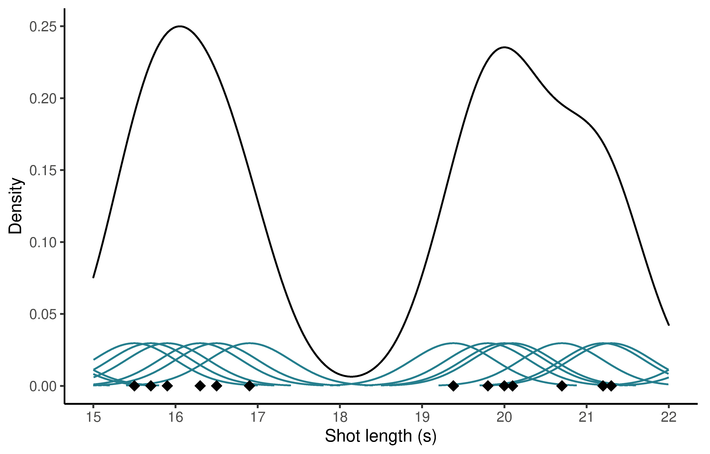

# Analysing film editing I {#editingI}

The most common application of quantitative methods to the analysis of film style is to determine if the duration of shots in two (or more) motion pictures or two (or more) groups of films differ, and, if so, by how much they differ. Comparisons of shot lengths in motion pictures have been used to identify similarities and differences in the style of individual filmmakers, historical periods, genres, national cinemas, and the impact of new technologies on motion picture production.

In this chapter we will cover some methods for describing and comparing shot length data for motion pictures. The most important idea to be introduced in this chapter is that of a *distribution* because this concept underpins everything we do when we apply computational methods to motion picture shot length data. We will analyse the distribution of shot lengths in Alfred Hitchcock's late-silent and early-sound films to see what they tell us about how the style of these films changed with the introduction of synchronised sound. We will apply a method based the quantiles of a shot length distribution to describe data sets numerically and we will learn a range of methods to visualise shot length data. Finally, we will ask three questions of the data for Hitchcock's films to see how thinking distributionally about shot lengths can help us to improve the quality of our analyses.

## Distributional thinking about film editing

A *data set* comprises a collection of pieces of related information produced by measuring properties of a group of objects. A data set is characterised by *variation*, which, in simple terms, is the quality of a measured property of an object to vary [@makar2005vtam]. Chris Wild argues that the need for statistics flows from variation:

>the statistical response to variation is to investigate, disentangle, and model patterns of variation in order to learn from them. Virtually all of the ways statisticians do this involve looking at the data through a lens which is distribution [@wild2006tcod: 21].

A *distribution* is a representation of the variation of a data set that allows us to organise and examine data efficiently to gain an overall understanding of how the data varies. Aisling Leavy argues that an understanding of distribution requires 'an awareness of the propensity of a variable to vary and comprehension of how that variability contributes to the notion of the distribution as an aggregate rather than a collection of individual data points' [@leavy2006udct: 90]. *Distributional thinking* is quantitative reasoning about variation, distribution, and the relationship between them [@bakker2004ltra; @prodromou2007tcod].

When we talk about the distribution of a data set, we need to describe a range of features, including the overall shape of the distribution and any deviations from that overall shape. To describe a distribution, we need to ask the following questions about its various features:

-   *centre*: where is the mass of the data located? Where is the centre of the data located? What is the typical value of a data set?
-   *spread*: how much variability is there in the data set?
-   *symmetry* (skewness): is the distribution symmetrical? Is the bulk of the data to the left of the distribution with a long right tail (positively skewed)? Or is the bulk of the data to the right of the distribution with a long left tail (negatively skewed)?
-   *modality*: how many peaks does the distribution have?
-   *peakedness*: is the shape of the peak(s) flat and broad or tall and pointed?
-   *tailedness* (kurtosis): how much of the data is in the tails of the distribution relative to the centre?
-   *outliers*: are there any deviations from the overall pattern of the data? Are there observations that are noticeably distinct from the bulk of the data?

In attending to these features we attempt to account for the variation in a data set that deals with its complexity that may arise in a range of different situations.

When talking about the editing of motion pictures a data set comprises the duration of each shot in the film -- the variable of interest -- and a *shot length distribution* is the way in which we think and talk about that data and how we compare different data sets for different films. However, if we look at the common applications of statistics to questions of film editing, we see that concepts of 'variation' or 'distribution' are seldom present. Distributional thinking of the sort Wild and Leavy describe as fundamental to statistical reasoning about data is rarely a part of the statistical analysis of film style.

At present, most descriptions in the literature on film style do not address the features of shot length distributions, relying on comparisons of average shot lengths (ASLs) alone. In many cases, it is not possible to get any other information about the style of a film or a group of films because the concept of a distribution does not appear to be well-understood in Film Studies. Most researchers applying statistical methods to the analysis of shot lengths in fact collect no data and never produce a shot length distribution, relying instead on a single number produced by dividing the running time of a film by the number of shots in that film. Consequently, they are unable to provide any information about the shot length data for a film beyond the ASL. Even when researchers do collect the full data set on shot durations for a film they only report the ASL and ignore other features of shot length distributions that are potentially interesting, such as the variability of the data or the shape of the shot length distribution. Only a small proportion of the literature addresses features of shot length distributions beyond the ASL (see, for example, @baxter2017ecsi; @fujita1989sldi; @kohara2013tsls; and @redfern2020mslo). The result is that a lack of distributional thinking characterises most applications of quantitative methods to the analysis of film style.

## Set up the project

### Create the project folder

The first tasks are to create a new project folder for our editing analysis with an associated `.rproj` file and to open and run the script `projects_folders.R` we created in Chapter \@ref(tools) to create the folders required for the project.

### Packages

In this chapter we will use the packages listed in Table \@ref(tab:editingI-project-table-packages).

```{r editingI-project-table-packages, results='asis', echo=FALSE}
pacman::p_load(here, tidyverse)
packages <- read_csv(here("Data", "packages.csv"))

packages %>% 
  filter(chapter == "editing_I") %>%
  select(-chapter) %>%
  arrange(Package) %>% 
  knitr::kable(caption = "Packages for analysing motion picture shot length data.") %>%
  kableExtra::kable_styling(bootstrap_options = c("striped"), font_size = 14)
```

We will load the required packages as we need to. For now, we need to be able load and wrangle data and so we load the here and tidyverse packages.

```{r editingI-packages-code-packages}
pacman::p_load(tidyverse, here)
```

### Data

The data set we will use in this chapter is the Early Hitchcock data set [@redfern2021ehxx], which comprises the shot length data for nine films directed by Alfred Hitchcock between 1927 and 1932, including four silent films (*The Ring* (1927), *The Farmer's Wife* (1928), *Champagne* (1928), and *The Manxman* (1929)), and five sound films (*Blackmail* (1929), *Murder!* (1930), *The Skin Game* (1931), *Rich and Strange* (1931), *Number Seventeen* (1932).

This data is available as a `.csv` file on [Zenodo](https://zenodo.org/record/4871227#.YinewkDP3s0) and can be accessed directly by reading the file from the URL download button of the repository. To avoid having to repeatedly download this data we will save it to the Data directory in the project folder, from where we can read again in the future if needed.

```{r editingI-project-code-download, eval=FALSE}
# Access the data directly from the zenodo repository
df_hitchcock <- read_csv("https://zenodo.org/record/4871227/files/Hitchcock_SL.csv?download=1")

# Save the csv file in the Data folder of our project
write_csv(df_hitchcock, here("Data", "early_Hitchcock.csv"))
```

To load the data we just read the `.csv` file from the Data folder.

```{r editingI-project-code-load}
# To load the saved csv file we can then run
df_hitchcock <- read_csv(here("Data", "early_Hitchcock.csv"))
```

The `df_hitchcock` data frame in Table \@ref(tab:editingI-data-table-display) is in a *wide* format, with one column of data for each film. 

```{r editingI-data-table-display, echo = FALSE}
knitr::kable(head(df_hitchcock), format = "html", 
             caption = "Early Hitchcock shot length data in wide format.") %>%
  kableExtra::kable_styling(bootstrap_options = c("striped"), font_size = 12)
```

We need to [re-arrange](https://tavareshugo.github.io/r-intro-tidyverse-gapminder/09-reshaping/index.html) the data so it is in a *long* format with one column for each variable -- `film` and `SL` (Table \@ref(tab:editingI-data-table-pivoteddata)). Reshaping the data frame to a long format makes it easier to apply data wrangling operations to the data frame. As we saw in Chapter \@ref(tools), the data frame also contains a number of `NA` values because each film has a different number of shots that need to be removed.

```{r editingI-data-code-pivot}
df_hitchcock <- df_hitchcock %>% 
  pivot_longer(cols = everything(), names_to = "film", values_to = "SL", 
               values_drop_na = TRUE) %>%  # Remove NA values
  arrange(film)  # Arrange the results by film title
```

```{r editingI-data-table-pivoteddata, echo = FALSE}
knitr::kable(head(df_hitchcock), format = "html", table.attr = "style='width:60%;'",
             caption = "Early Hitchcock shot length data in long format.") %>%
  kableExtra::kable_styling(bootstrap_options = c("striped"), full_width = TRUE, font_size = 14)
```

We will set the film titles as a factor so that they will display in the order we specify (i.e., the order of release) rather than the alphabetical order to which `ggplot2::ggplot()` defaults. This will make it easier to see how shot length distributions in Hitchcock's film changed over time.

```{r editingI-data-code-factors}
# Set film titles as factor
df_hitchcock$film <- factor(df_hitchcock$film,
                            levels = c("The Ring (1927)",
                                       "The Farmers Wife (1928)",
                                       "Champagne (1928)",
                                       "The Manxman (1929)",
                                       "Blackmail (1929)",
                                       "Murder (1930)",
                                       "The Skin Game (1931)",
                                       "Rich and Strange (1931)",
                                       "Number Seventeen (1932)"))
```

Finally, we will add a column called `type` to the `df_hitchcock` data frame that identifies whether a film in the data set is a silent film or a sound film. The `%in%` [operator](https://www.programmingr.com/tutorial/in-operator/) is used to identify if an element is a member of a vector or data frame. Combined with the `ifelse()` function we use it here to check if any of titles of the four silent films occur in the `df_hitchcock` data frame, and if they do we write the value `Silent` to the `type` column when they occur and writes the value `Sound` to the `type` column when they do not occur. This gives us the data frame with the format illustrated in Table \@ref(tab:editingI-data-table-type) to work with.

```{r editingI-data-code-type}
# Classify the films as either silent or sound
df_hitchcock <- df_hitchcock %>% 
  mutate(type = ifelse(film %in% c("The Ring (1927)",
                                   "The Manxman (1929)",
                                   "The Farmers Wife (1928)",
                                   "Champagne (1928)"),
                       "Silent", "Sound"))
```

```{r editingI-data-table-type, echo = FALSE}
knitr::kable(head(df_hitchcock), format = "html", table.attr = "style='width:60%;'",
             caption = "Early Hitchcock shot length with type of film added.") %>%
  kableExtra::kable_styling(bootstrap_options = c("striped"), full_width = TRUE, font_size = 14)
```

## Numerical summaries of shot length data

Descriptive statistics are *indices* of a distribution [@leavy2006udct], summarizing data sets using a small number of features that make large data sets manageable.

A conceptually simple method of describing and comparing shot length distributions is to use the [quantiles](https://en.wikipedia.org/wiki/Quantile) of the distributions. A *quantile* ($Q_{p}$) is a cut point dividing a data set arranged in order from the smallest value to largest so that a specified proportion $p$ of the data set lies below that point [@altman1994snqq]. The $p$-th quantile of a data set is found using the quantile function

$$
Q_{p} = \{x:Pr(X \leq x) = p\}
$$

Commonly used quantiles are the [median](https://en.wikipedia.org/wiki/Median) ($Q_{0.5}$) of a data set, dividing the range into two equal parts, or the lower ($Q_{0.25}$) and upper [quartiles](https://en.wikipedia.org/wiki/Quartile) ($Q_{0.75}$) that cut off the lower and upper 25% of a data set, respectively; but quantiles for any value of $p$ can be used. There is one less quantile than the numbers of groups created by dividing a data set into subsets of equal size: to divide a data set into 20 equal parts we need 19 quantiles.

The features of a shot length distribution listed above can be described in terms of its quantiles. The median shot length is a measure of location, while the [interquartile range](https://en.wikipedia.org/wiki/Interquartile_range), the difference between the upper and lower quartiles: $IQR = Q_{0.75} – Q_{0.25}$, describes the spread of a distribution.

The symmetry of a distribution is described by the [skewness](https://en.wikipedia.org/wiki/Skewness) coefficient,

$$
S = \frac{Q_{0.25} + Q_{0.75}-2Q_{0.5}}{Q_{0.75}-Q_{0.25}}
$$

which takes on values between -1 and 1. Values of $S$ greater than 0 indicate positive skewness. Positive skewness indicates that the right, upper tail of a distribution is longer than the lower, left tail and is typical for motion picture shot length distributions.

The [kurtosis](https://en.wikipedia.org/wiki/Kurtosis) of a distribution can also be described in terms of quantiles:

$$
T = \frac{(Q_{0.875}-Q_{0.625}) + (Q_{0.375}-Q_{0.125})}{Q_{0.75} - Q_{0.25}}
$$

Kurtosis measures the combined weight of the mass of data in the tails of a distribution relative to its centre, with higher values of kurtosis indicating there are a lot of data points in the tails [@westfall2014kapn]. For $T$, the two terms in the numerator measure the combined weight of the shoulders of a distribution while the denominator is the $IQR$, which describes the middle of the distribution. The terms in the numerator will be large if relatively more data is in the shoulders than in the centre of a distribution resulting in higher values of $T$ [@moors1988aqaf]. Kurtosis is, then, a measure of the presence of outliers in the data.

Taken together, these four statistics -- median, interquartile range, quantile skewness, and quantile kurtosis -- provide an informative, intuitive, and robust numerical summary of the distribution of shot lengths in a motion picture. These numerical descriptions do not require any assumptions to be made about possible models for a shot length distribution.

We can create a simple function that calculates the quantile-based summary of the shot length data of a film. There are multiple methods for calculating the quantiles of a data set. Here we will use the [Harrell-Davis quantile estimator](https://garstats.wordpress.com/2016/06/09/the-harrell-davis-quantile-estimator/) produced using the `hdquantile()` function in the Hmisc package.

```{r editingI-numerical-code-SLsummary}
# The input to the function is a vector containing the shot lengths for a film
SL_summary <- function(x){
  
  # Calculate the quantiles required to produce the summaries of the data
  q <- Hmisc::hdquantile(x, probs = seq(0.125, 0.875, 0.125), na.rm = TRUE, 
                         names = FALSE, se = FALSE, weights = FALSE)
  
  # Create a list containing the output values
  SL_sum <- list(`Shots` = length(x),
             `Mean` = mean(x),
             `Minimum` = min(x),
             `Lower quantile` = q[2],
             `Median` = q[4],
             `Upper quantile` = q[6],
             `Maximum` = max(x),
             `IQR` = q[6] - q[2],
             `Skewness` = (q[2] + q[6] - (2 * q[4]))/(q[6] - q[2]),
             `Kurtosis` = ((q[7] - q[5]) + (q[3] - q[1]))/(q[6] - q[2]))
}
```

We can apply this function to the data for each film in our data frame using `dplyr::group_modify()` and `purrr:map_dfc()` and rearrange the result.

```{r editingI-numerical-code-apply}
df_hitchcock_summary <- df_hitchcock %>% 
  select(film, SL) %>%  # Select only the film and SL columns
  group_by(film) %>%
  # Apply the SL_summary function to the data for each film
  group_modify(~{.x %>% 
      map_dfc(SL_summary)}) %>%
  mutate(across(everything(), round, 2)) %>%
  rename(Film = film) %>%  # Looks nicer when we display the table
  tibble()
```

```{r editingI-numerical-table-SLsummary, results = "asis", echo=FALSE}
pacman::p_load(DT)

datatable(df_hitchcock_summary, rownames = FALSE, class = "cell-border stripe", extensions = 'FixedColumns', 
          options = list(scrollX = TRUE, 
                         scrollCollapse = TRUE, 
                         paging = FALSE,
                         autoWidth = TRUE,
                         dom = "t",
                         columnDefs = list(list(width = '100px', targets = list(0))),
                         fixedColumns = TRUE, 
                         initComplete = JS("function(settings, json) {",
                                           "$(this.api().table().header()).css({'font-size': '12pt'});", "}"))) %>%
  formatStyle(columns = colnames(df_hitchcock_summary), fontSize = '10pt')
    
cat("<table width=100%>", paste0("<caption>", "(#tab:editingI-numerical-table-SLsummary)", "Descriptive statistics of the shot lengths of Alfred Hitchcock's late-silent and early-sound films. ", "&#9757;", "</caption>"),"</table>", sep = "\n")
```

From the quantile-based descriptive statistics in Table \@ref(tab:editingI-numerical-table-SLsummary), we see that the four silent films (*The Ring*, *The Farmer's Wife*, *Champagne*, and *The Manxman*) have shot length distributions that are relatively consistent, with similar median shot lengths and interquartile ranges. With the shift to sound filmmaking in 1929, Hitchcock's early sound films (*Blackmail*, *Murder!*, *The Skin Game*) show an obvious change in editing style with increases in the median as shots tended to become longer in duration and a more varied use shot lengths seen in the change in the interquartile range. There is also a change in the shape of shot length distribution as indicated by the increase in quantile skewness and quantile kurtosis. The difference between these early sound films and the silent movies that preceded them is an increase in the spread of shot lengths above the median as dialogue shots required longer takes, accompanied by a smaller shift towards more rapid editing as the spread of shots below the median shot length became slightly lower. For the later sound films we see a shift to an editing style characterised by shorter takes similar to the silent films and but with shot length distributions that are more skewed and kurtose like his first sound films. *Rich and Strange* has a number of rapidly edited montage sequences, such as the Paris sequence or the leisure activities aboard of the cruise ship, and a series of drawn-out conversational sequences that are cut more slowly; while *Number Seventeen* is largely comprised of a rapidly cut extended chase sequence in between two slower cut sequences at the house and the harbour, and which again maintains a distinction between dialogue heavy scenes and action.

## Visualising shot length distributions

Numerical summaries are useful descriptions of shot length distributions but they are limited in the amount of information they contain and require skill to be interpreted meaningfully.

Visualising the distribution of shot lengths in a film makes it easier to see the structure of the data, especially when working with large and/or multiple data sets. I often find that the information contained in numerical summaries begins to take on a concrete meaning only after visualising the data. Effective visual summaries allow us to discover patterns at different scales of analysis from gaining an overall picture of a data set at the macro-level to focusing on particular details at the micro-level. They also allow us to communicate the results of our analysis simply and effectively.

The use of graphical methods should be common practice in the statistical analysis of film style but it remains the case that many film scholars rely solely on numerical summaries of shot length data and do not visualise their data at all (if they actually have any data to visualise). In this section I describe four methods of visualising shot length distributions using the kernel density, the quantile profile, the empirical cumulative distribution function, and the adjusted boxplot.

### Kernel densities

The [kernel density](https://en.wikipedia.org/wiki/Kernel_density_estimation) is a [non-parametric](https://en.wikipedia.org/wiki/Nonparametric_statistics) estimate of the distribution of values in a data set. To calculate the kernel density, we fit a kernel function over each data point and sum the values of the kernel at each point on the x-axis.

The kernel density estimator is

$$
f(x) = \frac{1}{nh} \sum_{i=1}^{n}K\bigg(\frac{x-x_{i}}{h}\bigg)
$$

where $n$ is the number of shots in a film, $h$ is a smoothing parameter called the *bandwidth*, and $K$ is the *kernel function*. Figure \@ref(fig:editingI-kde-plot-demo) shows a detail from the kernel density of *The Skin Game*. Beneath the density, a black diamond indicates the length of a shot ($x_{i}$). The Gaussian kernels fitted over each data point are shown in green and the density at any point on the x-axis is equal to the sum of the kernel functions at that point. The closer the data points are to one another, the more the fitted kernels overlap and the greater the sum of the kernels and, therefore, the greater the density at that point.

```{r editingI-kde-plot-demo, echo = FALSE, out.width = "90%", fig.align = "center", fig.cap = "The Kernel density of *The Skin Game* at a point on the x-axis is calculated by fitting a kernel function (shown in green) to a shot length ($x_{i}$, the black diamonds) and then summing the values of those functions at $x$. NB: The kernels functions are not drawn to scale."}

```

The choice of [kernel function](https://en.wikipedia.org/wiki/Kernel_(statistics)#Kernel_functions_in_common_use) is relatively unimportant and here we will simply use the Gaussian kernel that is the default. The choice of bandwidth determines the shape of the density estimate and is much more important. To illustrate this, move the slider in Figure \@ref(fig:editingI-kde-plot-bw) to adjust the bandwidth of the kernel density estimate of the distribution of shot lengths in *The Skin Game*. If the bandwidth is too narrow the density estimate will be over-fitted and noisy with lots of localised spikes obscuring the structure in the data. Equally, if the bandwidth is too wide the density estimate will be over-smoothed and will again obscure the structure of the data.

```{r editingI-kde-plot-bw, echo = FALSE, out.width = "90%", fig.align = "center", fig.cap = paste("The kernel density of *The Skin Game* (1931) estimated with a range of bandwidth values. ", emo::ji('point_up'))}
pacman::p_load(plotly)

df_TSG <- df_hitchcock %>%
  filter(film == "The Skin Game (1931)")

bw_list <- c(0.25, 0.5, 1, 1.5, 2, 3, 4, 5, 10, 15, 20)

df_density <- data.frame()

for(i in 1:length(bw_list)){
  density_x <- density(df_TSG$SL, bw = bw_list[i])$x
  density_y <- density(df_TSG$SL, bw = bw_list[i])$y
  bw <- rep(bw_list[i], length(density_x))
  df_out <- cbind.data.frame(bw, density_x, density_y)
  df_density <- rbind.data.frame(df_density, df_out)
}

p <- ggplot() +
  geom_rug(data = df_TSG, aes(x = SL, text = paste("SL: ", SL))) +
  geom_line(data = df_density, 
            aes(x = density_x, y = density_y, group = bw, frame = bw,
                text =  paste("x: ", round(density_x, 1), 
                              "\ndensity: ", round(density_y, 3))), colour = "#277F8E") +
  scale_x_continuous(name = "Shot length (s)", limits = c(-5, 300)) +
  scale_y_continuous(name = "Density") +
  theme_classic() +
  theme(text = element_text(family = "Arial"))

fig <- ggplotly(p, tooltip = "text") %>%
  animation_opts(1000, easing = "elastic", redraw = FALSE) %>% 
  animation_slider(currentvalue = list(prefix = "Bandwidth = ", font = list(color = "black")))

fig
```

Setting the bandwidth to between 1 and 3 in Figure \@ref(fig:editingI-kde-plot-bw) is a reasonable compromise that lets us see the structure of the data without being under- or over-smoothed, enabling us to identify the key features of the distribution's shape. The distribution has a single tall, sharp peak and is clearly positively skewed, with most shots having duration less than 10 seconds but a very long right, upper tail that includes some outliers with very long duration (the longest shot in the film is 281 seconds) to give a large [range](https://en.wikipedia.org/wiki/Range_(statistics)) of values.

Using the [ggridges](https://cran.r-project.org/web/packages/ggridges/vignettes/introduction.html) package, we can efficiently plot the kernel density of each film in the early Hitchcock data set on a single plot (Figure \@ref(fig:editingI-kde-plot-ggridges)), with reference lines for the median shot length and the lower- and upper-quartiles added by setting `quantile_lines = TRUE`. Due to the skewed nature of shot length distributions it is easier to see the data by plotting shot length on a [logarithmic scale](https://en.wikipedia.org/wiki/Logarithmic_scale).

```{r editingI-kde-plot-ggridges, out.width = "90%",, fig.align = "center", fig.height = 7, fig.cap = "Shot length distributions of films directed by Alfred Hitchcock, 1927-1932. The quantile lines in each density plot show the lower quartile, median, and upper quartile of each distribution."}
# Load the ggridges package
pacman::p_load(ggridges)

ggplot(data = df_hitchcock, 
       aes(x = SL, y = reorder(film, desc(film)), fill = type)) + 
  geom_density_ridges(scale = 1, quantile_lines = TRUE, alpha = 0.8) +
  scale_x_continuous(name = "\nShot length (s)", 
                     expand = c(0.01, 0), 
                     breaks = c(0.1, 1, 10, 100), 
                     minor_breaks = c(seq(0.02, 0.09, 0.01), 
                                      seq(0.2, 0.9, 0.1), 
                                      seq(2, 9, 1), 
                                      seq(20, 90, 10), 
                                      seq(200, 900, 100)),
                     labels = c("0.1", "1.0", "10.0", "100.0"), 
                     trans = "log10") +
  scale_y_discrete(expand = c(0.01, 0)) +
  scale_fill_manual(name = NULL, values = c("#440154", "#277F8E")) +
  theme(legend.position = "bottom", 
        axis.title.y = element_blank(),
        axis.title = element_text(size = 10,face = "bold"),
        panel.background = element_rect(fill = "gray85"))
```

The summary statistics give us an overall impression of the difference in shot length distributions between Hitchcock's late silent and early sound films, but we do not yet know anything about the nature of that difference. Visualising the distributions by plotting their kernel densities in Figure \@ref(fig:editingI-kde-plot-ggridges) gives concrete meaning to the median shot length and interquartile range as indicated by the quantile lines each plot, making it clear how the descriptive statistics relate to data and illustrating how shot lengths in *Blackmail*, *Murder!*, and *The Skin Game* are more widely dispersed than those of the other films and how shot lengths initially increase with the shift to synchronised sound before shortening in duration. The shape of the distribution of shot lengths for *Blackmail* in Figure \@ref(fig:editingI-kde-plot-ggridges) resembles the distributions of the silent film in the quartiles of the lower tail and the quartiles of the upper tail of the sound films that followed its release. This pattern emerges due to the unique production circumstances of *Blackmail*, which was released in both silent and sound versions described by Charles Barr as

>works of continuously inventive bricolage. Juxtaposing them scene by scene, one registers a set of permutations: points at which variously, (a) both versions use 'silent' visuals; (b) both versions use 'sound' visuals; (c) silent and sound visuals are mixed within a scene; (d) the two films use entirely different visuals [@barr1983bsas: 123].

The change in distributional shape indicated by the quantile skewness and kurtosis values is evident, with the similarity of shape of the silent films clear to see and the shift in the mass of the data for the sound films in the upper tail of the distribution relative to the centre of the distribution.

### Quantile profile

Having described the distribution of shot lengths numerically using quantiles, we can visualise the distribution by plotting a quantile profile [@johnson2015opc] for each film in a data set. The quantile profile does not show information about the shape of a distribution in an accessible way, but it does make it easier to directly compare different parts of the shot length distributions of a set of films.

First, we need to calculate the quantiles for each film from $Q_{0.05}$ to $Q_{0.95}$ at intervals of 0.05. The results are displayed in Table \@ref(tab:editingI-quantiles-table-quantiles).

```{r editingI-quantiles-code-quantiles}
df_hitchcock_quantiles <- df_hitchcock %>%
  group_by(film) %>%
  group_modify(~ { 
   round(Hmisc::hdquantile(.x$SL, probs = seq(0.05, 0.95, 0.05), na.rm = TRUE,
                    names = FALSE, se = FALSE, weights = FALSE), 1) %>%
      enframe(name = "quantile", value = "SL")
  }) %>%
  # Re-add the type column which was dropped when we created the new data frame
  mutate(type = ifelse(film %in% c("The Ring (1927)", 
                                   "The Manxman (1929)", 
                                   "The Farmers Wife (1928)", 
                                   "Champagne (1928)"),
                       "Silent", "Sound"),
         quantile = seq(0.05, 0.95, 0.05))
```

```{r editingI-quantiles-table-quantiles, results = "asis", echo = FALSE}
datatable(df_hitchcock_quantiles, rownames = FALSE, class = "cell-border stripe",
          options = list(initComplete = JS("function(settings, json) {",
                                           "$(this.api().table().header()).css({'font-size': '12pt'});", "}"))) %>%
  formatStyle(columns = colnames(df_hitchcock_quantiles), fontSize = '10pt')
    
cat("<table width=100%>", paste0("<caption>", "(#tab:editingI-quantiles-table-quantiles)", "Quantiles of Alfred Hitchcock's late-silent and early-sound films. ", "&#9757;", "</caption>"),"</table>", sep = "\n")
```

Figure \@ref(fig:editingI-quantiles-plot-quantiles) plots the quantile profiles for each film on a log-scale as an interactive visualisation using the plotly package.

```{r editingI-quantiles-plot-quantiles, out.width = "90%", fig.align = "center", fig.cap = paste("The quantile profiles for Alfred Hitchcock's late-silent and early-sound films. ", emo::ji('point_up'))}
# Create the plot using ggplot as usual
quantile_plot <- ggplot(data = df_hitchcock_quantiles, 
       aes(x = quantile, y = SL, group = film)) +
  geom_line(aes(colour = factor(type))) +
  geom_point(aes(colour = factor(type),  
                 text = paste(film, 
                              "<br>Quantile: ", quantile,  # Add a line break <br>
                              "<br>SL: ", SL, "s"))) +
  scale_x_continuous(name = "Quantile", breaks = seq(0.1, 0.9, 0.1)) +
  scale_y_continuous(name = "Shot length (s)", 
                     trans = "log10", 
                     limits = c(0.5, 100), 
                     breaks = c(1, 10, 100), 
                     minor_breaks= c(seq(0.2, 0.9, 0.1), 
                                     seq(2, 9, 1), 
                                     seq(20, 90, 10))) +
  scale_colour_manual(name = NULL, values = c("#440154", "#277F8E")) +
  theme_minimal() +
  theme(text = element_text(family = "Arial"))

# Make the plot interactive using plotly::ggplotly()
plotly::ggplotly(quantile_plot, tooltip = "text")
```

The quantile profiles clearly show that the silent films are much more consistent in the distribution of their shot lengths than the sound films, which exhibit much greater variation in shot length at different quantiles. We can also see evidence of a hybrid editing style: with the exception of one of the sound films (*Blackmail*), Hitchcock's editing style after the introduction of sound meant that takes of shorter duration were slightly shorter than those of his silent films and, at the same time, longer takes in Hitchcock films increased in duration.

---

<details><summary style="font-size:16px; font-weight: bold;">`r emo::ji("point_left")` Click here to learn about the plotly package</summary> 

```{block, type = "rmdimportant"}
<h3 style="margin-top: -5px;">Interactive plots in R with plotly</h3>

[plotly](https://plotly.com/r/) is an R package for creating interactive plots using the plotly.js [JavaScript](https://en.wikipedia.org/wiki/JavaScript) library.

plotly has its own syntax for producing interactive plots in R, but the `ggplotly()` function provides easy integration with the ggplot2 package. As the example of quantile plot in this chapter illustrates, we can create a `ggplot()` object `quantile_plot` and then makes this plot interactive by passing it to `ggplotly()`: `ggplotly(quantile_plot)`.

Users can interact with plotly plots in different ways. 

- Moving a mouse pointer over a plot generated by plotly will bring up the modebar in the top right of the plot window. Users may select a range of actions from the modebar, including downloading the plot as a `.png` file; zooming, panning, or selecting sections of the plot to focus on specific elements; and choose whether to display information about the nearest data point on hover or if comparative data should be shown when moving the mouse over a data set.
- Hovering a mouse over a data point or a line will show a tool tip containing information about the data at that point. Information can be added as a text aesthetic in the `ggplot()` object and then called by passing that aesthetic to `ggplotly()` using `tooltip = "text"`. Tooltips can also be specified outside the `ggplot()` object.
- Users can remove data from a plot by single-clicking on an element in the legend. Double-clicking on an element in the legend isolates that data removing all other traces from the plot. Traces can then be added back to the plot by single-clicking on elements in the legend.
- Plots can be animated to show change over time, allowing users to play the animation from start to finish or to select a frame by using a slider representing a snapshot of the data.
```

</details>

---

### The empirical cumulative distribution function

The [empirical cumulative distribution function](https://en.wikipedia.org/wiki/Empirical_distribution_function) (ECDF) is a complete description of a data set that is simple to understand. The ECDF is the proportion of a data set less than or equal to a given value:

$$
F(x) = Pr(x \leq X) = \frac{\#(x \leq X)}{N}
$$

The ECDF is the inverse of the quantile function described above and swapping the axes in the plot of the quantile profile in Figure \@ref(fig:editingI-quantiles-plot-quantiles) gives a plot of the ECDF.

It is easy to calculate the ECDF: simply arrange the shot length values in order from shortest to longest, count the number of shots in a film ($x$) that are less than or equal to some specified value ($X$), and divide that number by the total number of shots in a film ($N$). To illustrate this process we will calculate the ECDF of *Blackmail* (Table \@ref(tab:editingI-ecdf-table-blackmail)) and plot the function.

```{r editingI-ecdf-code-blackmail}
df_blackmail_ecdf <- df_hitchcock %>%
  select(film, SL) %>%
  # Filter to only the shot length data for Blackmail
  filter(film == "Blackmail (1929)") %>%
  # Sort the shot length data from shortest to longest
  arrange(SL) %>%
  # Group the shots by their length
  group_by(SL) %>%
  # Count the number of shots with each duration
  count(SL) %>%
  rename(frequency = n) %>%
  ungroup %>%  # Ungroup the data before doing the calculations
  # Calculate the cumulative frequency and the ECDF
  mutate(`cumulative frequency` = cumsum(frequency),
         ecdf = round(`cumulative frequency`/max(`cumulative frequency`), 3))
```

```{r editingI-ecdf-table-blackmail, echo = FALSE}
knitr::kable(head(df_blackmail_ecdf), caption = "Calculating the ECDF of *Blackmail* (1929).", table.attr = "style='width:80%;'") %>%
  kableExtra::kable_styling(bootstrap_options = c("striped"), font_size = 14)
```

Figure \@ref(fig:editingI-ecdf-plot-blackmail2) plots the ECDF for *Blackmail* with shot length on both linear (Figure \@ref(fig:editingI-ecdf-plot-blackmail2).A) and logarithmic (Figure \@ref(fig:editingI-ecdf-plot-blackmail2).B) axes to illustrate the difference of applying a logarithmic transformation to make it easier to see the structure in the data.

```{r editingI-ecdf-plot-blackmail2, out.width = "90%", fig.align = "center", fig.cap = "The empirical cumulative distribution function of *Blackmail* (1929) plotted on (A) linear and (B) logarithmic axes."}
# Plot the ECDF on a linear x-axis
linear_scale_ecdf <- ggplot(data = df_blackmail_ecdf) +
  geom_line(aes(x = SL, y = ecdf), colour = "#277F8E") +
  scale_x_continuous(name = "Shot length (s)") +
  scale_y_continuous(name = "ECDF") +
  theme_minimal()

# Plot the ECDF on a logarithmic x-axis
log_scale_ecdf <- ggplot(data = df_blackmail_ecdf) +
  geom_line(aes(x = SL, y = ecdf), colour = "#277F8E") +
  scale_x_continuous(name = "Shot length (s)", 
                     trans = "log10",
                     breaks = c(1, 10, 100),
                     minor_breaks = c(seq(0.02, 0.09, 0.01), 
                                      seq(0.2, 0.9, 0.1), 
                                      seq(2, 9, 1), 
                                      seq(20, 90, 10))) +
  scale_y_continuous(name = "ECDF") +
  theme_minimal()

# Arrange the plots into a figure
figure <- ggpubr::ggarrange(linear_scale_ecdf, log_scale_ecdf, 
                            nrow = 2, ncol = 1, align = "v", labels = "AUTO")

# Call the figure
figure
```

Now that we understand how the ECDF is calculated and plotted, we can simplify this process by using the `stat_ecdf()` function in ggplot2 to do the whole process in one simple step (Figure \@ref(fig:editingI-ecdf-plot-statecdf)).

```{r editingI-ecdf-plot-statecdf, out.width = "90%", fig.height = 4, fig.align = "center", fig.cap = "The empirical cumulative distribution function of *Blackmail* (1929) plotted using `stat_ecdf()`."}
df_blackmail <- df_hitchcock %>%
  select(film, SL) %>%
  filter(film == "Blackmail (1929)")

ggplot(data = df_blackmail, aes(x = SL)) +
  # Plot as a step plot without adding additional points to the plot
  stat_ecdf(geom = "step", pad = FALSE, colour = "#277F8E") +
  # Use the same axes as before
  scale_x_continuous(name = "Shot length (s)", 
                     trans = "log10",
                     breaks = c(1, 10, 100),
                     minor_breaks = c(seq(0.02, 0.09, 0.01), 
                                      seq(0.2, 0.9, 0.1), 
                                      seq(2, 9, 1), 
                                      seq(20, 90, 10))) +
  scale_y_continuous(name = "ECDF") +
  theme_minimal()
```

The ECDF is easy to calculate requiring no complicated mathematics -- simply count, divide, and add. The plot is easy to produce and provides a lot of information about a data set for every little effort and, as we shall see below, is also a simple way of comparing multiple data sets.

### Adjusted boxplot

A [boxplot](https://en.wikipedia.org/wiki/Box_plot) is an excellent way of visualising a shot length data, conveying information about the location, spread, and shape of a distribution, as well as identifying any outlying data points. Boxplots are also an efficient method for comparing multiple distributions.

The boxplot provides a graphical representation of the numerical summary of a distribution. The interquartile range of a distribution is represented as a box, with the median indicated by a line through that box. The whiskers extending from the box mark the limits beyond which data points are considered to be outliers.

Due to the positively-skewed nature of the distribution of shot lengths in motion pictures it is necessary to use an [adjusted version](https://ai.plainenglish.io/use-adjusted-boxplot-for-skewed-distribution-d1bc0ec25f6d) of the boxplot to avoid incorrectly identifying data points as outliers. The adjustment described by @hubert2008aabf is based on the quantile skewness measure described above. An implementation of the adjusted box plot is available in the robustbase package, which includes functions for both directly plotting the adjusted boxplot using `adjbox()` and for computing the statistics for producing adjusted boxplots with `adjboxStats()` that we can then plot using ggplot2.

We can create a function `adjboxplot()` that will calculate the required statistics for drawing an adjusted box plot using `robustbase::adjboxStats()` and then plot the result. The input for the function is a data frame in long format with the variables `film` and `SL`.

```{r editingI-adjbox-code-function}
# Load the robustbase, viridis, and ggpubr packages
pacman::p_load(robustbase, viridis, ggpubr)

adjboxplot <- function(x){
  
  # Get overall minimum and maximum shot length to set 
  # axis limits for the figure
  x_min <- min(x$SL); x_max <- max(x$SL)
  
  # Set number of colours in palette
  v_cols <- if(n_distinct(x$film) > 2){
    viridis(n_distinct(x$film), begin = 0, end = 1)
  } else {
    viridis(2, begin = 0, end = 0.5)
  }
  
  # Split data by film
  df <- x %>% group_by(film) %>% group_split()
  
  # Create an empty plot list
  plot_list <- list()

  for(i in seq_along(df)){
    
    # Get adjusted boxplot stats using robustbase::adjboxStats()
    Film <- rep(df[[i]]$film[1], 5)  # Replicate the title of the film 5 times
    ajbs <- adjboxStats(df[[i]]$SL)$stats
    cols <- c("ylf", "y25", "y50", "y75", "yuf")
    df_film <- cbind.data.frame(Film, cols, ajbs)
    df_film <- df_film %>% 
      pivot_wider(names_from = "cols", values_from = "ajbs")
    
    # Identify outliers
    Film <- rep(df[[i]]$film[1], length(df[[i]]$SL))
    SL <- df[[i]]$SL
    out <- if_else(df[[i]]$SL < ajbs[1] | df[[i]]$SL > ajbs[5], "yes", "no")
    df_film2 <- cbind.data.frame(Film, SL, out)
    
    # Plot the adjsuted boxplot for a film
    p <- ggplot() +
      # Draw the box and the whiskers based on the statistics gathered above
      geom_boxplot(data = df_film, 
                   aes(x = Film, 
                       ymin = ylf, lower = y25, middle = y50, 
                       upper = y75, ymax = yuf),
                   fill = v_cols[i], colour = "black",
                   stat = "identity") +
      # Draw the individual data points with added jitter to avoid overlapping
      geom_jitter(data = df_film2, 
                  aes(x = Film, y = SL, colour = out, fill = out, shape = out), 
                  position = position_jitter(width = 0.2, height = 0)) +
      coord_flip() +  # Flip the axes of the plot
      scale_y_continuous(trans = "log10", 
                         limits = c(x_min, x_max), 
                         minor_breaks = c(seq(0.02, 0.09, 0.01), 
                                          seq(0.2, 0.9, 0.1), 
                                          seq(2, 9, 1),
                                          seq(20, 90, 10), 
                                          seq(200, 900, 100))) + 
      scale_colour_manual(values = c("black", "black")) +
      # Distinguish between non-outlying (grey) and 
      # outlying (white) data points
      scale_fill_manual(values = c("grey40", "white")) +
      scale_shape_manual(values = c(21, 23)) +
      labs(title = unique(df_film2$Film)) +
      theme_minimal() +
      theme(legend.position = "none",
            axis.title = element_blank(),
            axis.text.y = element_blank(),
            axis.ticks.y = element_blank(),
            plot.title = element_text(face = "bold", size = 12),
            panel.grid.major.y = element_blank(),
            panel.grid = element_line(colour = "grey70"))
    
    # Add the plot to the plot list
    plot_list[[i]] <- p
    
  }
  
  # Arrange and annotate figure
  figure <- ggarrange(plotlist = plot_list, align = "v", 
                      nrow = n_distinct(x$film))
  figure <- annotate_figure(figure, 
                            bottom = text_grob("Shot length (s)", size = 10.5))
  return(figure)
  
}
```

We can compare the shot length distributions of Hitchcock's early sound films by filtering the `df_hitchcock` data frame to leave only those films with `type` of `sound` and applying the `adjboxplot()` function.

```{r editingI-adjbox-code-apply, out.width = "90%", fig.align = "center", fig.height = 6, fig.cap = "Adjusted boxplots for Alfred Hitchcock's early sound films. The box represents the middle 50% of the data set. Outlying data points are marked as white diamonds."}
df_sound <- df_hitchcock %>%
  filter(type == "Sound")

adjboxplot(df_sound)
```

From Figure \@ref(fig:editingI-adjbox-code-apply) we see that the shot length distributions of Hitchcock's early sound films exhibit a variety of changes. After *Blackmail*, we see there is little variation in the centre of the distributions or in the range of the data but there is an change in the $IQR$, with a decrease in the lower quartile and an increase in the upper quartile. This indicates that after the hybrid style of *Blackmail*, which combined shots produced the silent and sound versions, the editing in Hitchcock's early sound films, *Murder!* and *The Skin Game*, shorter takes became slightly shorter while shots in the third quartile became longer to accommodate dialogue shots. The shift to a more rapid editing style in *Rich and Strange* and *Number Seventeen* is evident in the shift of the distribution to short shot duration, a narrower $IQR$, and the smaller range of shot lengths. We can also see that there are more outlying data points in the later sound films, visualising the information represented by the quantile kurtosis, $T$, in much more intuitive way.

Figure \@ref(fig:editingI-adjbox-code-apply) contains much of the information available in Table \@ref(tab:editingI-numerical-table-SLsummary), but presenting that information visually makes the similarities and differences between the distributions easier to perceive than trying to read a large set of numbers in a tabular format.

## Three questions about shot length distributions

Now that we know how to describe and visualise the distribution of shot lengths in a film, we can apply these methods to ask questions about the evolution of style in Hitchcock's films with the transition from silent to sound filmmaking.

### Question 1

One approach to comparing shot duration in motion pictures is to ask:

>How does the typical shot length in film $Y$ compare to the typical shot length in film $X$?

Answers to this question are typically presented as a comparison of the films' respective cutting rates as measured by their average shot lengths, which describes the mean ($\mu$) waiting time between cuts (Salt, 1974, 1992). Conventionally, the size of the difference between the average shot lengths of two films ($\mu_{Y} - \mu_{X}$) is interpreted as the difference in style between films $Y$ and $X$. This is the dominant approach used in statistical analyses of film style and film scholars such as @bordwell2002icvs, @buckland2006dbss, @obrien2009sltd, @roggen2019cras, and @salt1992fsat, amongst many others, all rely on the ASL as a means of describing differences in editing style (in many cases, exclusively so).

A key problem with this approach is that differences in average shot length do *not* reflect differences in style. For example, Barry Salt challenges Andrew Sarris's claim that Lewis Milestone's *The Front Page* (1931) is edited more quickly than *His Girl Friday* (1940), arguing that this is not in fact the case because both films have the same ASL. However, he also points out they are not stylistically similar: "The average shot length of both movies is the same; however, the Milestone film achieves this by having a larger number of very short shots and a larger number of very long shots" [@salt1974ssao: 18].

If we compare the means for *The Manxman* and *Rich and Strange* we see that the latter has a higher ASL, which, according to the conventional interpretation of ASLs, means that the sound film is edited more slowly. However, if we plot the distributions of shot lengths for these films (Figure \@ref(fig:editingI-question1-plot-kde)) we see that *Rich and Strange* has more shorter takes and more longer takes than *The Manxman* -- a feature not captured by the ASLs.

```{r editingI-question1-plot-kde, out.width = "90%", fig.align = "center", fig.cap = "The distribution of shot lengths in *The Manxman* (1929) and *Rich and Strange* (1931)."}
# Select the data for The Manxman and Rich and Strange
df_manxman_rich <- df_hitchcock %>%
  filter(film %in% c("The Manxman (1929)", "Rich and Strange (1931)"))

ggplot(data = df_manxman_rich) +
  geom_density(aes(x = SL, fill = film), 
               bw = 0.1, alpha = 0.8, trim = FALSE) +
  scale_x_continuous(name = "Shot length (s)", 
                     trans = "log10",
                     limits = c(0.1, 100),
                     breaks = c(0.1, 1, 10, 100),
                     minor_breaks = c(seq(0.2, 0.9, 0.1), 
                                      seq(2, 9, 1), 
                                      seq(20, 90, 10))) +
  scale_y_continuous(name = "Density") +
  scale_fill_manual(name = NULL, values = c("#440154", "#277F8E")) +
  theme_minimal() +
  theme(legend.position = "bottom")
```

```{block, type = "rmdtip"}
<h3 style="margin-top: -5px; font-weight: bold;">Reasons not to use the average shot length part I</h3>

The most common (and typically *only*) statistic used to describe the editing of a film is the *average shot length* (ASL).

If descriptive statistics are indices of a distribution, what does the ASL tell us about the distribution of shot lengths in a motion picture?

Motion picture shot length distributions are positively skewed. Because the mean of a positively skewed distribution is pulled in the direction of the right tail by the presence of outlying data points, the ASL does *not* describe the centre of a shot length distribution. Furthermore, the ASL contains no information about the spread, symmetry, modality, tailedness, or peakedness of the data, or about the presence of outliers in a shot length distribution.

@salt1992fsat [: 146] describes the average shot length as a ‘rather obvious concept,’ but the meaning of the ASL is elusive. If it does not describe a feature of a shot length distribution, what does the mean mean?

**Inferences about ASLs are just that -- inferences about ASLs -- and they tell us nothing the distribution of shot lengths in motion pictures.**
```

### Question 2

An alternative way to address the problem of comparing the shot lengths in two films is to systematically compare all the shot lengths in two films and to ask:

>Do the shots in film $Y$ tend to be longer than shots in film $X$?

In statistical terms, to answer this question we test if the two distributions are *stochastically equal* by testing if the probability of a shot from film $Y$ being greater than a shot from film $X$ is equal to the probability of a shot from $X$ being greater than one from $Y$.

To calculate the probability that a shot in $Y$ has greater duration than a shot in $X$ $(P(Y>X))$, we count the number of times the number of times a shot in $Y$ has duration greater than that of a shot in $X$ and divide by the product of the number of shots ($N_{X}$ and $N_{Y}$) in each film:

$$
P(Y > X) = \frac{\#Y_{j}>X_{i}}{N_{X}N_{Y}}
$$

To find the probability that the length of a shot in $Y$ is shorter than the length of a shot in $X$ $(P(Y<X))$ we perform the same procedure based on the number of times a shot in $Y$ is shorter than a shot in $X$.

If $P(Y>X) = P(Y<X)$, then there is no tendency for shots in one film to have shots of duration greater/less than shots in the other. If $P(Y>X)$ is greater than $P(Y<X)$, the shots in $Y$ tend to have longer duration than those in $X$. If $P(Y>X)$ is less than $P(Y<X)$, the shots in $Y$ tend to have shorter duration than those in $X$.

The stochastic equality of the distributions can be assessed using the [dominance statistics](https://en.wikipedia.org/wiki/Stochastic_dominance) $d$ and $HL\Delta$ [@redfern2014ctsl].

Cliff's $d$ statistic [@cliff1993dsoa; @cliff1996omfb] is a simple, non-parametric method of testing the stochastic equality of two distributions:

$$
d = P(Y > X) - P(Y < X)
$$

The value of $d$ ranges from -1, when every shot in $Y$ has shorter duration than every shot in $X$, to 1, when every shot in $Y$ has longer duration than every shot in $X$. Stochastic equality $(P(Y>X) = P(Y<X))$ occurs when $d = 0$.

We can calculate $d$ quickly using the [Wilcoxon-Mann-Whitney test](https://en.wikipedia.org/wiki/Mann–Whitney_U_test) (WMW) test, which is a nonparametric statistical test to determine if there is a difference between two datasets by testing if one sample is stochastically superior to the other. The $A$ statistic of stochastic superiority is equal to $P(Y > X) + 0.5P(Y = X)$, and can be calculated as $A = U/N_{Y}N_{X}$, where $U$ is the test statistic of the WMW test [@delaney2002csrt]. $d$ is then a linear transformation of $A$: $d = 2A – 1$.

Cliff's $d$ statistic has numerous advantages over the standard practice of comparing ASLs to determine differences between shot length distributions: it does not require any assumptions about the data; it is robust against outliers and unequal variances; it is invariant under monotonic transformation; and it provides a more direct answer to the sort of questions researchers often wish to ask of data. As Cliff points out,

>if one's primary interest is in a quantification of the statement "$X$s tend to be higher than $Y$s," then [$d$] provides an unambiguous description of the extent to which this is so [@cliff1996omfb: 125].

A limitation of Cliff's $d$ is that while it helps us to understand if the shots in one film tend to be shorter/longer than the shots in another it does not tell us how *much* shorter or longer they tend to be. To answer this question we need another statistic.

The *Hodges-Lehman difference* is the median of the pairwise differences between every shot in $Y$ and every shot in $X$ [@hodges1963eolb]:

$$
HL \Delta = median\{Y_{j} - X_{i}\}
$$

In other words, we subtract the length of every shot in film $X$ from every shot in film $Y$ and then find the median of the $N_{X} × N_{Y}$ differences.

If $HL\Delta > 0$, then the shots in $Y$ tend to be of greater duration than those in $X$, and if $HL\Delta < 0$ is less than zero, the shots in $Y$ tend to be of shorter duration than those in $X$. When $HL\Delta = 0$ there is no tendency for shots in one film to be longer than those in the other.

$HL\Delta$ is an analogue to $d$, with the advantage that it expresses differences in style on the same measurement scale as the data under analysis (i.e., shot lengths in seconds). However, $HL\Delta$ does not tell us if a difference of, say 2 seconds, is a small or a large difference -- which is what $d$ measures. These statistics should therefore be used in conjunction to provide complimentary pieces of information when comparing shot length distributions.

Let's compare the shot length distributions of *The Ring* and *Number Seventeen*. First, let's get the data for these two films from the `df_hitchcock` data frame and split them into separate objects:

```{r editingI-question2-code-split}
# Select the two films we want and split the data frame
df_ring_seventeen <- df_hitchcock %>% 
  filter(film %in% c("The Ring (1927)", "Number Seventeen (1932)")) %>%
  group_by(film) %>% 
  group_split()
# Create separate data frames for each film -
# note that dplyr has arranged the films alphabetically after group_split()
df_seventeen <- df_ring_seventeen[[1]]
df_ring <- df_ring_seventeen[[2]]
```

We can apply the Wilcoxon-Mann-Whitney $U$ test using the `wilcox.test()` function from the stats package, which is part of the base installation of R. We can calculate $d$ from the test statistic $U$ via $A$. Setting `conf.int = TRUE` will return $HL\Delta$ for these films (Table \@ref(tab:editingI-question2-table-results)).

```{r editingI-question2-code-calculate}
# Apply the WMW test
wilcox_res <- wilcox.test(df_ring$SL, df_seventeen$SL, conf.int = TRUE)

# Get the test statistic
U <- wilcox_res$statistic

# Calculate A
A <- U/(length(df_seventeen$SL)*length(df_ring$SL))

# Calculate Cliff's d
d <- 2*A - 1

# Get the Hodges-Lehmann difference
HLD <- wilcox_res$estimate
```

```{r editingI-question2-table-results, echo = FALSE}
df_dominance <- data.frame("Statistic" = c("U", "A", "Cliff's d", "HLD"),
                          "Result" = c(U, round(A, 2), round(d, 2), round(HLD, 2)))

knitr::kable(df_dominance, format = "html", table.attr = "style='width:50%;'",
             caption = "Shots in *Number Seventeen* (1932) tend to have shorter duration than those in *The Ring* (1927)") %>%
  kableExtra::kable_styling(bootstrap_options = c("striped"), full_width = TRUE, font_size = 14)
```

From the fact that $d$ and $HL\Delta$ are negative, we conclude that shots in *Number Seventeen* tend to be of shorter duration than those in *The Ring* and that the median pairwise difference is almost a second.

A limitation of Cliff's $d$ and $HL\Delta$ is that while they tell us if the shots in film $Y$ tend to be longer than shots in film $X$ and the size of that difference, they contain no information about the nature of that difference. This problem may be addressed by visualising the shot length distributions using the empirical cumulative distribution function described above. To see where the difference in shot length distributions lie, we can plot each film's ECDF.

```{r editing-question2-plot-ecdf, out.width = "90%", fig.align = "center", fig.cap = "The empirical cumulative distribution functions of *The Ring* (1927) and *Number Seventeen* (1932)."}
# Re-merge the df_ring_seventeen data frame using do.call()
df_ring_seventeen <- do.call(rbind, df_ring_seventeen)

# Plot the ECDF for each film
ggplot(data = df_ring_seventeen, 
       aes(x = SL, colour = reorder(film, desc(film)))) +
  stat_ecdf(geom = "step", pad = FALSE) +
  scale_x_continuous(name = "Shot length (s)", 
                     trans = "log10",
                     minor_breaks = c(seq(0.02, 0.09, 0.01), 
                                          seq(0.2, 0.9, 0.1), 
                                          seq(2, 9, 1),
                                          seq(20, 90, 10), 
                                          seq(200, 900, 100))) +
  scale_y_continuous(name = "ECDF") +
  scale_colour_manual(name = NULL, values = c("#440154", "#277F8E")) +
  theme_minimal() +
  theme(legend.position = "bottom")
```

From Figure \@ref(fig:editing-question2-plot-ecdf) we see that for the majority of their respective distributions the ECDF of *The Ring* lies to the right of the corresponding function for *Number Seventeen* because shot lengths in the former tend to be longer than those in the latter. At the same time we can see that longer shots in the latter film tend to be longer than those in the former.

Extending this approach to compare groups of films is simple by calculating the dominance statistics for all the silent and sound films. We can embed a `for` loop within a `for` loop for the complete set of pairwise results and use [`tidyr::nest()`](https://tidyr.tidyverse.org/articles/nest.html) to put the data for each from film into its own data frame and collect all those data frames into a single object (Table \@ref(tab:editingI-question2-table-dominance)).

```{r editingI-question2-code-dcompare}
# Split the data between silent and sound films, 
# the shot length data by and nest
df_silent <- df_hitchcock %>% 
  filter(type == "Silent") %>% 
  group_by(film) %>% 
  nest()

df_sound <- df_hitchcock %>% 
  filter(type == "Sound") %>% 
  group_by(film) %>% 
  nest()

# Pairwise comparisons of films
df_results <- data.frame()  # Empty data frame to store the results

for (i in 1:length(df_silent$film)){  # Loop over the silent films
  for (j in 1:length(df_sound$film)){  # Loop over the sound films
    
    n1 <- length(df_silent$data[[i]]$SL)
    n2 <- length(df_sound$data[[j]]$SL)
    
    res <- wilcox.test(df_sound$data[[j]]$SL, df_silent$data[[i]]$SL, 
                       conf.int = TRUE)
    d <- 2 * (res$statistic/(n1 * n2)) - 1
    hld <- res$estimate
    
    df_temp <- data.frame(Silent = df_silent$film[i], 
                          Sound = df_sound$film[j], 
                          d = round(d, 2), 
                          hld = round(hld, 2))
    
    df_results <- rbind.data.frame(df_results, df_temp)
  }
}
```

```{r editingI-question2-table-dominance, results = "asis", echo = FALSE}
pacman::p_load(DT)

datatable(df_results, rownames = FALSE, class = "cell-border stripe",
          options = list(initComplete = JS("function(settings, json) {",
                                           "$(this.api().table().header()).css({'font-size': '12pt'});", "}"))) %>%
  formatStyle(columns = colnames(df_results), fontSize = '10pt')
    
cat("<table width=100%>", paste0("<caption>", "(#tab:editingI-question2-table-dominance)", "Comparing the shot length distributions of Alfred Hitchcock's late-silent and early-sound films using dominance statistics. Negative differences indicate the sound films tend have shorter shot lengths. ", "&#9757;", "</caption>"),"</table>", sep ="\n")
```

We can visualise the results as a [heat map](https://en.wikipedia.org/wiki/Heat_map) to make the patterns in the data easier to see.

```{r editingI-question2-plot-heatmap, out.width = "90%", fig.height = 7, fig.align = "center", fig.cap = "Comparing the shot length distributions of Alfred Hitchcock's late-silent and early-sound films using (A) Cliff's $d$  and (B) $HL\\Delta$. Negative differences indicate the sound films tend have shorter shot lengths."}
# Heat map of Cliff's d
d_heatmap <- ggplot(data = df_results) +
  geom_tile(aes(x = Silent, y = reorder(Sound, desc(Sound)), 
                fill = as.numeric(d)), 
            colour = "white", size = 0.25) +
  labs(x = "Silent", y = "Sound") +
  scale_fill_viridis_c(name = "Cliff's d") +
  guides(fill = guide_colourbar(barwidth = 1, barheight = 10, 
                                title.position = "top")) +  
  theme_minimal() +
  theme(legend.position = "right",
        axis.text.x = element_text(angle = 45, vjust = 1, hjust = 1))

# Heat map of HLD
hld_heatmap <- ggplot(data = df_results) +
  geom_tile(aes(x = Silent, y = reorder(Sound, desc(Sound)), 
                fill = as.numeric(hld)), 
            colour = "white", size = 0.25) +
  labs(x = "Silent", y = "Sound") +
  scale_fill_viridis_c(name = "HLD (s)") +
  guides(fill = guide_colourbar(barwidth = 1, barheight = 10, 
                                title.position = "top")) +
  theme_minimal() +
  theme(legend.position = "right",
        axis.text.x = element_text(angle = 45, vjust = 1, hjust = 1))
  

# Combine the plots into a single figure
fig <- ggpubr::ggarrange(d_heatmap, hld_heatmap, 
                         nrow = 2, ncol = 1, labels = "AUTO")

# Call the figure
fig
```

From the change in the colours alone in Figure \@ref(fig:editingI-question2-plot-heatmap) we can see a shift in Hitchcock's editing from *Blackmail* to *Number Seventeen* when compared to the silent films, with shots length in the first sound films tending to be longer in duration than the silent films, while *Rich and Strange* and *Number Seventeen* tend to have shots of shorter duration. For example, we see that shots in *Rich and Strange* tend to be shorter in duration than those of *The Manxman*, which is the *opposite* of what the ASLs of these films tell us.

```{block, type = "rmdtip"}
<h3 style="margin-top: -5px; font-weight: bold;">Reasons not to use the average shot length part II</h3>

We commit an [ecological fallacy](https://en.wikipedia.org/wiki/Ecological_fallacy) when we ascribe to an individual the characteristics of the group to which they belong. There are different versions of the ecological fallacy but the one we are concerned with here is *an error in statistical inference arising from the assumption that if you select an individual from a group with a higher mean, that individual will have a higher value*. 

This fallacy is evident in the use of the average shot length as a statistic of film style.

The ASLs for *The Ring* and *Number Seventeen* are 5.01s and 5.66s, respectively. According to the conventional interpretation, this means that shot lengths in *Number Seventeen* have longer duration than those in *The Ring*.

However, having applied the dominance statistics approach to comparing the shot length distributions of these films we see that shots in *Number Seventeen* tend to be shorter than those in *The Ring* -- exactly the *opposite* of what the ASLs apparently tell us.

Using the difference in the ASLs of these films as a means of comparing the duration of their shots would have lead us to make commit an ecological fallacy when making inferences about the differences in shot length distributions of these films by assuming that because *Number Seventeen* has the greater ASL the shots in this film would have greater duration than those in *The Ring*.

Additionally, we see the difference in ASLs (5.66 - 5.01 = 0.65 seconds) under estimates the pairwise difference in shot lengths of 0.84 seconds given by the Hodges-Lehmann difference.

**Comparing films based on their respective ASLs cannot be relied upon to accurately reflect differences in style between films and we will often find ourselves committing an ecological fallacy when we rely upon the ASL. Nor can the difference between two ASLs be interpreted as a meaningful estimate of the size of the difference between films.**
```

### Question 3

The ASL tells us nothing about the distribution of shot lengths in a film and being able to interpret the difference in the ASLs of *The Front Page* and *His Girl Friday*, for example, it is necessary to have additional information about their respective shot length distributions.

Cliff's $d$ and $HL\Delta$ describe differences in style at a global level, but in order to fully understand what these statistics are telling us it is necessary to visualise the empirical cumulative distribution functions of the films we analyse.

In both of the above cases it is necessary to refer to the distribution of shot lengths to contextualise the meaning of the summary measures used. It therefore makes sense to begin any comparison of motion picture shot length by thinking distributionally about differences in film style. We can therefore ask:

>How do shot lengths in specific parts of their respective distributions compare between films?

To answer this question we can compare the quantiles across two groups of films, subtracting the value of the $p$-th quantile of each silent film from the $p$-th quantile of each sound film and plot the distribution of the differences.

We can create a simple function `qdiff()` to calculate the pairwise quantile differences between the silent and sound films in the early Hitchcock data set. This function takes two matrices of quantiles as inputs(`x` and `y`), assuming the matrices have equal shapes and that the step in the quantiles are equal. The argument `p` is the step increase for the quantiles, which in this case is 0.05.

```{r editing-qdiff-function}
qdiff <- function(x, y, p = 0.05){

  df <- data.frame()
  for (i in 1:dim(x)[2]){
    # Calculate the differences between the quantiles
    diff <- as.vector(outer(x[, i], y[, i], '-')) 
    q <- i * p  # Set the value of the quantiles for export
    df_a <- cbind(rep(q, length(diff)), diff)
    df <- rbind(df, df_a)
  }
  colnames(df) <- c("quantile", "difference")
  return(df)
  
}
```

To prepare the data, we need to split the data frame `df_hitchcock_quantiles` we produced earlier that contains the quantiles for each film according to the type of film -- silent or sound -- and to pivot the data frame to a wide format. Before applying the `qdiff()` function to the data for silent and sound films we first drop the columns containing `film` and `type` because these will not be used in the calculations and convert the data format to a matrix, the input type expected by the function.

```{r editing-data-split}
# Split the data frame containing the quantiles for each 
# Hitchcock film into silent and sound films
df_split <- df_hitchcock_quantiles %>% 
  group_by(type) %>% 
  group_split()

# Create data frames for each type of film and re-arrange to a wide format
df_hitchcock_silent <- df_split[[1]] %>% 
  pivot_wider(names_from = quantile, values_from = SL) %>%
  select(-c(film, type)) %>%  # Drop the columns we don't need
  as.matrix()  # Convert to matrix data type

df_hitchcock_sound <- df_split[[2]] %>% 
  pivot_wider(names_from = quantile, values_from = SL) %>%
  select(-c(film, type)) %>% 
  as.matrix()
```

Now we just need to apply the `qdiff()` function, which will produce the result in Table \@ref(tab:editing-qdiff-table).

```{r editing-apply-qdiff}
# Calculate the quantile differences
df_hitchcock_q_diff <- qdiff(df_hitchcock_sound, df_hitchcock_silent)
```

```{r editing-qdiff-table, echo = FALSE}
knitr::kable(head(df_hitchcock_q_diff), format = "html", table.attr = "style='width:60%;'",
             caption = "Quantile differences between Alfred Hitchcock's late-silent and early-sound films.") %>%
  kableExtra::kable_styling(bootstrap_options = c("striped"), full_width = TRUE, font_size = 14)
```

Figure \@ref(fig:editingI-question3-plot-qdiff) plots the difference distributions in which a negative difference indicates that the $p$-th quantile for a silent film is greater than the $p$-th quantile for a sound film and a positive difference indicates a greater shot length at the $p$-th quantile in a sound film.

```{r editingI-question3-plot-qdiff, out.width = "90%", fig.align = "center", fig.cap = "Difference distributions for pairwise differences between quantiles of shot length distributions of films directed by Alfred Hitchcock, 1927-1932. Positive differences indicate that quantiles the sound films in the sample are higher than those of the silent films."}
# Load the viridis package
pacman::p_load(viridis)

ggplot() +  
  geom_vline(aes(xintercept = 0), linetype = "dashed", colour = "#DDDDDD") +
  geom_density(data = df_hitchcock_q_diff, aes(x = difference, 
                                               group = as.factor(quantile), 
                                               colour = as.factor(quantile)), 
               size = 0.6) + 
  geom_text(aes(x = 5, y = 1.25, 
                label = "Sound films have higher quantiles \u2192"),
            hjust = 0, show.legend = FALSE) +
  scale_x_continuous(name = "Difference (s)", 
                     limits = c(-10, 90), 
                     breaks = seq(-10, 90, 10)) + 
  scale_y_continuous(name = "Density", 
                     limits = c(0, 1.25), 
                     breaks = seq(0, 1.25, 0.25)) +
  scale_colour_viridis(name = "Quantile", 
                       labels = c("0.05","0.10","0.15","0.20","0.25",
                                  "0.30","0.35", "0.40","0.45","0.50",
                                  "0.55","0.60","0.65","0.70", "0.75",
                                  "0.80", "0.85","0.90", "0.95"), 
                       discrete = TRUE, direction = -1) +
  guides(colour = guide_legend(ncol = 2)) +
  theme_classic() +
  theme(legend.key.width = unit(0.6, "cm"), 
        legend.key.height = unit(0.4, "cm"),
        legend.position = c(0.75, 0.595),
        legend.title = element_text(size = 10), 
        panel.grid.minor = element_blank())
```

From Figure \@ref(fig:editingI-question3-plot-qdiff) we see that differences at the lower quantiles ($Q_{0.05}$ to $Q_{0.35}$) are centred around negative values, reinforcing the fact that the shorter takes in Hitchcock's sound films tend to be shorter than those in his silent films. At the same time, we see that the distributions of the differences between the upper quartiles lie to the right of 0s, again showing that the longer takes in the sound films tend be of greater duration than the silent films. As the distribution of differences shows two peaks for quantiles in the range $Q_{0.55}$ to $Q_{0.85}$ we can also identify the presence of sub-groups within the sample, which is accounted for by the second change in Hitchcock's editing style with *Rich and Strange* and *Number Seventeen* and the shift of mass in the distributions to the lower tail that occurs with the use of rapidly edited montage and chase sequences.

## Summary

In this chapter we have covered a range of methods for thinking about shot length data distributionally. We have summarised and visualised the shot length data of films using quantile-based methods that are easy to implement and simple to understand.

We have also seen that the average shot length is not meaningful statistic of shot length data, containing no information about the distribution of shot lengths in a film. The ASL does not accurately reflect differences in the styles of motion pictures and does not accurately estimate differences in style. It does not answer the questions we wish to ask about film style.

If we want to ask the question 'How do shot lengths in Hitchcock's late-silent films compare to those of his early-sound films?', then comparing the quantiles of the shot length distributions of these films shows that the difference in editing in these films is more complicated than can be conveyed by comparing their average shot lengths. The dominance statistics approach using $HL\Delta$ and Cliff's $d$ provides a more accurate global description of the differences in shot lengths of these films than the ASLs and the meaning and interpretation of these statistics correspond more closely to questions we wish to ask of shot length data. However, they do not automatically lead us to consider the nature of those differences. A key advantage of the quantile approach is that we can use this simple method tp identify and to talk about the complicated nature of these differences by thinking about shot lengths *distributionally*.
