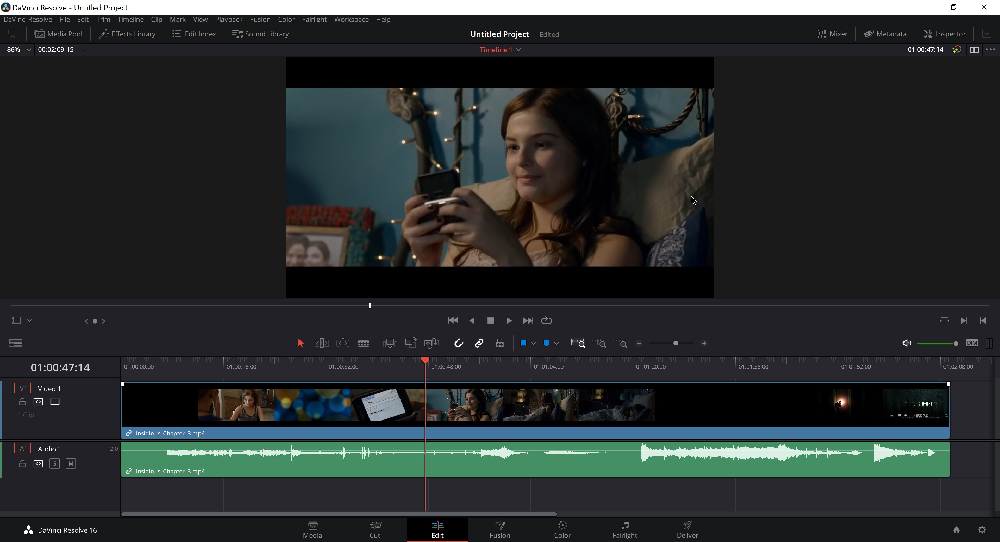

# Analysing film editing II {#editingII}

```{r echo = FALSE}
pacman::p_load(here, tidyverse)
```


In chapter \@ref(editingI) we looked at how to describe and compare the distribution of shot lengths in a motion picture. In this chapter we will look at editing as a [time series](https://en.wikipedia.org/wiki/Time_series) using a range of methods to analyse cutting rates.

Cutting rates affect viewers' experiences of the cinema in a number of ways, and research has shown that they effect the viewers’ attention and arousal [@kostyrka-allchorne2017deof; @lang1999teop; @ludwig2017teoc], comprehension [@davies1985ucse], memory [@lang2000teoe], and emotional responses [@heft1987tioc] to motion pictures.

Karen Pearlman [-@pearlman2016crie: 55] writes that cutting rate ‘is not just another way of saying “duration of shots” although the two ideas do overlap,’ and distinguishes between the different ways in which motion picture editors shape the rhythm of a film by controlling the timing of shots -- choosing a frame to cut on, the placement of a shot within a sequence, and the length of time a shot is held on screen -- and the pacing of a film, by controlling the rate at which cuts occur [@pearlman2017eacb].

However, it is generally the case that when film scholars discuss the cutting rate of a film they do so in terms of shot duration, typically expressed in the form of a single figure -- the average shot length (ASL). For example, David Bordwell uses the concepts of ASL and cutting rate interchangeably: 

>In the mid- and late-1960s, several American and British filmmakers were experimenting with faster cutting rates. Many studio-released films of the period contain ASLs between six and eight seconds, and some have significantly shorter averages [@bordwell2002icvs: 17]. 

Similarly, Yuri Tsivian argues that we can track historical change in editing patterns by ‘comparing their prevailing ASLs’ of different historical eras to ‘get a sense of how cutting rates changed over the last hundred years’ [@tsivian2009cpot: 95]. Sam Roggen [-@roggen2019cras] directly conflates cutting rate and ASL to define the former in terms of the latter, referring to ‘cutting rates (quantified as average shot length).’ There are many other examples to be found in the literature of this usage of the ASL. 

Despite the claims of researchers to be analysing cutting rates, this aspect of film style has largely been overlooked in quantitative research on film editing, which has focused almost exclusively on shot lengths. This may be attributed to the improper use of the ASL as a measure of the cutting rate which has forestalled work in this area. Consequently, a range of statistical methods that could profitably be employed to analyse style in the cinema have been ignored. Analysing cutting rates requires a mental adjustment in the way in which we think computationally about film editing, leaving behind the duration of shots to focus on *the times at which cuts occur*. After all, it is the cutting rate we are interested in and this requires us to shift our focus from timing to pacing in the cinema. In this chapter we will learn how to analyse motion picture cutting rates, thinking of film editing not terms of shot duration but as a point process that will allow us to understand pacing in the cinema.

## Key concepts

### Rate

A [rate](https://en.wikipedia.org/wiki/Rate_(mathematics)) is a measure of the frequency of some phenomenon of interest per unit of time expressed as the ratio between the total frequency and the total time elapsed [@everitt2010tcdo: 358]:

$$ 
r = \frac{frequency}{time}
$$

In writing on film, there are two definitions of the cutting rate, $r$. @pearlman2019orif [: 153], for example, defines the cutting rate in terms of *cuts (c) per unit of time* calculated as the total number of cuts divided by the running time of the film:

$$
r_{c} = \frac{number\ of\ cuts}{running\ time}
$$

Cut here really means *transition*, and so includes fades, dissolves, and other types of transitions along with hard cuts, where the moment of transition from shot A to shot B (such as the midpoint of a dissolve) is marked as a cut. 

Alternatively, Raymond Spottiswoode [-@spottiswoode1973agot: 45] defines the cutting rate in terms of the number of *shots (s) per unit of time* calculated as the number of shots divided by the running time of the film:

$$
r_{s} = \frac{number\ of\ shots}{running\ time}
$$

A *shot* is defined as the amount of time elapsed between two cuts.

We can represent the running time of a film as a line and mark the points in a film at which cuts occur (Figure \@ref(fig:editingII-concepts-plot-hypothetical)). There is a one-to-one correspondence between cuts and shot lengths, and the time at which the $k$-th cut occurs is equal to the sum of the lengths of the prior shots. There is one less cut point than the number of intervals created by dividing a line into segments and so the number of shots in a film will always be $c + 1$: to produce a film comprising 100 shots we need to make 99 cuts. Consequently, $r_{c}$ will be slightly different to $r_{s}$. However, if we allow the end of the final shot to be classed as a cut to define its duration, then the two definitions are equivalent. For example, in Figure \@ref(fig:editingII-concepts-plot-hypothetical) we have a hypothetical film with 100 cuts (including the end of the final shot) and 100 shots, and a running time of ten minutes to give

$$
r_{c} = r_{s} = \frac{100}{10} = 10\ cuts\ (shots)\ per\ minute
$$
[]{#hypothetical-figure}
```{r editingII-concepts-plot-hypothetical, echo = FALSE, out.width="90%", fig.align='center', fig.height=2, fig.cap="A hypothetical film with 100 cuts (including the end of the final shot) and 100 shots with a running time of 10 minutes. Each vertical line marks the point at which a cut occurs."}
# Sample from random uniform distribution
set.seed(5) # For reproducibility
x <- c(runif(99, 0, 10), 10)
y <- rep(1, 100)
df <- cbind.data.frame(x, y)
# Plot
ggplot(df, aes(x = x, y = y)) + 
  geom_vline(xintercept = x, col = '#277F8E') + 
  scale_x_continuous(name = "Time", breaks = seq(0, 10, 2)) +
  theme_light() +
  theme(axis.title.y = element_blank())
```

```{block, type = "rmdtip"}
<h3 style="margin-top: -5px; font-weight: bold;">Reasons not to use the average shot length part III</h3>

It is immediately obvious that the ASL does not describe the cutting rate of our hypothetical film because it is *not a rate*. The ASL is defined as the mean time elapsed between two cuts and is expressed as the ratio of the total running time of a film and the number of cuts (shots):

$$
ASL = \frac{running\ time}{number\ of\ cuts\ (shots)}
$$

For our hypothetical film in Figure [7.1](#hypothetical-figure) this means we must wait $1/10$-th of a minute, or 6 seconds, on average until a cut occurs. This does not meet the above definition of a rate because it does not express a frequency of events per unit of time. Phrasing the mean waiting time as a rate, i.e., ‘6 seconds per cut,’ could imply the cut has duration which is not our intent and is potentially confusing when some types of transition (such as fades or dissolves) do have duration even though we treat them as cuts for the purposes of analysis. 

However, it is common to use the ASL as a measure of cutting rate. For example, Barry Salt uses $r_{s}$ as as a measure of cutting rate, which he defines in the glossary to *Moving Into Pictures* as 

>How many shots there are in a fixed length of film. Measured by Average Shot Length (ASL) (q.v.) [@salt2006mipm: 409, this quote is rendered as it is in the source]. 

This leads us to look up the definition of the ASL which he gives as 

>The length or running time of a film, …, divided by the number of shots (407). 

The definition of the cutting rate is clearly at odds with the definition of the ASL and Salt conflates these two concepts to assert that

$$
\frac{number\ of\ shots}{running\ time} = \frac{running\ time}{number\ of\ shots} ,
$$
which is obviously not possible.

As the ASL is the [reciprocal](https://en.wikipedia.org/wiki/Multiplicative_inverse) of the cutting rate multiplied by the unit of time $\big(\frac{1}{r} \times t\big)$ there is clearly a mathematical relationship between these two concepts, but it is a basic error to treat them as equivalent because they are conceptually different, measuring different things and requiring different methods of analysis. Because the ASL is the reciprocal of the cutting rate it can *never* measure the cutting rate.

**The ASL is not a measure of the cutting rate of a film and contains no information about the temporal structure of a film.**
```

### Editing as a point process
Analysis of motion picture cutting rates requires us to think of the editing of a film as a simple [point process](https://en.wikipedia.org/wiki/Point_process). A point process is a stochastic process over a time interval $(0, T]$, whose realisations are the times at which the events comprising that process occur. A temporal point process can be represented simply as a timeline with the times at which events occurred marked on that line.

Every point process is associated with a [counting process](https://en.wikipedia.org/wiki/Counting_process), defined as the number of events ($N$) that have occurred up to and including time $t$: $N(t)$. A counting process has integer values that are 

-  non-negative: $N(t) \geq 0$
-  non-decreasing: $N(t_{2}) \geq N(t_{1})$ if $t_{2} \geq t_{1}$
-  the number of events in any interval $[t_{1},t_{2})$ is equal to the difference between the counts at two different times $(N(t_{2}) - N(t_{1}) = N[t_{1},t_{2}))$.

Figure \@ref(fig:editingII-concepts-plot-counting) illustrates a temporal point process, with the times at which events occur marked on the x-axis representing time, and its associated counting process on the y-axis.

```{r editingII-concepts-plot-counting, echo = FALSE, out.width="90%", fig.align='center', fig.height=4, fig.cap="A temporal point process with events times ($t_{i}$) and counting process ($N(t)$)."}
set.seed(5)
df <- data.frame("x" = rep(0, 8),
                "t1" = c(0, round(runif(7), 3)))

t2 <- c(sort(df$t1[2:8]), NA)

df <- df %>% 
  arrange(t1) %>% 
  mutate(y = 0:7,
         t2 = t2)

# plot the data frame
ggplot(data = df) +
  geom_segment(aes(x = t1, y = y, xend = t2, yend = y)) +
  geom_segment(aes(x = t1[8], y = 7, xend = 1, yend = 7)) +
  geom_segment(aes(x = t2, y = y, xend = t2, yend = y + 1), linetype = "dashed") +
  geom_point(aes(x = t2, y = y)) +
  geom_point(aes(x = t1, y = y), shape = 21, fill = "white") +
  scale_x_continuous(name = "Time",
                     limits = c(0, 1),
                     breaks = df$t1, 
                     labels = c(expression(t[0]), expression(t[1]), expression(t[2]), 
                                expression(t[3]), expression(t[4]), expression(t[5]), 
                                expression(t[6]), expression(t[7]))) +
  scale_y_continuous(name = expression(paste(italic("N"), "(", italic("t"), ")")), 
                     limits = c(0, 7.5),
                     breaks = 0:7) +
  theme_light() +
  theme(panel.border = element_blank(),
        panel.grid = element_blank(),
        axis.line = element_line(colour = "dark gray", 
                                 arrow = grid::arrow(length = unit(0.2, "cm"), type = "closed")))
```

For a motion picture, the set $T$ is simply the times at which the cuts occur:

$$
T = \{t_{i},\ ...,\ t_{N}\}
$$

where $t_{i}$ is the time at which the $i$-th cut occurs in seconds since the beginning of the film and $N$ is the total number of cuts in a film. In practice, $t_{N}$ will mark the end of the last shot in a film. As above, *shot* is defined as the time elapsed between two cuts: $s = t_{i} - t_{i-1}$.

It is natural to think of editing as a point process because this reflects how editors think about time in the cinema. [Non-linear editing software](https://en.wikipedia.org/wiki/Non-linear_editing) such as [DaVinci Resolve](https://www.blackmagicdesign.com/products/davinciresolve) or [Adobe Premiere Pro](https://www.adobe.com/uk/products/premiere.html) are timeline-based, with video and audio clips, effects, and transitions arranged in chronological order horizontally across the screen (Figure \@ref(fig:editingII-concepts-image-NLE)). 

```{r editingII-concepts-image-NLE, out.extra='class=\"zooom\"', echo = FALSE, out.width = "90%", fig.align = "center", fig.cap = paste("Timeline-based editing in DaVinci Resolve. ", emo::ji("point_up"))}

```

The [edit decision list](https://en.wikipedia.org/wiki/Edit_decision_list) (EDL) produced by a non-linear editing system contains the times at which cuts occur from the beginning of a film (Table \@ref(tab:edtingII-concepts-table-EDL)) and is simply the set of times $T$.

```{r edtingII-concepts-table-EDL, echo = FALSE}
df_edl <- read_csv(here("Data", "edl.csv"))

df_edl <- df_edl %>%
  mutate(Shot = if_else(Shot < 10, paste0("00", Shot), paste0("0", Shot)),
         Reel = paste0("00", Reel))

knitr::kable(df_edl, caption = "Extract from an edit decision list for *Blackmail* (1929) film produced by DaVinci Resolve.") %>%
  kableExtra::kable_styling(bootstrap_options = c("striped"), full_width = TRUE, font_size = 14)
```

Film editors do not describe their work in terms point processes, but the marking of points on a line representing the running time of a film is nevertheless a key concept in how editors think about time in the cinema. It can also be a key concept in the way in which we analyse editing in the cinema.

## Setting up the project

### Create the project
Create a new project in RStudio from a new directory using the `New project...` command in the `File` menu and run the script `projects_folders.R` we created in Chapter \@ref(tools) to create the required folder structure.

### Packages
In this project we will use the packages listed in Table \@ref(tab:editingII-project-table-packages):

```{r editingII-project-table-packages, results="asis", echo = FALSE}
packages <- read_csv(here("Data", "packages.csv"))

packages %>% 
  filter(chapter == "editing_II") %>%
  select(-chapter) %>%
  arrange(Package) %>% 
  knitr::kable(caption = "Packages for time series analysis of editing data.") %>%
  kableExtra::kable_styling(bootstrap_options = c("striped"), font_size = 14)
```

### Data
In this chapter we will continue to work with the Early Hitchcock data set [@redfern2021ehxx] we used in Chapter \@ref(editingI). As we have already downloaded and saved the `.csv` file containing this data, we can make a copy and save it in the Data folder of this project.

## Analysing cutting rates

### The step function plot

Perhaps the simplest way to visualise the evolution of the cutting rate of a film is to plot the counting process $N(t)$ against the set of times $T$ to produce a *step function plot*.  One advantage to plotting the step function rather than the shot lengths of a motion picture is that the latter can be noisy making it harder to identify how the editing changes. If the cutting rate is constant, then the cumulative number of cuts in the step function plot will increase linearly. Slower cutting rates will still increase the cumulative count but at a shallower angle relative to the time axis as the running time of the movie is used up without consuming a large number of cuts; while faster cutting rates will be evident when the plot rises non-linearly at a steeper angle due to there being many cuts in a brief period of time.

To illustrate this method we will use the data for *Blackmail* (1929). We will load the data set for this chapter and then pivot the data frame to a long format, removing `NA` values.

```{r editingII-step-code-data}
pacman::p_load(here, tidyverse)

# Load the data
df_hitchcock <- read_csv(here("Data", "early_Hitchcock.csv"))

# Pivot to long format
df_hitchcock <- df_hitchcock %>% 
  pivot_longer(cols = everything(), names_to = "film", values_to = "SL", 
               values_drop_na = TRUE) %>%
  arrange(film)
```

We will create two plots as a single figure: a [rug plot](https://en.wikipedia.org/wiki/Rug_plot) similar to Figure \@ref(fig:editingII-concepts-plot-hypothetical) above and the step function plot itself.

A rug plot is a 1D-strip plot that marks points on a line. To create the rug plot we use `geom_vline`, which will plot a vertical line at every point marked on the x-axis when a shot occurs. We could use ggplot2's [`geom_rug()`](https://ggplot2.tidyverse.org/reference/geom_rug.html) function to add a strip plot directly to our step function plot but this is not as visually appealing as creating own rug plot and will overlap the lower left corner of the step function obscuring some of the data.

```{r editingII-step-code-rugplot}
# Wrangle the data for plotting
df_blackmail <- df_hitchcock %>%
  filter(film == "Blackmail (1929)") %>%
  # Calculate the cut times as the cumulative sum of the shot lengths using cumsum()
  mutate(cut_times = cumsum(SL),  
         cut = 1:length(SL)) %>%  # Index the cuts
  select(-SL)  # Drop the shot length data as we no longer need this

# Create the rug plot
rug_plot <- ggplot(data = df_blackmail) +
  geom_vline(aes(xintercept = cut_times), size = 0.1, colour = "#277F8E") +
  scale_x_continuous(name = element_blank(), 
                     limits = c(0, max(df_blackmail$cut_times)), 
                     expand = c(0, 0)) +
  scale_y_continuous(name = element_blank(), expand = c(0, 0)) +
  theme_classic() +
  theme(axis.line = element_blank(),
        axis.text = element_blank(),
        axis.ticks = element_blank(),
        plot.margin = margin(0.2, 0.4, 0.2, 0.2, "cm"))
```

We also need to create a data frame for plotting the step function plot that comprises the a cumulative count of shots in the film (i.e., the shot number) and the cut timings. Both vectors in this data frame need to start at `0` and so when we create the data frame we will add a row to the head of the data frame containing a zero in each vector using `dplyr::add_row()`.

```{r editingII-step-code-step}
# Add a row to the head of the data frame
df_blackmail <- df_blackmail %>% 
  add_row(film = df_blackmail$film[1], # Add the title of the film to the zero row
          cut_times = 0,               # Add the time of the start of the film
          cut = 0,                     # Number the `zero` cut
          .before = 1)                 # Specify where the new row is to be added

# Create the plot
step_plot <- ggplot(data = df_blackmail) +
  geom_step(aes(x = cut_times, y = cut), colour = "#277F8E") +
  scale_x_continuous(name = "Time (s)", expand = c(0, 0)) +
  scale_y_continuous(name = bquote(italic("N")*"(0,"*italic("t")*")"), # format y-axis label
                     expand = c(0, 0)) +
  theme_classic() +
  theme( plot.margin = margin(0.2, 0.4, 0.2, 0.2, "cm"))
```

Now we can combine the two into a single figure. By setting the `heights` argument in `ggpubr::ggarrange` we can control the relative height of the plots in the figure: in this case we want the rug plot to take up 15% of the figure and the step function plot to take up 85% of the figure.

```{r editingII-step-plot-count, out.width="90%", fig.align='center', fig.cap="The editing of *Blackmail* (1929) as a counting process."}
pacman::p_load(ggpubr)

count_plot <- ggarrange(rug_plot, step_plot, nrow = 2, ncol = 1, 
                        align = "v", heights = c(0.15, 0.85))

count_plot
```

Figure \@ref(fig:editingII-step-plot-count) plots the counting process of *Blackmail*, and shows that the film can be divided into sections where the cutting rate increases with a slope of one, including the opening sequence in which Alice and Frank go to the tea house (0-1263.94) and the beginning of the investigation after the discovery of the body (2135.89-2835.31); sections where the slope of the function is less than one in which the cutting rate slows, such as the sequence at Crewe's studio during which Crewe assault's Alice and she kills him (1263.94-2835.31) or the section beginning with the famous 'knife' sequence after which Tracy attempts to blackmail Alice (2835.31-4292.41); and sections in which the slope of the step function is greater than one associated with the rapid cutting rate of the chase sequence in the British museum (4292.41-4706.77s). The change points in the editing are easy to identify, enabling us to segment the film on the basis of its cutting rate. It is also clear that the film has multiple editing regimes and so we should speak of the multiple editing *styles* of *Blackmail* rather than the editing style of the film in the singular.

To compare the data for two films with different numbers of shots and different running times we need to normalise the data to a [unit vector](https://en.wikipedia.org/wiki/Unit_vector) with the range $[0, 1]$ on each axis. To demonstrate this process we will compare the editing in *Blackmail* to the film that preceded it, *The Manxman* (1929).

We need to create a data frame for the plot that combines the normalised counts and cut times for the two films. First, we need to add a row containing the time and index of the `zero` shot so that the data for both films starts at 0 seconds. Now we can create two new columns: `norm_cuts`, which is the normalised shot number equal to the index of the $i$-th cut divided by the total number of cuts in a film ($N$): $i/N$; and `norm_times`, which is the normalised cut times equal to the time of the $i$-th cut ($t_{i}$) divided by the running time ($T$) of a film: $t_{i}/T$.

```{r editingII-step-code-normalise}
# Select the data for The Manxman and Blackmail and calculate the cut times
df_films_step_plot <- df_hitchcock %>%
  filter(film %in% c("Blackmail (1929)", "The Manxman (1929)")) %>%
  group_by(film) %>%
  mutate(cut_times = cumsum(SL),  
         cut = 1:length(SL)) %>%   
  select(-SL) 

# Add the row with the zero cut for each film
df_films_step_plot <- df_films_step_plot %>% 
  group_by(film) %>%
  group_modify(~ add_row(.x, 
                         film = .x$film[1], 
                         cut_times = 0,     
                         cut = 0,           
                         .before = 1))

# Normalise the cut times and cut numbers
df_films_step_plot <- df_films_step_plot %>%
  mutate(norm_times = cut_times/max(cut_times),
         norm_cut = cut/max(cut))
```

Now we have wrangled the data into the appropriate format we can plot the step function for each film.

```{r editingII-step-plot-compare, out.width="90%", fig.align='center', fig.cap="The normalised step functions of *The Manxman* (1929) and *Blackmail* (1929)."}
ggplot(data = df_films_step_plot) + 
  geom_step(aes(x = norm_times, y = norm_cut, colour = film)) +
  scale_x_continuous(name = "Normalised running time", 
                     breaks = seq(0, 1, 0.2), expand = c(0,0)) +
  scale_y_continuous(name = "Normalised count", 
                     breaks = seq(0, 1, 0.2), expand = c(0,0)) +
  scale_colour_manual(name = NULL, values = c("#277F8E", "#440154")) +
  theme_classic() +
  theme(legend.position = "bottom")
```

Figure \@ref(fig:editingII-step-plot-compare) plots the step functions for *The Manxman* and *Blackmail*. It is immediately apparent that the two films have different cutting rates. The cutting rate of *Blackmail* shows much greater variation than that of *The Manxman*, which has a slope of one for the most of its running time. The difference in editing styles between the two films is immediately apparent when plotting the counting process of the cutting rates.

### Cut density
In Chapter \@ref(editingI) we looked at the use of kernel densities to describe the distribution of shots in a motion picture. We can use the same method to describe the pacing of a film by fitting the kernel density function to the timeline of a film's cuts.

*Cut density* is an uncomplicated way of assessing the cutting rate of a film by fitting a kernel density estimate to the point process. This is often referred to as shot density, but as the mathematical and graphical operations are based on the times of the cuts and not the duration of the shots we should properly refer to the cut density when using this method. Additionally, 'shot density' is easily confused with the use of kernel densities to describe the shot length distribution of a film.

In the context of the cutting rate of a film, the density is greatest when one cut quickly follows another and, therefore, the faster the cutting rate will be at that point in the film; while low densities indicate cuts that are distant from one another on the time axis.

We will calculate the cut density for *Number Seventeen* (1932). First, we select the data and calculate the cut times. Next, we calculate the density for the `cut_times` vector using R's built in `density()` function. As before, we need to decide on the bandwidth parameter (`bw`) we want to use. We will also set the value for `n`, which is the number of points on the x-axis at which the density is calculated. Setting `n = 500` means that the density will be calculated at 500 evenly-spaced points on the x-axis representing the running time of the film. This will become relevant when we want to compare the densities for multiple films. The `from` and `to` commands set the range for which the density is calculated. We want the density to cover the whole range f the films running time so `from` is set to `0` and to is set to the total running time of the film, which is the maximum value of the `cut_times` vector.

The `density()` function returns a list, of which we want to access the `x` variable, which locates the points on the x-axis at which the density is calculated, and the `y` variable, which stores the density values. We can extract these from the list and save them as the `time` and `density` variables.

```{r editingII-density-code-seventeen}
# Load the data
df_seventeen <- df_hitchcock %>%
  filter(film == "Number Seventeen (1932)") %>%
  mutate(cut_times = cumsum(SL))

# Calculate the density
seventeen_density <- density(df_seventeen$cut_times, bw = 25, n = 500, 
                          from = 0, to = max(df_seventeen$cut_times))

# Create a data frame for plotting
df_seventeen_density <- data.frame(film = rep("Number Seventeen (1932)", 500), 
                                   times = seventeen_density$x,
                                   density = seventeen_density$y)

head(df_seventeen_density)
```

Rather than create a separate rug plot, this time we will add a rug plot of the actual cut times from `df_seventeen` using the `geom_rug()` command. Note that we need to use the cut times from the `df_seventeen` data frame because the `time` variable in `df_seventeen_density` marks the points at which the density is evaluated and *not* the timings of the cuts. 

```{r editingII-density-plot-seventeen, out.width="90%", fig.height=3.5, fig.align='center', fig.cap="The cut density of *Number Seventeen* (1932)."}
# Set the scipen option to suppress scientific notation on axis labels
options(scipen = 9999)

ggplot() +
  geom_line(data = df_seventeen_density, aes(x = times, y = density), 
            colour = "#277F8E", size = 1) +
  geom_rug(data = df_seventeen, aes(x = cut_times), colour = "#277F8E") +
  scale_x_continuous(name = "Time (s)") +
  scale_y_continuous(name = "Density") +
  theme_classic()
```

Figure \@ref(fig:editingII-density-plot-seventeen) plots the cut density of *Number Seventeen* and shows that the cutting rate increases over the course of the film and that there is a shift to more rapid cutting in the second half of the film. Within this large-scale trend, there are localised moments of rapid editing and a key feature in the latter part of the film is that the density of these moments does not drop to the ground level once they are over but exits at a higher as they contribute to the overall trend to more rapid editing. A key advantage of visualising the cutting rate this way, then, is that it lets us see different things about the editing of the film at different scales, allowing us to identify events at the micros-scale of individual moments in the film as well as describing the editing at the macro-scale of the film, and to see the relationship between structures at these scales. 

It is harder to localise change points in cutting rates when plotting the cut density compared to the counting process, but it is easier to look at editing structures at different scales when plotting the density.

Comparing the time series data of multiple films presents us with some problems. The running time of motion pictures varies so that the time series of editing data are of different lengths, while the number of cuts in a motion picture varies so that a different number of events is recorded for each time series. There is no uniform editing pattern so that events are recorded at irregular intervals. 

These problems are easily over come by comparing cut densities for different films because we can normalise the running time of different films to a unit vector as we did when comparing the step functions above. We can calculate the cut density at equal number of points on the time axis by setting `n` to the same value when calculating the density of each film. This will give us time series with equal numbers of points sampled at regular intervals of $1/n$ over the normalised interval $[0, 1]$.

We also need to standardise the cut density $f(y)$ of each film to the interval $[0, 1]$ by subtracting the minimum value of $y$ from the $i$-th value of the density $y$ and dividing by the range:

$$
f(y) = \frac{y_{i} - y_{min}}{y_{max} - y_{min}}
$$

This sets the point at which the cut density is highest for each film to a value of 1; the point at which density is lowest is set to a value of 0; and the rest of the values are scaled within this interval. We could compare the non-normalised densities, but it is important to remember that different films will exhibit different variances in their densities, and this may lead incorrect interpretations of the data because what counts as high or low density will be different for each film.

Note that this process is similar to the normalisation process for comparing the step functions of two (or more) films, because both the x- and y-axes of the plot will cover the range $[0, 1]$. However, normalising the cut densities is different because each film will have the same number of rows in the data frame (500) irrespective of the number of shots in each film, whereas the number of data points for each film remained equal to the number of cuts when normalising the data for the step function plot.

To illustrate this process we will compare the cut density of *Number Seventeen* with that of the *The Ring* (1927). We've already created a data fame containing the cut density of *Number Seventeen*, so we need to repeat this process to create a data frame for *The Ring* and combine the two together.

```{r editingII-density-code-ring}
# Load the data
df_ring <- df_hitchcock %>%
  filter(film == "The Ring (1927)") %>%
  mutate(cut_times = cumsum(SL))

# Calculate the density
ring_density <- density(df_ring$cut_times, bw = 25, n = 500, 
                        from = 0, to = max(df_ring$cut_times))

# Create a data frame for plotting
df_ring_density <- data.frame(film = rep("The Ring (1927)", 500), 
                              times = ring_density$x,
                              density = ring_density$y)


# Combine the data frames for Number Seventeen and The Ring
df_films_density <- rbind(df_seventeen_density, df_ring_density)
```

Having combined the data frames we can normalise the running times and density values.

```{r editingII-density-code-norm}
# Normalise the times and density vectors for each film
df_films_density <- df_films_density %>%
  group_by(film) %>%
  mutate(norm_times = times/max(times),
         norm_density = (density - min(density))/(max(density) - min(density)))
```

Figure \@ref(fig:editingII-density-plot-normed) plots the cut densities of *Number Seventeen* and *The Ring*. We can see that *The Ring* has a very different editing structure, comprised of three large sections that account for approximately one-third of the running time each, with a declining trend over the course of the first two sections while there is an increasing trend in the cutting rate in the final third.

```{r editingII-density-plot-normed, out.width="90%", fig.align='center', fig.cap="Comparing the cut densities of *Number Seventeen* (1932) and *The Ring* (1927)."}
ggplot(data = df_films_density) +
  geom_line(aes(x = norm_times, y = norm_density, colour = film), size = 1) +
  scale_x_continuous(name = "Normalised time", breaks = seq(0, 1, 0.2), 
                     labels = scales::percent) +
  scale_y_continuous(name = "Normalised density", breaks = seq(0, 1, 0.2)) +
  scale_colour_manual(name = NULL, values = c("#277F8E", "#440154")) +
  facet_wrap(~film, nrow = 2) +
  theme_classic() +
  theme(legend.position = "none",
        strip.background = element_blank(),
        strip.text = element_text(face = "bold", hjust = 0, size = 10.5))
```

We can extend the comparison of cut density to all the films the Early Hitchcock data set. We need to use the original data file containing the shot length data for Hitchcock's films rather than the `df_hitchcock` data frame we have been working with so far. 

We will loop over each column in the `.csv` file to calculate the density for each film at 500 points on the x-axis. We will also normalise the running times and density values. In this instance, to store the results of the loop we need to explicitly specify that the empty data frame has 500 rows.

```{r editingII-density-code-multiple}
# Load the original data
df_original <- read_csv(here("Data", "early_Hitchcock.csv"))

# Get a list of the column names (i.e., films)
films <- colnames(df_original)

# Create an empty data with 500 rows
df_hitchcock_density <- data.frame()[1:500,]

for (i in 1:dim(df_original)[2]){
  
  dat <- na.omit(df_original[i])
  dat <- dat %>% mutate(cuts = cumsum(dat[[1]]))
  
  df_temp <- data.frame(density(dat[[2]], bw = 20, n = 500, 
                                from = 0, to = max(dat))[2]) %>%
    rename(density = 1) %>%
    # Normalise the density
    mutate(norm_density = (density - min(density))/(max(density) - min(density))) %>%
    select(norm_density)
  
  names(df_temp)[1] <- films[i]
  
  df_hitchcock_density <- cbind(df_hitchcock_density, df_temp)
  
}

# Save the data frame with the normalised density estimates as a .csv file
write_csv(df_hitchcock_density, here("Data", "norm_density.csv"))
```

The data frame `df_hitchcock_density` is in wide format, but to plot the data we need to pivot the data frame to long format. We also need to add a column, `time`, containing the points at which the density is evaluated for each film.

```{r editingII-density-code-format}
# Load the normalised density data if necessary
df_hitchcock_density <- read_csv(here("Data", "norm_density.csv"))

# Re-arrange the data for plotting
df_density_plot <- df_hitchcock_density %>% 
  pivot_longer(cols = 1:9, names_to = "film", values_to = "density") %>%
  arrange(film) %>%
  mutate(density = round(density, 3),
         time = rep(1:500/500, 9),
         type = ifelse(film %in% c("The Ring (1927)",
                                   "The Manxman (1929)",
                                   "The Farmers Wife (1928)",
                                   "Champagne (1928)"),
                       "Silent", "Sound")) %>%
  relocate(time, .after = film)

# Assert the ordering of the films as a factor
df_density_plot$film <- factor(df_density_plot$film,
                               levels = c("The Ring (1927)",
                                          "The Farmers Wife (1928)",
                                          "Champagne (1928)",
                                          "The Manxman (1929)",
                                          "Blackmail (1929)",
                                          "Murder (1930)",
                                          "The Skin Game (1931)",
                                          "Rich and Strange (1931)",
                                          "Number Seventeen (1932)"))
```

Figure \@ref(fig:editingII-density-plot-densities) plots the densities of the films in the Early Hitchcock data set sorted by type, with a loess trend line fitted to each group. 

```{r editingII-density-plot-densities, out.width="90%", fig.align='center', fig.cap=paste("The normalised cut densities of Alfred Hitchcock's late-silent and early-sound films, with fitted loess trendlines. ", emo::ji('point_up'))}
# Load the plotly package to create an interactive plot
pacman::p_load(plotly)

# Create the plot
density_plot <- ggplot(data = df_density_plot) +
  geom_line(aes(x = time, y = density, group = film, colour = film,
                text = paste0(film,
                              "<br>Time: ", time * 100, "%",
                              "<br>Density: ", density))) +
  geom_smooth(aes(x = time, y = density, group = type), 
              colour = "black", method = "loess", span = 0.15, 
              se = FALSE, size = 0.7) +
  scale_x_continuous(name = "Normalised time\n", breaks = seq(0, 1, 0.2), 
                     labels = scales::percent) +
  scale_y_continuous(name = "Normalised density", breaks = seq(0, 1, 0.2)) +
  scale_colour_viridis_d(name = "Film") +
  facet_wrap(~type, nrow = 2) +
  theme_classic() +
  theme(strip.background = element_blank(),
        panel.spacing = unit(25, "pt"),
        strip.text = element_text(face = "bold", hjust = 0, size = 10.5))

# Pass the plot to plotly to create an interactive version
ggplotly(density_plot, tooltip = c("text")) %>% 
  layout(legend = list(orientation = 'h', xanchor = "left", y = -0.2,
                       title = list(text = '<b> Film </b>'), 
                       font = list(size = 10.5)))
```

Comparing the silent and sound films we see that the cut densities in the former tend to be higher than in the latter over the running time of a film, with the loess trendline of the silent films tracking a standardised density of approximately 0.45 over the normalised times of the films compared to a level of ~0.25 for the sound films.

There are some key similarities in the cutting rates of the two groups. Both groups of films have a peak in the trendline as the cutting rate increases in the closing sections of a film, but this tends to occur slightly earlier in the sound films (after ~90% of the normalised running time) compared to the silent films (~95%). Several of the films in the sample (*Champagne*, *The Manxman*, *The Skin Game*, *Rich and Strange*, and *Number Seventeen*) have a large scale structure in which the density of the second half of the film is different when compared to the first half, exhibiting either less variation in the cutting rate in the second half of the film; the absence (*Champagne*) or presence (*Number Seventeen*) of trend in the cutting rate in the second half the film, or the reversal of the trend in the cutting compared to the first half of the film (*The Manxman* -- in this film the densities falls over the first 52.2% of the film to its minimum level before reaching a normalised density of 0.994 after 94.4% of the film); or the absence of high densities in the second half (*The Skin Game*). This suggests that Hitchcock's style did not change in several key respects with the introduction of sound technologies, and that by 1931 he and his editors had returned to elements of the style of the late-silent films.

### Clustering

We can look for relationships between the cut densities of Hitchcock's films by applying clustering methods to group films according to their cutting rates. In this section we will apply two different methods to cluster the Hitchcock time series data: [principal components analysis](#PCA) and [agglomerative hierarchical clustering](#AHC). @redfern2014reot and @baxter2017ecsi have previously applied principal component analysis to motion picture editing data, but it remains largely unused as a means of exploring questions of film style. 

#### Principal component analysis {#PCA}

[Principal component analysis](https://en.wikipedia.org/wiki/Principal_component_analysis) (PCA) is a type of [geometric data analysis](https://en.wikipedia.org/wiki/Geometric_data_analysis) for exploring and visualisng high dimensional data sets. It is used to reduce the dimensionality of a data set by transforming a large number of correlated variables to a small set of new, uncorrelated variables are called *principal components* or *dimensions* that simplify the structure of the data by eliminating redundancy in the variables while retaining most of the information. The principal components are linear combinations of the original variables that maximise the variance between observations and by plotting the transformed data set in a low-dimensional space with principal components as the axes, we can see relationships between the individuals in a data set and similar data points should cluster together.

We will not cover the linear algebra behind principal components analysis here. For those who are interested, @jolliffe2016pcaa provides an overview of the mathematics of PCA.

PCA is sensitive to the variances of the original variables and so the data must be standardised (as we did when applying $k$-medoids clustering in Chapter \@ref(colour)) or normalised prior to applying the analysis. We have already taken care of this step when we normalised the range of the cut densities and so we can proceed to calculating the PCA.

Once step we do need to perform is to transpose the data frame so that the films move from being columns to rows. In PCA terms, this means transforming the films from variables to individuals. We will do this using R's `t()` function to create a new data frame `df_hitchcock_density_t` with 500 columns of numerical *variables* (the densities) observed for nine *individuals* (the films). We will also add a variable identifying if a film is silent or sound, though we will not use this variable when reducing the dimensionality via PCA.

```{r editingII-cluster-code-tanspose}
# Transpose the data frame df_hitchcock_density
df_hitchcock_density_t <- df_hitchcock_density %>% t() %>% data.frame()

# Set the type of film
df_hitchcock_density_t <- df_hitchcock_density_t %>% 
  mutate(type = c(rep("Silent", 4), rep("Sound", 5))) %>%
  relocate(type)

head(df_hitchcock_density_t[, 1:5])
```

We will use the [FactoMineR](http://factominer.free.fr) package to perform the PCA. When we perform the principal component analysis we will drop the `type` variable, leaving out the first column of the data frame: `df_hitchcock_density_t[,-1]`. We will use this variable later as a graphical parameter. The factoextra package is designed to work with FactoMineR, taking the output of the PCA and streamlining the process of visualising the results in the style of ggplot2 plots. We will use this package to plot the results rather than use the default plotting options in FactoMineR, which are styled after the base R graphics. Consequently, we will set `graph = FALSE` in our call to `PCA()`. Note that here `FactoMineR::PCA()` uses the correlation matrix rather than the variance-covariance matrix.

```{r editingII-cluster-code-pca}
# Load the packages for PCA
pacman::p_load(FactoMineR, factoextra)

# Perform PCA after dropping the type column
res_pca <- PCA(df_hitchcock_density_t[,-1],  graph = FALSE)
```

To determine how many dimensions we should retain we need to look at the [eigenvalues](https://en.wikipedia.org/wiki/Eigenvalues_and_eigenvectors) of the results of the PCA. An eigenvalue represents the proportion of the total variance explained by a dimension and the sum of the eigenvalues is equal to the number of the variables entered into the PCA -- in this example, the 500 points at which the cut density is evaluated. From the eigenvalues below, we see that dimension 1 has an eigenvalue of 203.07 and accounts for 40.6% of the total variance in the data frame of cut densities.

```{r editingII-cluster-code-eigenvalues}
# Extract eigenvalues/variances from the results of the 
# principal components analysis
get_eig(res_pca)
```

The [scree plot](https://en.wikipedia.org/wiki/Scree_plot) plots the proportion of the variance of each eigenvalue arranged in order of size, with the point at which the curve of the plot levels off (the 'elbow') taken as the cut off point for retaining dimensions. Figure \@ref(fig:editingII-cluster-plot-screeplot) plots the scree plot for the Early Hitchcock cut densities and shows that the elbow of the plot comes after the first two dimensions, which account for 53.3% of the total variance in the data set. We will retain these two dimensions.

```{r editingII-cluster-plot-screeplot, out.width="90%", fig.align='center', fig.cap="Scree plot of the eigenvalues of principal components analysis of cut densities of Alfred Hitchcock's late-silent and early sound films."}
# Visualize variances of the dimensions
fviz_screeplot(res_pca, addlabels = TRUE, ylim = c(0, 45), 
               barfill = "#277F8E", barcolor = "#277F8E")
```

We can get information on how well these dimensions represent the data for these films by accessing the numerical summaries of the individuals. To get the coordinates of each film in the first two dimensions we call `res_pca$ind$coord[, 1:2]`. These are the coordinates used to plot the data points in Figure \@ref(fig:editingII-cluster-plot-ind) and are the projection of each film's distance from the origin to a given principal component in multidimensional space.

```{r editingII-cluster-code-coord}
res_pca$ind$coord[, 1:2]
```

To assess how much a film contributes to the variance of a dimension we look at its contributions. The larger the value the more that film contributes to the variance of that dimension. The sum of the contributions to a dimension is 100%. For example, we see that *Number Seventeen* contributes relatively little to the variance of the first dimension but accounts for almost a third of the variance of the second dimension.

```{r editingII-cluster-code-contrib}
res_pca$ind$contrib[, 1:2]
```

Finally, we can look at the squared cosine (`cos2`) for each principal component to see how well that component represents that individual. The closer the value of `cos2` is to 1 the better that film is represented by that dimension. Looking at the squared cosine for *Number Seventeen* we see that it is relatively poorly represented by the first dimension but is represented much better by the second dimension. 

```{r editingII-cluster-code-cos2}
res_pca$ind$cos2[, 1:2]
```

Some films are poorly represented by these dimensions (e.g., *Rich and Strange*) and will be better represented by other dimensions. However, these other dimensions may be dominated by this single film and provide no useful information about others in the sample. This may reflect the stylistic uniqueness of a film, where a single principal component captures key aspects of its style. It may also reflect the fact a film is not strongly associated with any single dimension and that it's variance is spread across multiple principal components, which is the case with *Rich and Strange*.

With `factoextra::fviz_pca_ind()` we can plot the first two dimensions of the PCA, using the `type` variable to assign colour by identifying the types as factors and passing those factors to the `habillage` argument when visualising the distribution of points. Films with cutting rates that are negatively correlated will lie on opposite sides of the origin of the plot, while films with positively correlated cutting rates will lie on the same side of the origin.

```{r editingII-cluster-plot-ind, out.width="90%", fig.align='center', fig.cap="The first two principal components of cut densities of Alfred Hitchcock's late-silent and early sound films."}
# Set the type of a film as a factor
type <- as.factor(df_hitchcock_density_t$type)

# Plot the films on the first two principal components
fviz_pca_ind(res_pca,
             habillage = type,  # Colour by type
             palette = c("#440154", "#277F8E"),
             legend.title = "Type", title = "",
             addEllipses = TRUE, ellipse.type = "convex",  # Add convex hulls
             repel = TRUE, labelsize = 4)  # Format data labels
```

From Figure \@ref(fig:editingII-cluster-plot-ind) we see that the first dimension separates the films in the sample based on their type. This reflects the fact that there is a clear difference in the cutting densities of Hitchcock's late-silent and early sound films. From Figure \@ref(fig:editingII-density-plot-densities) we know this is because the silent films tend to have higher densities over the course of their running time than the sound films. We have clustered the data according to their type.

The second dimension indicates there are subgroups within both the silent and sound films, reflecting local similarities and differences in cut density. Films that lie in the same direction from the origin in Figure \@ref(fig:editingII-cluster-plot-ind) are stylistically more similar to one another than they are to films orientated in a different direction. Of the silent films, *The Ring* and *The Farmer's Wife* do not exhibit the change in density approximately half way through that we see in *Champagne* and the *The Manxman*; and the times at which the peaks and troughs occur in the density plots for the former two films tend to be more similar to one another than those of the latter two, which tend to be more similar to one another. This sub-grouping splits the silent films chronologically, suggesting an evolution in editing style from late-1927 to early-1929. It would be interesting to see how the editing Hitchcock's other late-silent films *Downhill* (1927) and *Easy Virtue* (1928) compare to the four silent films analysed here.

The sub-groupings of the sound films, however, are not arranged in chronological order, indicating that while the cutting rates of Hitchcock's films changed with the shift to synchronised sound production the editing style of Hitchcock's early sound films did not evolve in a consistent manner but changed from film to film. The cut densities of *Murder* and *The Skin Game* are more more similar to one another than the other sound films. Interestingly, the cut density of *Blackmail* is more similar to that of *Rich and Strange* than either of the films in the sample released between these two films. This may be because *Blackmail* includes sequences of rapid editing (such as the chase through the British Museum) that are absent from *Murder* and *The Skin Game* and so has more in common with the sound films from late-1931 and 1932 that we learnt in Chapter \@ref(editingI) are edited more quickly than the silent films in the sample. *Number Seventeen* is the most different from the other sound films, possibly due to its trend to an increasing cutting rate over the course of its running time. Hitchcock does not appear to have settled on a stable editing style in the early sound period as he adapted to the demands of new filmmaking technologies.

#### Agglomerative hierarchical clustering {#AHC}

An alternative approach to looking for relationships among the style of Hitchcock's films is [hierarchical clustering](https://en.wikipedia.org/wiki/Hierarchical_clustering).

Hierarchical clustering is the process of sorting a set of unlabelled data sets into groups so that the within-group similarity is minimized and the between-group dissimilarity is maximized. Agglomerative clustering begins with each object as its own cluster and then proceeds to build clusters from the bottom-up by merging together the closest clusters, moving up the hierarchy until all the clusters have been merged together.

As with PCA, it is necessary to standardise or normalise the data to remove baseline differences and differences of scale before applying the clustering algorithm.

The first stage in hierarchical clustering analysis is to calculate the [distance matrix](https://en.wikipedia.org/wiki/Distance_matrix) of the pairwise distances between the cut densities of Hitchcock's films. That is, for every pair of films in the sample we calculate the distance between the corresponding points of their cut densities. We will use the [Euclidean distance](https://en.wikipedia.org/wiki/Euclidean_distance), which is the square root of sum of the squared distances between the data points of two objects:

$$
||a-b||_{2} = \sqrt{\sum_{i}(a_{i}-b_{i})^{2}}
$$

To calculate the distance matrix we use R's `dist()` function. We will use the same data frame `df_hitchcock_density_t` we used for the principal component analysis and, as before, we drop the type column from the clustering.

```{r editingII-cluster-code-distance}
# Calculate the distance matrix using the Euclidean distance
mat_distance <- dist(df_hitchcock_density_t[, -1], method = "euclidean")
```

Once we have calculated the distance matrix we need to assign objects to clusters using a linkage criteria that determines the point from which distances are interpreted. Various criteria are available:

- [single linkage](https://en.wikipedia.org/wiki/Single-linkage_clustering): clusters are merged based on the minimum distance between two points in their existing clusters.
- [complete linkage](https://en.wikipedia.org/wiki/Complete-linkage_clustering): clusters are merged based on the distance between the the most distant elements in their existing clusters.
- [unweighted pair group method with arithmetic mean](https://en.wikipedia.org/wiki/UPGMA): clusters are merged based on the average between all pairs of data points in existing clusters.
- [Ward's method](https://en.wikipedia.org/wiki/Ward%27s_method): clusters are merged by minimizing the total within-cluster variance.

In this example, we will use Ward's method.

```{r editingII-cluster-code-cluster}
# Assign clusters
hclust_ward <- hclust(mat_distance, method = "ward.D2")
```

The output of hierarchical clustering is a [dendrogram](https://en.wikipedia.org/wiki/Dendrogram). A dendrogram is a tree diagram representing the nested grouping of data objects. The individual data objects are placed at the end of the branches of a dendrogram and are called leaves. A group of data objects is called a [clade](https://en.wikipedia.org/wiki/Clade), and may contain only a single leaf. Data objects within a clade are more similar to one another than objects in another clade. The point at which the branches of a dendrogram join represent the distance between clusters merged together. Items similar to one another are combined at low heights, while dissimilar items are combined at greater heights.

To create a ggplot2-style dendrogram we will use the ggdendro package that extends the functionality of ggplot2. We will reformat the data so it is suitable for plotting as a ggplot2 object. We will also create a data frame from the labels so that we can assign colours to the films in the dendrogram according to their type.

```{r editingII-cluster-plot-labels, out.width="90%", fig.align='center', fig.cap="Dendrogram of cut densities of Alfred Hitchcock's late-silent and early-sound films."}
# Load the ggdendro package
pacman::p_load(ggdendro)

# Convert the clustering solution to a format suitable for ggplot2
dendr <- dendro_data(hclust_ward, type="rectangle")

# Access the labels for the films
labs <- label(dendr)

# Add the type of film to the labels
labs$group <- c(rep("Silent", 4), rep("Sound", 5))

labs
```

Now we can plot the dendrogram.

```{r editingII-cluster-plot-dendrogram, out.width="90%", fig.align='center', fig.cap="Dendrogram of the results of agglomerative hierarchical clustering of the cut densities of Alfred Hitchcock's late-silent and early-sound films."}
# Plot the dendrogram
ggplot(segment(dendr)) +
  geom_segment(aes(x = x, y = y, xend = xend, yend = yend)) +
  geom_text(data = label(dendr), 
            aes(x = x, y = -0.2, label = paste0("  ", label), colour = labs$group), 
            size = 3, hjust = 1) +
  scale_y_continuous(name = "Distance", expand = c(0.5, 0), 
                     breaks = seq(0, 12.5, 2.5)) +
  scale_colour_manual(name = NULL, values = c("#440154", "#277F8E"),
                      labels = c("Silent", "Sound")) +
  coord_flip(ylim = c(0, 9)) +
  theme_minimal() +
  theme(legend.position = "bottom",
        axis.line.y = element_blank(),
        axis.ticks.y = element_blank(),
        axis.text.y = element_blank(),
        axis.title.y = element_blank(),
        panel.grid = element_blank())
```

The dendrogram in Figure \@ref(fig:editingII-cluster-plot-dendrogram) distinguishes between the silent and sound films, and grouping films of each type with one another. The distance between the silent and sound films is greater than the distances between the films within these groups, indicating that the majority part of the variation in the editing of these films is between films made before and after the introduction of synchronised sound. Again, this reflects the fact that the silent films have higher standardised cut densities over the course of their running time compared to the sound films.

The sub-groupings of the silent films within these types reflects the PCA results above, with films that are closest to one another in the multidimensional space of the principal components analysis clustered together at a lower level with a smaller distance between them in the dendrogram. 

The sub-groupings of the sound films, however, are different compared to the PCA results. *Number Seventeen* and *Blackmail* are most similar to one another among the sound films as before, but the dendrogram clusters *Murder* and *Rich and Strange* as being more similar to one another than *The Skin  Game*, whereas the results of the PCA place *Murder* and *The Skin Game* as more similar to one another than *Rich and Strange*. This may reflect differences in the way in which the clustering algorithms group films, with one method being sensitive to some features in the data while the other method is sensitive to a different set of features. Nonetheless, the results of the hierarchical clustering analysis reinforce our interpretation of the PCA results that Hitchcock had yet to settle on a stable style during the early sound period and this is reflected in the fact that the sound films are not grouped by release date. As we have seen, the earliest (*Blackmail*) and latest (*Number Seventeen*) films in this group are clustered together as being most similar to one another.

Finally, it is important to remember that the fact that two films are clustered together in a dendrogram does not mean they are edited in the same way. It means only that they are the most similar objects with the sample subjected to the clustering algorithm. Cluster analysis does not interpret the data; that is the responsibility of the analyst. Cluster analysis is subjective, but its value derives from the fact that it allows us to search through large amounts of data and alert us to the possibilities of relationships between films we wish to analyse.

## Summary
An advantage of using the methods described in this chapter to think about editing as a point process is that they are simple to interpret because they describe the cutting rate directly in a way the reflects how editors work with a timeline. Comparatively, shot durations may be *shorter* or *longer*, but often what we want to describe about a film’s editing is *quicker* or *slower* and it is intuitive to depict an increasing cutting rate as a rising curve when plotting the step function or instantaneous rate rather than plotting a decrease in shot duration. Plotting the step function, it is immediately obvious when the cutting rate changes, making it easier to identify when changes in a film’s editing occur. The cut density smooths the data with some loss of information but is both sensitive to changes in editing and has the advantage of representing the cutting rate if that is what we intend to analyse. Furthermore, cut density provides a means by which we can represent the editing of a film suitable for cluster analysis. By applying principal components analysis or hierarchical clustering to editing as a time series we can explore relationships among the stylistic and formal features of groups of films; and, given the size and complexity of data sets that record the style of motion pictures, they are valuable tools that can make life much simpler for the analyst.
