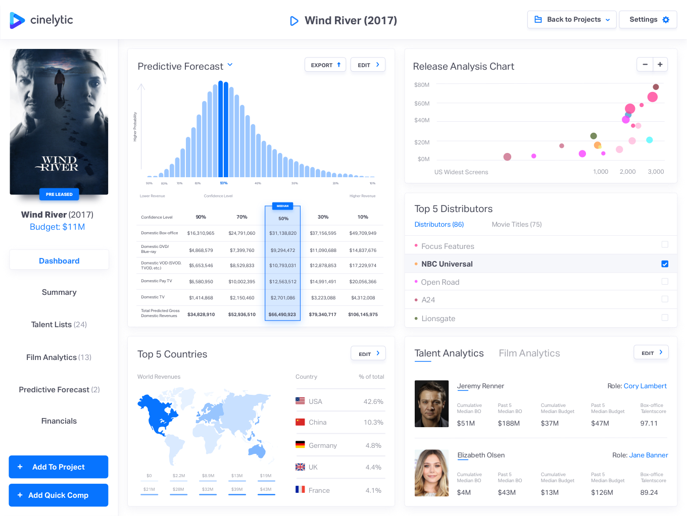
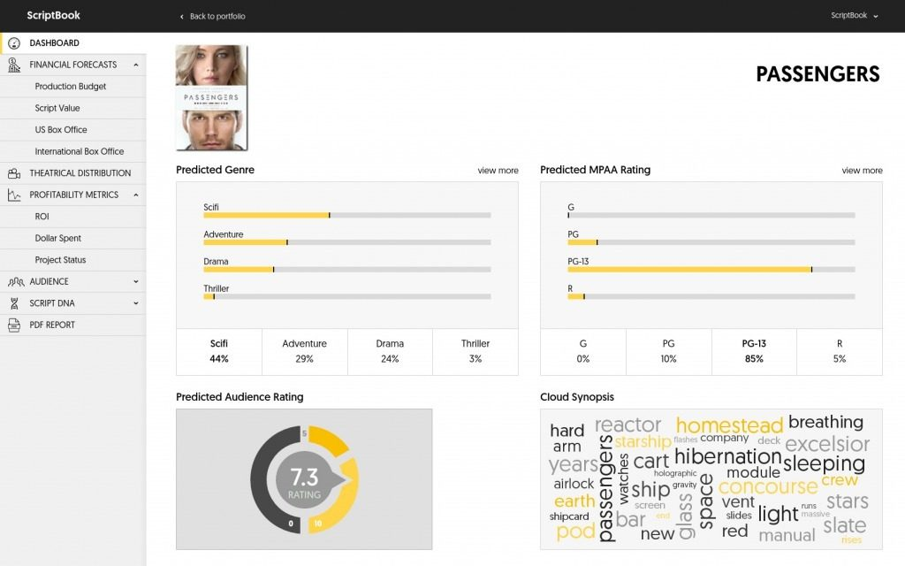
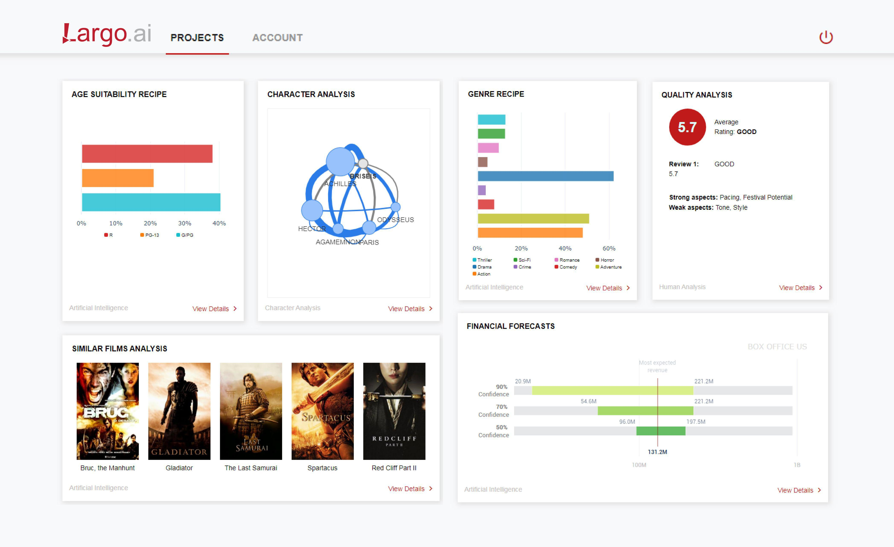
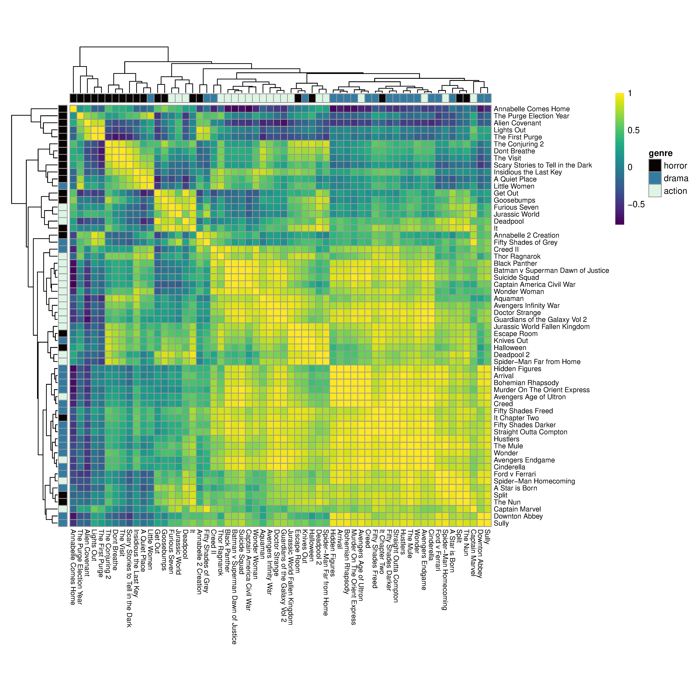
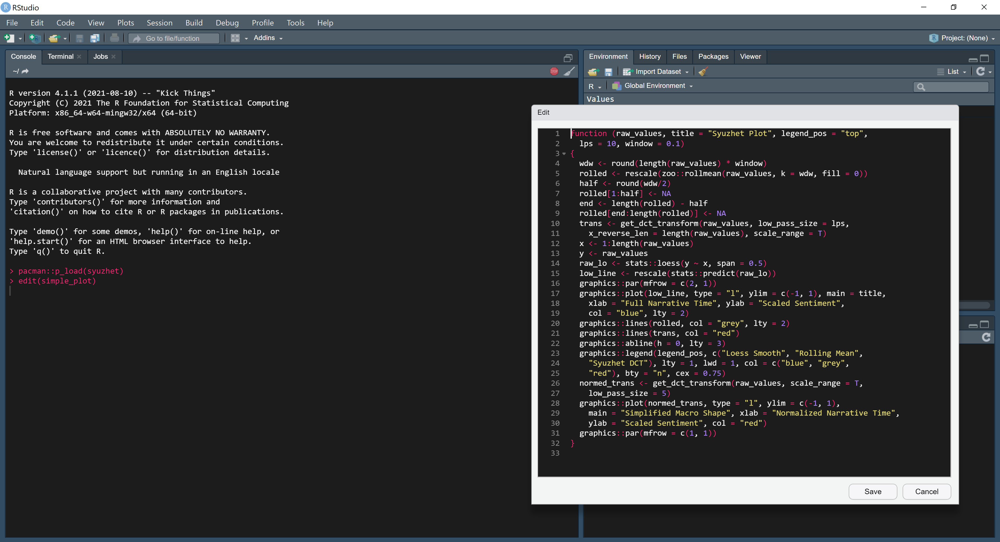

# Analysing lexical texts {#texts}

<br>

::: {style="text-align: right"}
> Pity the poor screenwriter, for he cannot be a poet. He cannot use metaphor and simile, assonance and alliteration, rhythm and rhyme, synecdoche and metonymy, hyperbole and meiosis, the grand tropes. Instead, his work must contain all the substance of literature but not be literary. A literary work is finished and complete within itself. A screenplay waits for the camera. If not literature, what then is the screenwriter's ambition? To describe in such a way that as the reader turns pages, a film flows through the imagination. <br><br> Robert McKee [-@mckee1997ssss: 395]
:::

<br>

A film is not a film singly; it exists at the centre of a textual web that includes its production materials (screenplay, shooting script, costumes and costume designs, props and prop designs, lighting designs, etc.), and its paratexts (trailers, posters, reviews, merchandise, social media, fan-produced texts, etc.) [@gray2010sssp]. Many of the texts connected to a film are *lexical* texts; that is, they are texts related to or derived from a motion picture made up of *words* that can be analysed [stylometrically](https://en.wikipedia.org/wiki/Stylometry). 

Computational analyses of cinema's lexical texts are a major part of the new phase of the technological development of the cinema, with data-driven methods using [machine learning](https://en.wikipedia.org/wiki/Machine_learning) and [natural language processing](https://en.wikipedia.org/wiki/Natural_language_processing) (NLP) models applied to assessing screenplays prior to production to predict the success of a movie based on a script. 

[Cinelytic](https://www.cinelytic.com) was founded in Los Angeles in 2013. The company makes predictions about the future success of a movie at the pre-production phase using *talent analytics*, which combines information about actors’ popularity, box office, reviews, age, and social media interactions, and *film analytics*, that considers likely box office performance based on a film’s genre and compares the performance of different distributors. The outputs of this process are intended to support producers in making decisions about which films to greenlight for production, thereby minimising the risk of investing in a product.

```{r texts-intro-image-cinelytic, out.extra='class=\"zooom\"', echo = FALSE, out.width = "90%", fig.align = "center", fig.cap = paste("The Cinelytic dashboard. ", emo::ji("point_up"))}

```

Belgian company [ScriptBook](https://www.scriptbook.io/#!/), founded in 2015, analyses over 400 different parameters, identifying the genre and predict the MPAA rating of a script; conduct a sentiment analysis to determine the emotions of a scene; estimate the degree to which audiences will find characters likeable; and assess the gender equality of a screenplay (including the [Bechdel test](https://en.wikipedia.org/wiki/Bechdel_test)), looking at the percentage of male and female characters, the percentages of screen presence and spoken lines of those characters, and the distribution of gender interactions. The ScriptBook system will also identify target audiences for a film based on a script, segmenting that potential audience by gender and age; and make a range of forecasts about the likely success of a film by predicting its budget, box office gross, return on investment, and will make a recommendation as to whether a film based on a script should be greenlit.

```{r texts-intro-image-scriptbook, out.extra='class=\"zooom\"', echo = FALSE, out.width = "90%", fig.align = "center", fig.cap = paste("The ScriptBook dashboard. ", emo::ji("point_up"))}

```

[Largo.AI](http://largofilms.ch), based in Switzerland and founded in 2018, analyses the content of screenplays to detect genre, predict audience reactions, and propose talent for a film at the pre-production phase. Largo.AI can also be used to enhance a film at different stages of production by analysing texts, videos, and audio creating a ‘film recipe’, proposing changes to the film to maximise its profitability. Largo.AI’s analysis is directed towards identifying the target audience of a film and the changes it proposes to a screenplay are directed towards that end. This audience may vary from country to country and so Largo.AI localises proposed changes to vary a single film according to differences in genre popularity between countries.

```{r texts-intro-image-largo,out.extra='class=\"zooom\"', echo = FALSE, out.width = "90%", fig.align = "center", fig.cap = paste("The ScriptBook dashboard. ", emo::ji("point_up"))}

```

The stylometric studies that form the basis for new filmmaking technologies such as Cinelytic, ScriptBook, and Largo.AI use a wide range of methods to explore different aspects of different types of lexical texts connected to motion pictures. (For a discussion of the practicalities of using different types of lexical texts see [below](#practical)).

@murtagh2009tson and @murtagh2010tcfd explored the structure of *screenplays* of individual films and television programmes using [correspondence analysis](https://en.wikipedia.org/wiki/Correspondence_analysis), hierarchical clustering, and tag clouds to identify linear and hierarchical relationships between scenes and sequences, and demonstrating there is a significant degree of formal continuity between film and television screenplays.

@schmidt2015paav used *subtitles* to identify plot arcs in different types of films and television episodes, combining sentiment analysis with principal components analysis to plot the structures of a motion pictures sorted according to types identified using [topic modelling](https://en.wikipedia.org/wiki/Topic_model). @delvecchio2020ipih analysed subtitles of over 6000 films, applying [sentiment analysis](https://en.wikipedia.org/wiki/Sentiment_analysis) and cluster analysis to group films by their emotional arcs and identifying six basic narrative shapes, before comparing the structure of films to their box office performance to determine which types of narratives are popular with audiences.

Analysis of *transcriptions* of dialogue of films and television programmes has shown that screenwriters tend to adapt their style to the demands of genre [@holobut2016sots], though network analysis of dialogue revels strong authorial signals within genres and cinematic universes [@holobut2020tsof]. @holobut2020tsof applied sentiment analysis to track changes in sentiments over time, finding that the proportions of positive and negative sentiments in romance films and thrillers have remained stable since the 1940s while action films, superhero films, and vampire films exhibit small increases in the proportion of negative sentiments. @byszuk2020tvod analysed transcriptions of dialogue in episodes of *Doctor Who*, identifying strong stylistic differences between classic series (produced between 1963 and 1989), with 'communities' of episodes within these group reflecting generic and topical differences, and the new series (those produced since 2005), which shows a strong authorial signal of the showrunners. This study also identified strong authorial styles of *Doctor Who's* showrunners in the writing process, using machine learning (specifically, [support vector machines](https://en.wikipedia.org/wiki/Support-vector_machine)) to classify dialogue according to its authorship shared between the writer and the show runner. @vanzyl2016saci identified differences in the speech patterns of characters in *The Big Bang Theory* (2007-2019), showing that each of the main characters had a distinct 'voice' and that the speech of the Sheldon Cooper character was linguistically distinct from other characters in the show reflecting the specific linguistic choices made by the screenwriters in constructing characters.

*Audio descriptions* for blind and visually impaired cinemagoers have been used to explore the semantic content of motion pictures, charting narratively significant character actions over the course of a film, distinguishing between actions characteristic of different genres, and associating characters with narrative events [@salway2007acao; @salway2005whif; @salway2007acwe]. @matthews2021gaom applied topic modelling to *plot summaries* of over 32000 films to identify the lexical signatures of different genres and to track the evolution of those signatures over time. Even *movie titles* have been analysed in order to predict the box office success of motion pictures [@bae2019tiom]. 

There are several packages for text analysis in R covering a wide range of methods, including:

- natural language processing: cleanNLP [@R-cleanNLP] and coreNLP [@R-coreNLP].
- sentiment analysis: SentimentAnalysis [@R-SentimentAnalysis], sentimentr [@R-sentimentr], sentometrics [@ardia2021trps], syuzhet [@R-syuzhet], and vader [@R-vader].
- text mining and text analysis: quanteda [@benoit2018qarp], stylo [@eder2016swra], tidytext [@slige2016ttma], and tm [@feinerer2008tmii].
- data wrangling for text data: textclean [@R-textclean] and stringr [@R-stringr].
- topic modeling: topicmodels [@grun2011taro].

There are also specialist packages for working with specific types of cinematic lexical texts. Packages such as srt [@R-stylo] and subtools [@R-subtools] make working with `.srt` subtitle files straightforward.

In this chapter we will not attempt to cover every possible method for analysing lexical texts. Rather, we will focus on three areas: processing movie subtitles to produce a tidy data set for analysis; clustering films based on word frequencies and proportions; and sentiment analysis and the structure of films. Those who would like to explore further methods can adapt the approaches described in @silge2017tmwr to cinema's lexical texts.

## Setting up the project

### Create the project
We will begin by creating a new project in RStudio from a new directory using the `New project...` command in the `File` menu and run the script `projects_folders.R` we created in Chapter \@ref(tools). We will create additional subfolders within this structure as we go to make it easier to manage our data.

### Packages
In this chapter we will use the packages listed in Table \@ref(tab:texts-project-table-packages):

```{r texts-project-table-packages, results="asis", echo = FALSE}
pacman::p_load(here, tidyverse)
packages <- read_csv(here("Data", "packages.csv"), show_col_types = FALSE)

packages %>% 
  filter(chapter == "texts") %>%
  select(-chapter) %>%
  arrange(Package) %>% 
  knitr::kable(caption = "Packages for analysis of cinemas lexical texts.") %>%
  kableExtra::kable_styling(bootstrap_options = c("striped"), font_size = 14)
```

### Data
Our data set in this chapter will be the subtitles for the top twenty grossing films at the US box office (adjusted for inflation) in the genres horror, drama, and action from 2015 to 2019 based on data from [The Numbers](https://www.the-numbers.com). Table \@ref(tab:texts-data-table-sample) lists the films in the sample.

```{r texts-data-table-sample, results = "asis", echo=FALSE}
pacman::p_load(DT)
df_texts_sample <- read_csv(here("Data", "texts_sample.csv")) %>% arrange(Genre)
datatable(df_texts_sample, rownames = FALSE, class = "cell-border stripe",
          options = list(initComplete = JS("function(settings, json) {",
                                           "$(this.api().table().header()).css({'font-size': '12pt'});", "}"))) %>%
  formatStyle(columns = colnames(df_texts_sample), fontSize = '10pt')

cat("<table width=100%>", paste0("<caption>", "(#tab:texts-data-table-sample)", "The top 20 grossing horror, drama, and action films at the US box office from 2015 to 2019. Box office gross is adjusted for inflation. Source: ", "<a href='https://www.the-numbers.com'>The Numbers</a>", ". &#9757;", "</caption>"),"</table>", sep = "\n")
```

The subtitles for each film in the sample were downloaded from [opensubtitles.org](https://www.opensubtitles.org/en/en%20) as `.zip` files and extracted to access the `.srt` files. 

Each `.srt` file is accompanied by an [`.nfo`](https://en.wikipedia.org/wiki/.nfo) file, which contains information from opensubtitles.org about the subtitles we have downloaded. We will not use any of this information and files of this type can be ignored.

To make it easier to manage the subtitle files we can create a subfolder for each genre within the Data folder for the project. The `.srt` files for the films in each genre are then stored in their respective folders.

```{r texts-data-code-subfolders, eval=FALSE}
genre_sub_folders <- c("action", "drama", "horror")

for (f in genre_sub_folders){dir.create(here::here("Data", f))}
```

## Working with `.srt` files
The subtitles for each film in the sample are contained in `.srt` files that include the number of the subtitle, the start and end points in hours:minutes:seconds,milliseconds, and the text of the subtitle. The first six subtitles in *Aquaman* (2018) are shown below.

```{r texts-srt-code-txt, comment='', echo=FALSE}
cat(readLines(here::here("Data", "aquaman_sample.txt")), sep = '\n')
```

We need to re-arrange this data into a useable format for analysis. The srt package makes working with `.srt` files simple, extracting the information in the file and arranging it as a data frame that includes the number of the subtitle, the start and end times of the subtitle, which are converted to seconds, and the text of the subtitle. Table \@ref(tab:texts-srt-table-df) displays the first six subtitles in *Aquaman* arranged as a data frame after loading using the `srt::read_srt()` function.

```{r texts-srt-code-read, eval=FALSE}
pacman::p_load(srt)
aquaman_subtitles <- read_srt(here("Data", "action", "Aquaman.2018.720p.BluRay.x264.srt"),
                              collapse = " ")
```

```{r texts-srt-table-df, results = "asis", echo=FALSE}
read_csv(here("Data", "aquaman_sample.csv")) %>% 
  select(-film) %>%
  knitr::kable(caption = "The first six subtitles of  *Aquaman* (2018) arranged as a data frame after loading using `srt::read_srt()`.") %>%
  kableExtra::kable_styling("striped", font_size = 14)
```

To read the `.srt` files for each film in each genre we will loop of the subfolders in our Data directory and loop over each file within each subfolder to create a data frame `df_subtitles` that contains the subtitles for each film. 

First, we will get a list of the directories in our project's Data folder. The result is returned as a character vector of the folder names. By setting `full.names = FALSE` we get just the names of the folders in the Data folder rather than the full path to each directory. Setting `recursive = FALSE` means the Data folder will not be included in the object `folders`.

```{r texts-srt-code-listdirs, eval=FALSE}
folders <- list.dirs(here("Data"), full.names = FALSE, recursive = FALSE)

folders
```

```{r texts-srt-code-folders, eval=FALSE}
## [1] "action" "drama"  "horror"
```

Within each folder, we will loop over the `.srt` files to read them and add them to the data frame `df_subtitles` that will store our data set. 

`.srt` files on opensubtitles.org have a naming convention whereby the title of the film is followed by the year of release and the details of the source media. For example, the filename of the `.srt` file for *Bohemian Rhapsody* (2018) is `Bohemian.Rhapsody.2018.720p.BluRay.x264-SPARKS.srt`. We only need the title of the film and so we will use `stringr::str_split()` to split the filename into two parts at the release year using the pattern `.20` (because all the films in our example were released since 2015 and some sequels have `.2` in their filename) and keep the string with index `1` (i.e., everything before `.20` in the filename), which is the title of each film. We also want to replace any dots (`.`) in the film's title with a space using `stringr::str_replace_all()` -- notice that the dots need to be escaped using [double backslashes](https://stringr.tidyverse.org/articles/regular-expressions.html#escaping) (`\\.`) in order for R to recognise them as characters.

From experience, I have found that `srt::read_srt()` does not always assign an id number to the first subtitle in the data frame, leaving the cell with a value of `NA`. We can use `dplyr::replace_na()` to assign the correct value of `1` if this is the case.

```{r texts-srt-code-loops, eval=FALSE}
# Create an empty data frame to store the results
df_subtitles <- data.frame()

# Loop over each folder in the Data directory
for(f in seq_along(folders)){
  
  genre <- folders[f]
  
  # Get a list of the .srt files in a folder
  files <- list.files(here("Data", genre), pattern = "*.srt$")
  
  # Loop over each .srt file in a folder
  for (i in seq_along(files)){
    
    file <- files[i]
    film <- str_split(file, pattern = ".20", simplify = TRUE)[1]
    film <- str_replace_all(film, pattern = "\\.", replacement = " ")
    
    dat <- read_srt(here("Data", genre, files[i]), collapse = " ")
    
    dat <- dat %>% mutate(genre = rep(genre, length(n)),
                          film = rep(film, length(n)),
                          n = replace_na(n, 1)) %>%
      relocate(film) %>%
      relocate(genre) 
    
    df_subtitles <- rbind(df_subtitles, dat)
    
  }
  
}
```

```{r texts-srt-code-data, echo=FALSE}
df_subtitles <- read_csv(here("Data", "df_subtitles.csv"), show_col_types = FALSE)
```

### Removing html tags
As we can see in Table \@ref(tab:texts-srt-table-df), some subtitles are intended to be presented as italics and will be tagged using the [html italic tags](https://www.w3schools.com/html/html_formatting.asp): `<i>` ... `</i>`. These need to be removed prior to analysis. We can do this using the `str_replace_all()` function from the stringr package. We will remove these tags and replace them with nothing, i.e. `""` (Table \@ref(tab:texts-srt-table-tags)).

```{r texts-srt-code-tags, eval=FALSE}
df_subtitles <- df_subtitles %>% 
  mutate(subtitle = str_replace_all(subtitle, c("<i>" = "", "</i>" = "")))
```

```{r texts-srt-table-tags, echo=FALSE}
df_subtitles %>% filter(film == "Aquaman") %>% slice_head(n = 6) %>%
   knitr::kable(caption = "The first six subtitles of  *Aquaman* (2018) with html tags removed.") %>%
  kableExtra::kable_styling("striped", font_size = 14)
```

### Removing extended ASCII and unicode characters

Some subtitles will indicate lyrics by topping and tailing a subtitle with a musical note (`r knitr::asis_output("\U1D160")[1]`). When these are rendered as a characters in the `df_subtitles` data frame they will appear as a nonsensical set of symbols (e.g., `♪`) because the [unicode](https://en.wikipedia.org/wiki/Unicode) character of the musical note cannot be represented as an ASCII character. These will also need to be removed. Rather than use the stringr package, this time we will use the `gsub()` function with [regular expressions](https://en.wikipedia.org/wiki/Regular_expression) (regex) to remove all non-ASCII characters that do *not* have [hex codes](https://en.wikipedia.org/wiki/Hexadecimal) between `20` and `7E` (though we could use [stringr with regular expressions](https://stringr.tidyverse.org/articles/regular-expressions.html) if we wished to). [ASCII](https://en.wikipedia.org/wiki/ASCII) is a character encoding format that enables text characters to be represented numerically by a computer. For example, `A` has the ASCII code `65` (or `41` in hex). [ASCII characters](https://www.asciitable.com) with hex codes in the range `20` to `7E` are the *printable characters* and include letters (upper and lower case) and the main punctuation symbols in English. 

To replace ASCII characters outside the desired range with no character in the `subtitle` column of the `df_subtitles` data frame we need to tell `gsub()` (1) what to look for (`"[^\x20-\x7E]"`) -- `^` is the symbol for logical [`NOT`]((https://en.wikipedia.org/wiki/Negation)) in regex; (2) what the replacement string is (`""`); and (3) the text source (`df_subtitles$subtitle`).

```{r texts-srt-code-regex}
df_subtitles$subtitle <- gsub("[^\x20-\x7E]", "", df_subtitles$subtitle)
```

This means that song lyrics will now be treated the same as dialogue in the data frame, which may not be desirable depending on the design of a particular study. We may want to remove such text completely from the data frame. However, we will not let this worry us here.

ASCII characters in the range `20` to `7E` do not include accented characters (i.e., letters with acute, grave, circumflex, umlauts, and other accents), which are a part of extended ASCII. Consequently, words that have accented characters will be altered. For example, fianc&#233; will become fiance. Working with languages other than English will thus require consideration of the character map used to represent letters. Some [companies](https://www.capitalcaptions.com/services/subtitle-services-2/capital-captions-standard-subtitling-guidelines/) require their subtitlers use [UTF-8 character encoding](https://en.wikipedia.org/wiki/UTF-8) to ensure proper display of foreign characters, but words including such characters may not suitable for sentiment analysis because they may not be recognised by a sentiment lexicon. 

### Removing subtitle credits
Subtitles on opensubtitles.org are submitted by members of the public who may add a subtitle identifying their work (Table \@ref(tab:texts-srt-table-credits)).

```{r texts-srt-table-credits, results = "asis", echo=FALSE}
df_subtitles %>% filter(str_detect(subtitle, "Subtitles")) %>%
  slice_head(n = 5) %>%
  knitr::kable(caption = "A sample of rows in the data frame `df_subtitles` containing the string `Subtitles`") %>%
  kableExtra::kable_styling("striped", font_size = 14)
```

We want to remove all these rows from our data frame and so we will filter out all the rows that contain the string `Subtitles`. To do this we use the `stringr::str_detect()` function to find the rows that contain a particular string of characters, prefacing it with an exclamation mark `!`, which is the symbol for logical `NOT` in dplyr. The following code thus leaves behind all those rows that do *not* contain the string `Subtitles`.

```{r texts-srt-code-filter}
df_subtitles <- df_subtitles %>%
  filter(!str_detect(subtitle, "Subtitles"))
```

This will require us to re-number the subtitles for films that affected by this process.

```{r texts-srt-code-renumber}
df_subtitles <- df_subtitles %>%
  group_by(film) %>%
  mutate(n = 1:length(film))
```

Looking at the example of *Avengers Endgame* (2019) in Table \@ref(tab:texts-srt-table-wrangled), we can see that the first subtitle containing the credit for the creator of the `.srt` file has been removed and that the subtitles have been re-numbered.

```{r texts-srt-table-wrangled, results = "asis", echo=FALSE}
df_avengers <- df_subtitles %>% filter(film == "Avengers Endgame") %>%
  slice_head(n = 5)

datatable(df_avengers, rownames = FALSE, class = "cell-border stripe",
          options = list(dom = "t",
                         initComplete = JS("function(settings, json) {",
                                           "$(this.api().table().header()).css({'font-size': '12pt'});", "}"))) %>%
  formatStyle(columns = colnames(df_avengers), fontSize = '10pt')

cat("<table width=100%>", paste0("<caption>", "(#tab:texts-srt-table-wrangled)", "The first five subtitles in *Avengers Endgame* (2019) after filtering and re-numbering.", "</caption>"),"</table>", sep = "\n")
```

Now that we have wrangled our `.srt` files into a tidy data frame and cleaned the text, we can begin our analysis.

## Word frequencies: correlation and cluster analysis
@slige2016ttma describe a method of comparing the frequency of words in texts based on the [correlations between the proportions of words in a pair of texts](https://www.tidytextmining.com/tidytext.html#word-frequencies). 

Here we will extend this method to produce a heatmap that lets us explore relationships between the subtitles of the films in our sample and to cluster texts based on those correlations.

First, we will need to load the tidytext package so that we can create a tidy data frame with one row for each word in each film that displays the frequency with which that word occurs in a film. The `unnest_tokens()` function splits the text in each subtitle into tokens at a specified level, where a token is a meaningful unit of text such as a word, an [*n*-gram](https://en.wikipedia.org/wiki/N-gram), or a sentence. Here we are interested tokens at the level of individual words in the subtitle column of the `df_subtitles` data frame and so we pass the keyword arguments `word` and `subtitle` to the function. [Stop words](https://en.wikipedia.org/wiki/Stop_word) are commonly occurring words such as *and*, *the*, *of*, *to*, and so on that are filtered out of a sample because they are not useful when analysing texts. These can be removed using the `anti-join()` function, which filters the contents of a data frame (the unnested word counts) that do *not* match the contents of a second data frame (the list of stop words). We will store our results in a new data frame `df_word_counts`.

```{r texts-correlation-code-n}
pacman::p_load(tidytext)

df_word_counts <- df_subtitles %>% 
  group_by(film) %>%
  unnest_tokens(word, subtitle) %>% 
  count(word, sort = TRUE) %>% 
  anti_join(stop_words) %>%
  arrange(film)

head(df_word_counts)
```

We can see from the head of the data frame that the most commonly occurring words in *A Quiet Place* (2018) are *protect*, *safe*, *sound*, and *stop*, though the frequencies are low because this film features little dialogue, most of which is signed.

We can use the data frame `df_word_counts` to calculate the proportion of words in a film's subtitles and pivot the data frame to a wide format with the words in the sample assigned to the row names of the data frame.

```{r texts-correlation-code-p}
df_word_props <- df_word_counts %>%
  group_by(film) %>%
  mutate(proportion = n / sum(n)) %>%
  select(-n) %>%  # Drop the count column
  pivot_wider(names_from = film, values_from = proportion) %>%
  column_to_rownames(var = "word")

df_word_props[1:5, 1:3]
```

Looking at the head of the data frame containing the word proportions we see that *protect* occurs in *A Quiet Place* and *Alien: Covenant* (2017), though it accounts for a lower proportion of the total dialogue in the latter. *protect* does not occur in *A Star is Born* (2018) and so has the value `NA`.

To calculate the correlation between the proportion of words in the films in our sample, we first need to convert the data frame to a matrix: `m_word_props`. We will then calculate the pairwise correlations between every film in the sample using the `cor()` function, with the `use` argument sent to `complete.obs` so that missing values handled by [case-wise deletion](https://www.statisticssolutions.com/missing-data-listwise-vs-pairwise/). This means that the correlation between each pair of films is based on a set of variables shared by all films and variables that have at least one missing value are dropped. Setting `use = pairwise.complete.obs` handles missing data by pair-wise deletion with each pair of variables for which data is available included in the correlation matrix. This will result in a matrix with different correlation coefficients because it is based on a different set of variables (i.e., words). 

```{r texts-correlation-code-correlations}
# Change the class of the word proportions to a matrix
m_word_props <- as.matrix(df_word_props)

# Correlations between films using case-wise deletion
m_word_correlations <- cor(m_word_props, method = "pearson", 
                           use = "complete.obs")

m_word_correlations[1:5, 1:3]
```

The correlation matrix is too large to read and so we will visualise the information it contains as a [heatmap](https://en.wikipedia.org/wiki/Heat_map). But first, we have to do a little data wrangling.

To be able to identify the genre of the films in the heatmap we need to create a list of the films in the sample and the genres they are associated with and assign a colour to each genre. We can do this by creating a data frame `df_annotations()` containing a list of the films in the sample, using `dplyr::distinct()` to get a list in which each film title appears only once. (In the `df_subtitles` data frame the title of each film occurs multiple times). We also need to convert the column of film titles to the row names in the data frame. Having done that we will count the number of different genres in the sample and assign a colour to each genre that we will pass to our heatmap.

```{r texts-correlation-code-annotations}
df_annotations <- df_subtitles %>% select(genre, film) %>%
  distinct(genre, film, .keep_all = TRUE) %>% 
  column_to_rownames(var = "film")

# Count the number of genres in the sample
k <- length(unique(df_annotations$genre))

# Create a palette with k colours using the mako palette
pal <- viridis::mako(k)

# Create a list associating a genre with each colour in the palette
annotations_pal <- list(genre = c("horror" = pal[1], 
                                  "drama" = pal[2], 
                                  "action" = pal[3]))
```

To visualise the relationships between films we will use the pheatmap package, which will give us a heatmap of the correlations between films along with a [dendrogram](https://en.wikipedia.org/wiki/Dendrogram) showing how the subtitles of the films cluster. `df_films` is passed as a list of annotations along with the annotation colours in `annotations_pal`. We can select a [hierarchical clustering](https://en.wikipedia.org/wiki/Hierarchical_clustering) method from the options for the `method` argument for the `hclust()` function in the base stats packages. Here we will use the [complete linkage](https://en.wikipedia.org/wiki/Complete-linkage_clustering) method.

```{r texts-correlation-plot-heatmap, eval=FALSE}
pacman::p_load(pheatmap)

pheatmap(m_word_correlations, 
         # Add annotations to the columns and rows of the heatmap
         annotation_col = df_annotations, annotation_row = df_annotations,
         # Colours for the annotations
         annotation_colors = annotations_pal, 
         # Suppress the label for the annotation row and column
         annotation_names_row = FALSE, annotation_names_col = FALSE,
         # Set the palette for the heatmap with 50 levels
         color = viridis::viridis(50), 
         # Set the method for hierarchical clustering
         clustering_method = "complete",
         # Control display elements of the heatmap
         fontsize_row = 8, fontsize_col = 8, cellheight = 8, cellwidth = 8)
```

```{r texts-correlation-image-test, out.extra='class=\"zooom\"', echo = FALSE, out.width = "90%", fig.align = "center", fig.cap = paste("Heatmap and cluster analysis of a sample of movie subtitles in three genres. ", emo::ji("point_up"))}

```

The heatmap and dendrogram in Figure \@ref(fig:texts-correlation-image-test) shows that there is reasonable separation between different genres (reading the columns from left to right), with horror films grouping on the left (*Annabelle Comes Home* (2019) to *It* (2017)), action films in the central cluster (*Annabelle: Creation* (2017) to *Spider-man Far From Home* (2019)), and drama films on the right (*Hidden Figures* (2016) to *Sully* (2016)), though the clustering does not perfectly separate the different classes of films. *Little Women* (2019), for example, does not cluster with the other drama films and finds itself among the horror films. This is because *Little Women* appears to correlate highly with *A Quiet Place* because both films have a relatively high proportion of words relating to family (e.g. *mother*). The centre of the heatmap is comprised of superhero films, mixing together films from the Marvel and DC universes, but other superhero movies are to be found elsewhere in the heatmap. *Deadpool* (2016) is to be found among the horror films, while *Captain Marvel* (2019) and *Avengers Endgame* (2019) are to be found among the group dominated by drama films. Interestingly, films do not cluster with their sequels. *Deadpool* and *Deadpool 2* (2018) do not cluster together. Nor do the four Avengers films; *It* and *It: Chapter 2* (2019); *Creed* (2015) and *Creed II* (2018); and *Fifty Shades of Grey* (2015) and *Fifty Shades Darker* (2017) and *Fifty Shades Freed* (2019), though the latter two films are part of the larger cluster of drama films while the first movie in the franchise is not.

Looking at the heights of the branches of the dendrogram and the correlation between films within the three main clusters, we see that for films in the cluster dominated by drama films tend be more correlated, with lower branches in the dendrogram. This indicates that the proportions of words in films in this cluster are more similar to one another than films in the cluster dominated by horror films, which exhibits less correlation between films within this cluster and the branches of the dendrogram tend to be higher indicating greater distance between the films. That said, there are three groups within the horror-dominated cluster that are much more similar to one another than to other films in this cluster. 

## Sentitment analysis: emotion and structure
Torben Grodal's mental flow model of the experience of watching a film takes film genres to be prototypical narrative forms constructed to evoke characteristic emotions in viewers [@grodal1997mpan; @grodal1999ecan; @grodal2005ffiv]. The characteristic emotion of action films is aggressive tensity, while fear is the characteristic emotion of horror films. Tragedies, comedies, and romances are characterised by sorrow, laughter, and romantic love, respectively. If genres are associated with particular emotions then we should expect to see this reflected in the use of emotional words in the dialogue of films belonging to a particular genre. 

[Sentiment analysis](https://en.wikipedia.org/wiki/Sentiment_analysis) is a natural language processing technique to automatically identify, quantify, and classify the emotional valence of a text; evaluate a text's polarity (positive, negative, neutral) and the presence and absence of different affective states (such as anger, joy, sadness, surprise); and analyse the temporal evolution of its sentiments over the course of a text.

The valence of a text is determined by a [sentiment score](https://www.analyticsvidhya.com/blog/2021/12/different-methods-for-calculating-sentiment-score-of-text/). The most common way of assigning a sentiment score is to match the words in a text to a lexicon of terms that have been identified as possessing a particular polarity, exhibiting an affective state, or a value representing the strength of the emotion. Commonly used lexicons include [AFINN](http://www2.imm.dtu.dk/pubdb/pubs/6010-full.html), [bing](https://www.cs.uic.edu/~liub/FBS/sentiment-analysis.html), and [nrc](https://saifmohammad.com/WebPages/NRC-Emotion-Lexicon.htm). The sentiment score can be assess at different textual levels, including individual words, sentences, or whole texts.

In this section, we will explore the frequency of different emotions across genres in our sample and the emotional structure of films using the sentimentr and syuzhet packages.

### Emotion words

To illustrate a simple sentiment analysis we will use the subtitles for *Annabelle: Creation* (2017), which we will filter from our `df_subtitles` data frame. To extract the sentences for this film we will use the `get_sentences()` function from the sentimentr package to create a list of sentences from the subtitle text in our data frame.

```{r texts-emotions-code-sentences}
# Select the data for Annabelle: Creation
df_annabelle_2 <- df_subtitles %>%
  filter(film == "Annabelle 2 Creation")

# Load the required packages
pacman::p_load(sentimentr, syuzhet)

# Extract the sentences from the subtitles
annabelle_2_sentences <- get_sentences(df_annabelle_2$subtitle)
```

To assign emotions to sentences we use the `sentimentr::emotion()` function. The `emotion()` function returns a data frame that counts the number of words in each sentence and the number of words of each emotion type. It then assigns a score to each emotion for that sentence by dividing the number of words assigned to each emotion by the total number of words in the sentence.

In this example we are using the nrc lexicon from the lexicon package. This lexicon assigns a value of -1 to negative words and 1 to positive words. We will also use the valence shifters from the lexicon package in order to recognise when emotions are negated so that terms with a negative valence (e.g., *not happy*) are not mistaken for terms with a positive valence (*happy*) because a negation or a [contrasting conjunction](https://dictionary.cambridge.org/grammar/british-grammar/conjunctions-contrasting) is ignored. Ignoring a negation is a problem with some R packages for sentiment analysis and users should make sure they have read the manuals and vignettes for a package to understand how it handles word valences. The valence shifters also amplify and de-amplify emotions in order to modulate the strength of an emotion.

```{r texts-emotions-code-emotions}
annabelle_2_emotions <- emotion(annabelle_2_sentences,
                                emotion_dt = lexicon::hash_nrc_emotions,
                                valence_shifters_dt = lexicon::hash_valence_shifters,
                                drop.unused.emotions = FALSE)
```

The first sentence in the subtitles for *Annabelle: Creation* ("`r annabelle_2_sentences[[1]]`") has eight words, one of which is tagged as a fear word (*hide*), to give a fear score of $\frac{1}{8} = 0.125$. The score for all other emotions is zero (Table \@ref(tab:texts-emotions-table-emotions)).

```{r texts-emotions-table-emotions, results = "asis", echo=FALSE}
annabelle_2_emotions %>% 
  filter(element_id == 1) %>% 
  datatable(rownames = FALSE, class = "cell-border stripe", 
            options=list(initComplete = JS("function(settings, json) {",
                                           "$(this.api().table().header()).css({'font-size': '10pt'});", "}"))) %>%
  formatStyle(columns = colnames(annabelle_2_emotions), fontSize = '8pt')

cat("<table width=100%>", paste0("<caption>", "(#tab:texts-emotions-table-emotions)", "The emotions of words in the first sentence of the subtitles of *Annabelle: Creation* (2017). ", "&#9757;", "</caption>"),"</table>", sep = "\n")
```

We can count the number of words assigned to each emotion and plot them as a bar chart to analyse frequency of different emotions. Along the way we also want to do a little data wrangling, converting the names of the emotions to a factor; formatting the names to replace the underscores the `sentimentr::emotion()` function uses to append `negated` to a category of emotion (e.g. `anger_negated`) with a space; and capitalizing the names of the emotions.

```{r texts-emotions-code-count}
annabelle_2_emo_counts <- annabelle_2_emotions %>% 
  group_by(emotion_type) %>% 
  summarise(count = sum(emotion_count)) %>% 
  mutate_if(is.factor, as.character) %>% 
  arrange(emotion_type) %>% 
  mutate_at("emotion_type", str_replace, "_", " ") %>% 
  mutate(emotion_type = R.utils::capitalize(emotion_type))

head(annabelle_2_emo_counts)
```

Figure \@ref(fig:texts-emotions-plot-count) shows that dialogue in *Annabelle: Creation* uses a broad range of emotions. Positive emotions such as `joy` and `trust` are the most frequent categories, but negative emotions (`anger`, `disgust`, `fear`, and `sadness`) are slightly less numerous in aggregate. The nrc emotion lexicon has more negative categories than positive categories and so the way it assigns words across categories may introduce a bias into any analysis, indicating a false diversity of terms across a particular valence. In the context of the horror genre, `anticpation` and `surprise` words may be considered as a negative emotion as they will serve to creating a frightening experience for the viewer. In another genre, such as romance, such words will likely have a positive valence. Negated emotional terms are relatively rare, indicating that emotions conveyed through dialogue in *Annabelle: Creation* are direct.

```{r texts-emotions-plot-count, out.width="90%", fig.align='center', fig.cap="The frequency of words by different emotions in *Annabelle: Creation* (2017)."}
ggplot(data = annabelle_2_emo_counts) +
  geom_col(aes(x = reorder(emotion_type, desc(emotion_type)), 
               y = count, fill = emotion_type)) +
  geom_text(aes(x = emotion_type, y = count, label = count), 
            hjust = -0.4, size = 3.2) +
  scale_x_discrete(name = "Emotion") +
  scale_fill_viridis_d() +
  coord_flip() +
  theme_classic() +
  theme(axis.line = element_blank(),
        axis.text.x = element_blank(),
        axis.ticks = element_blank(),
        axis.title.x = element_blank(),
        legend.position = "none",
        panel.grid = element_blank())
```

We can plot the trendlines of the different emotions over the course of the film by fitting a loess smoother to the emotion scores of the subtitles. Here 'narrative time' is the numbering of the subtitles in order and so does *not* correspond to the running time of the film. We could use the timings we obtained when we loaded the subtitles using `srt::read_srt()` above; however, this presents us with the problem of what to do when there is more than one sentence in a subtitle. The timings returned by `srt::read_srt()` are for the subtitles and *not* for the sentences. We could split the time allocated for such a subtitle in half and work out the timings for each sentence individually, but this would also be artificial.

As negated emotions are infrequent in *Annabelle: Creation* we will drop these from our data frame and focus on the direct emotions only. Having done that, we will select the columns we need and group the data by the `emotion_type` variable and fit the smoother. Different values for the span parameter will return different loess smoothers; here we will use a span of 0.4 for all emotions.

```{r texts-emotions-code-model}
# Drop the negated emotion and do a little formatting
annabelle_2_emotions <- annabelle_2_emotions %>% 
  filter(!str_detect(emotion_type, "_negated")) %>%
  mutate(emotion_type = R.utils::capitalize(emotion_type))

# Fit a loess smoother to each emotion
annabelle_2_fitted_values <- annabelle_2_emotions %>%
  select(element_id, emotion_type, emotion) %>%
  group_by(emotion_type) %>%
  mutate(model = loess(emotion ~ element_id, span = 0.4)$fitted) %>%
  mutate(model = round(model, 5))

head(annabelle_2_fitted_values)
```

Now that we have fitted the smoothers we can plot the results to see how the different emotions evolve over the course of the film. Figure \@ref(fig:texts-emotions-plot-model) shows that for the first half of the subtitles the emotions of `anticipation`, `trust` and `joy` exhibit similar trends. However, in the second half of the data set this relationship is broken as `joy` increases in subtitles towards the end of the film, recovering from its lowest point midway through the film, while  `anticpation` and `trust` do not rise to the same level and fall away at the end. Interestingly, `anticpation` and `suprise` do not have similar trendlines, indicating that words with these emotions do not correlate. Negative emotions tend to be stronger in the second half of the subtitles, with `sadness` and `disgust` both increasing markedly. The relationship between `anger`, `disgust`, and `fear` is complicated with different pairs of emotions having similar trendlines at different points in the film. `anger` and `fear` are closely tied in the first part of the film before `disgust` and `fear` track together while the use of `anger` words falls away and remains low for nearly half the subtitles. Then, in the second half, all three emotions exhibit similar trends before `disgust` increases as the others fall away. `sadness` increases as `joy` decreases and vice versa for most of the film, as one might expect; though in final quarter these two emotions have similar trends. 

```{r texts-emotions-plot-model, out.width="90%", fig.align='center', fig.cap=paste("Fitted loess trendlines in individual emotions in *Annabelle: Creation*.", emo::ji("point_up"))}
annabelle_2_emotion_plot <- ggplot(data = annabelle_2_fitted_values) +
  geom_line(aes(x = element_id, y = model, 
                group = emotion_type, colour = emotion_type,
                text = paste("Narrative time: ", element_id,
                             "<br>", emotion_type, ": ", model))) +
  scale_colour_viridis_d(name = NULL) +
  labs(x = "Narrative time", y = "Emotion") +
  theme_light()

# Load the plotly package to create an interactive plot
pacman::p_load(plotly)

ggplotly(annabelle_2_emotion_plot, tooltip = "text") %>%
  # Format the legend of the interactive plot
  layout(legend = list(orientation = 'h', xanchor = "left", y = -0.2,
                       title = list(text = '<b>Emotion</b>'), 
                       font = list(size = 10.5)))
```

Obviously, this type of analysis excludes much emotional information available to the viewer through performance, facial expressions, mise-en-scéne, and music; but an analysis of the frequency and temporal distribution of emotion words in a text can determine how filmmakers use the full range of formal devices to realise the emotions indicated in the script. 

Next, let us look at the frequency of the different emotion words for every film in the sample sorted by genre. To do this we will need to create a nested data frame `df_films` that has three parts: a character vector identifying the genre of each film, a character vector identifying the title of each film, and list of 60 data frames, one per film, that contains the subtitles of each film.

```{r texts-emotions-code-nest}
# Created a nested data frame of subtitles
df_films <- df_subtitles %>%
  select(genre, film, n, subtitle) %>%
  group_by(genre, film) %>%
  nest()

head(df_films)
```

Once we have created our nested data frame we will loop over each element in each part to build up a single data frame `df_emotions` that will get the sentences from each films subtitles and then the emotion words from those sentences as we did above. As a part of this loop we will create a list of unique indices for each emotion word using `dplyr::group_indices()`. This is a necessary step because when we extract the sentences, any subtitles containing more than one sentence will have the same value in the `element_id` column and be uniquely identified by the value in the `sentence_id` column, making later processing trickier. This occurs because sentimentr treats every subtitle as an individual text rather than as part of a single text. Creating an `id` column based on grouping together the `elmenent_id` and `sentence_id` will make our lives easier.

```{r texts-emotions-code-loop, eval=FALSE}
# Create an empty data frame to collect the results of the loop
df_emotions <- data.frame()

for(i in 1:length(df_films[[1]])){
  
  genre <- df_films[[1]][i] # Get the genre of a film
  film <- df_films[[2]][i]  # Get the title of a film
  subs <- df_films[[3]][i]  # Get the data frame containing a film's subtitles
  
  # Extract sentences the sentences
  sentences <- get_sentences(subs[[1]]$subtitle)
  
  # Get the emotion words
  df <- emotion(sentences, drop.unused.emotions = FALSE)
  
  df <- df %>% mutate(genre = rep(genre, length(element_id)),
                      film = rep(film, length(element_id)),
                      id = group_indices(., element_id, sentence_id)) %>% 
    relocate(id) %>%
    relocate(film) %>%
    relocate(genre) %>%
    select(-c(element_id, sentence_id))
  
  df_emotions <- rbind.data.frame(df_emotions, df)
  
}
```

Now that we obtained the emotion words for each film we can find out how many words occur for each type of emotion for each film.

```{r texts-emotions-code-emocounts, eval=FALSE}
df_emotion_counts <- df_emotions %>% 
  group_by(genre, film, emotion_type) %>% 
  summarise(count = sum(emotion_count)) %>% 
  mutate_if(is.factor, as.character) %>% 
  arrange(emotion_type) %>% 
  mutate_at("emotion_type", str_replace, "_", " ") %>% 
  mutate(emotion_type = R.utils::capitalize(emotion_type),
         genre = R.utils::capitalize(genre))
```

```{r texts-emotions-code-loademocounts, echo=FALSE}
# Takes too long to run the loop every time so load the saved version of the data
df_emotion_counts <- read_csv(here("Data", "df_emotion_counts.csv"))
```

We can check the head of the data frame to ensure it is in the proper format.

```{r texts-emotions-code-emocountshead}
head(df_emotion_counts)
```

Now we can plot the data and begin our analysis.

```{r texts-emotions-plot-emocounts, out.width="90%", fig.align='center', fig.height=10, fig.cap=paste("The frequency of emotion terms by genre. ", emo::ji("point_up"))}
sample_emotions_plot <- ggplot(data = df_emotion_counts) +
  geom_jitter(aes(x = reorder(genre, desc(genre)), y = count, colour = genre,
                  text = paste("Film: ", film,
                               "<br>Frequency: ", count)), 
              size = 1, width = 0.2) +
  scale_colour_viridis_d(begin = 0, end = 0.8) +
  labs(x = NULL, y = "Frequency") +
  facet_wrap(~emotion_type, nrow = 8) +
  coord_flip() +
  theme_light() +
  theme(legend.position = "none",
        panel.spacing.y = unit(10, "pt"),
        strip.background = element_blank(),
        strip.text = element_text(colour = "black"),
        text = element_text(size = 10))

# Make the plot interactive
ggplotly(sample_emotions_plot, tooltip = "text")
```

It is also worth recalling that while films in all genres use different emotion words, *how* they are used will be very different. A quantitative analysis will not answer 'how' questions, but they can help us to pick potentially explicable patterns and frame questions worth exploring.

Figure \@ref(fig:texts-emotions-plot-emocounts) shows us that the frequency of emotion words in films across the different genres are similar for action and drama films. Horror films tend to have far fewer `anticipation` and `trust` words, and marginally fewer words for the other emotions. Horror films create `anticpation` and `surpise` through the use of startles (shock cuts or acoustic startles) and may use words with these emotions less frequently than other genres. For example, characters in horror films tend to be reactive, responding to the horrifying situations in which the find themselves; whereas drama films will focus more on characters desires and goals for the future (as part of the canonic form of Hollywood narration; see @stam1992nvif: 189). This may account for the fact that horror films appear to use fewer `anticipation` words relative to drama films. 

Interestingly, horror films have a slight tendency to use fewer `fear` words than either the action or drama genres. This may be because fear is the dominant mood of films in this genre and there is less need to have characters express this emotion through dialogue when the different elements of film style (mise-en-scene, cinematography, editing, and sound design) have already created such an emotional state in the viewer. In contrast, because fear is not the mood of action or drama films, it may be necessary to have characters verbalise `fear` explicitly. I have not come across any studies examining the role of dialogue in shaping the emotional experience of viewers of horror films, though there are many analyses of how visual and sonic style achieve this. On the basis of this brief study, it is a project worth considering for the future.

Negated emotions are much less frequent than direct emotions for films in all three genres and there are no differences between the difference genres in the frequency with which negated emotions occur. Action films exhibit less variation in the frequency of different emotion words than the other genres, reflecting the relative homogeneity of films in this class -- most of the action films in this sample are superhero movies -- whereas the other genres are more heterogeneous. *Straight Outta Compton* (2015) stands out as having more emotion words than other films in the sample, particularly for `anger`, `disgust`, `fear`, `sadness`, and `trust`. This film also has of the most `anger negated` and `disgust negated` words. 

Figure \@ref(fig:texts-emotions-plot-emocounts) uses the raw counts of emotion words. We could repeat this analysis using the emotion scores produced by dividing the number of emotion words in a sentence by the total number of words in a sentence (i.e., the `emotion` column in Table \@ref(tab:texts-emotions-table-emotions)) in order to compare the relative strength of the emotional content films. By summing the emotion scores calculated in this way, we can take into account the *verbosity* of a film. The fact that *Straight Outta Compton* has so many more `anger` words may be because it simply has so much more dialogue than other films in the sample. Perhaps the reason horror films have fewer emotion words than drama films is simply due to the fact that horror films have fewer words in total. It may be the case that dialogue in horror films is *more* emotional because the proportion of emotion words is higher than in other genres. The code above can be easily adapted to plot the emotion score for each film rather than the raw frequencies -- I leave this as an exercise for the reader to perform their analysis.

### How to edit an R function
One of the key features of R is that it is [open source](https://en.wikipedia.org/wiki/Open-source_software); that is, anyone can see and alter its code base and the functions in its packages. This means that if there is a function that does not do what we want it to do, we can edit that function to get what we want.

The `simple_plot()` function from the syuzhet package returns a plot of the trend in the sentiments in a text, fitting three smoothers to the sentiments of the sentences in a text -- a [moving average](https://en.wikipedia.org/wiki/Moving_average), a [loess smoother](https://en.wikipedia.org/wiki/Local_regression), and a [discrete cosine transform](https://en.wikipedia.org/wiki/Discrete_cosine_transform) (DCT) -- to describe the trend in sentiments over the course of a text. Figure \@ref(fig:texts-edit-plot-simple) plots the sentiments for the subtitles in *Annabelle: Creation* produced using `syuzhet::simple_plot()`. The degree of smoothing of the moving average is determined by the `window` argument. The smoothing of the discrete cosine transform is determined by the `lps` argument, which sets the size of the [low pass filter](https://en.wikipedia.org/wiki/Low-pass_filter) -- the lower the value the greater the level of smoothing with the amount of noise in the trendline increasing as the size of the filter increases. Changing either of these arguments does not affect the shape of the loess smoother, which has no argument to control its span. Note that the x-axis represents *narrative time* in a lexical text, where the 'time' is the index of the sentence in a text. The first sentence of text thus has a time of 1, the second sentence has a time of 2, and so on. As before, this should not be confused with the running time of a film. 

The simplified macro shape in the lower panel of Figure \@ref(fig:texts-edit-plot-simple) plots a scaled version of the discrete cosine transform against the normalised narrative time sampled at 100 data points, so that values on the x-axis are a percentage of the narrative time in a data set. The `lps` in the simplified macro shape has a size of 5 and cannot be controlled by any of the arguments passed to the `simple_plot()` function.

```{r texts-edit-plot-simple, out.width="90%", fig.height=5.5, fig.align='center', fig.cap="Trends in the sentiment of *Annabelle: Creation* (2017) produced using `syuzhet::simple_plot()`."}
# Get the sentiments for each sentence
annabelle_2_sentiments <- get_sentiment(annabelle_2_sentences)

# Set the margin parameters - simple_plot() is fussy about plot margins
par(mar = c(5,5,2,1))
# Plot the smoothers
simple_plot(annabelle_2_sentiments, lps = 30, window = 0.05, 
            title = "Annabelle: Creation")
```

The `simple_plot()` function is something of a black hole -- data goes into the function but cannot be recovered from the output. Consequently, we cannot use the fitted values of the smoothers for any subsequent analysis we may wish to do. This also limits us to using the plots produced by the function, which use R's base graphics package and allows us to modify those plots by specifying the main title and the position of the legend only. If we want to produce ggplot2 style plots we will need access to the data values of the trendlines so we can visualize the data for ourselves. We can change this by adding some code to the `simple_plot()` function that builds a data frame containing the data we want and returns that data frame when the function exists. The code for the `simple_plot()` function can be read [below](#simpleplot).

Reading the `simple_plot()` function we see that:

- the sentence number and the raw sentiment data are stored in the objects `x` and `y`, respectively.
- the discrete cosine transform is stored in the object `trans`.
- the values of the moving average are stored in the object `rolled`.
- the loess smoother is stored in the object `low_line`.
- the simplified macro shape is a scaled version of the discrete cosine transform, which is stored in the object `normed_trans`.

Note that some of these data objects are created using other functions from the syuzhet package. For example, the discrete cosine transform is produced by the `get_dct_transform()` function. We could use this function to get the DCT values directly if that is what we want, but here we will collect all the data for the different smoothers in one go by editing the `simple_plot()` function.

[]{#simpleplot}

---

<details><summary style="font-size:16px; font-weight: bold;">`r emo::ji("point_left")` Click here to read the code of the `simple_plot()` function</summary> 

```{block, type = "rmdimportant"}
<h3 style="margin-top: -5px;">The `simple_plot()` function from the syuzhet package</h3>

The `simple_plot()` function in the syuzhet package fits three smoothers to the sentiments of sentences -- a [moving average](https://en.wikipedia.org/wiki/Moving_average), a [loess smoother](https://en.wikipedia.org/wiki/Local_regression), and a [discrete cosine transform](https://en.wikipedia.org/wiki/Discrete_cosine_transform) -- to describe the trend in sentiments over the course of a text. We cant set the parameters for the smoothers by setting the size of the low pass filter (`lps`) and the `window` size. We can also set the title of the plot returned by the function and the position of the plot legend. 

The function also returns a simplified macro shape plot of the discrete cosine transform with `lps = 5` sampled at 100 points on the x-axis, representing the normalised narrative time of a text.

<script src="https://gist.github.com/DrNickRedfern/5f5113b69a70bdadfec234ea41ac4730.js"></script>

```

</details>

---

R's `edit()` function launches the script editor (see Figure \@ref(fig:texts-edit-image-edits)) that lets us edit the `simple_plot()` function to create a new function called `sp` by adding a lines of code to collect the data objects we identified above and return the data frame we desire. The code for the new `sp()` function can be read [below](#spcode). Clicking `Save` in the script editor window will add the new `sp()` function to the workspace.

```{r texts-edit-code-edits, eval=FALSE}
# Load the syzuhet package
pacman::p_load(syzuhet)

# Open the editor to create a new function call sp
sp <- edit(simple_plot)
```

```{r texts-edit-image-edits, out.extra='class=\"zooom\"', echo=FALSE, fig.align = "center", out.width = "90%", fig.cap=paste("The script editor for adapting a function in RStudio. ", emo::ji("point_up"))}

```

Double-clicking on the function name in the Environment tab RStudio's *Environment* pane will open the function in the Source pane. We can save the `sp()` as an R script in the Code folder of our project. To save the function as an R script in RStudio, go to `File > Save As...` and save the file in the project's Code folder as `sp.R`. We can then source the file whenever we need to.

Note that our new `sp()` function still uses other functions from the syuzhet package and so it will still be necessary to load this package in order for `sp()` to function correctly.

[]{#spcode}

---

<details><summary style="font-size:16px; font-weight: bold;">`r emo::ji("point_left")` Click here to read the code of the `sp()` function</summary> 

```{block, type = "rmdimportant"}
<h3 style="margin-top: -5px;">The `sp()` function</h3>

The `sp()` function performs the same analysis as the `simple_plot()` function and will still return the same plot as before; but will also add a list of data frames to the workspace if we assign it to an object.

The code has been changed to 

- wrap the plot commands in an `if` statement controlled by the `plot` argument, which has a default value of `TRUE`;
- move the calculation of the simplified macro shape so that it does not lie within the `if` statement (lines 18-19); and,
- collect the fitted values as a list of data frames of the three smoothers and the simplified macro shape (lines 39-48). It is necessary to store these in separate data frames because they have different numbers of data values, and so returning a list of the data frames simplifies this process.

<script src="https://gist.github.com/DrNickRedfern/0d465eb6aa45212fcb149176eb2b7763.js"></script>

Other edits that could be made to the `simple_plot()` function include adding an argument to control the span of the loess smoother, adding an argument to control the size of the low pass filter for the simplified macro shape plot, and adding the plots to the list of outputs from the function. 

We could also change the way this function presents graphics by using ggplot2 instead of R's base graphics package, adding any arguments to control the appearance of plots as necessary.
```

</details>

---

Using our new `sp()` function, we can gather the data we want as a data frame. The results of our edited function is the same as the original function (compare Figure \@ref(fig:texts-edit-plot-sp) with Figure \@ref(fig:texts-edit-plot-simple) to see that they are identical). The only difference is that now those outputs are accessible to us as data.

```{r texts-edit-plot-sp, out.width="90%", fig.height=5.5, fig.align='center', fig.cap="The `sp()` function returns the same result as the original `syuzhet::simple_plot()` function."}
# Remember to load the syuzhet package when using sp()
pacman::p_load(syuzhet)

# Source the sp() function from the Code folder
source(here("Code", "sp.R"))

# Get the sentiments for each sentence
annabelle_2_sentiments <- get_sentiment(annabelle_2_sentences)

# Set the margin parameters
par(mar = c(5,5,2,1))
# Apply the function
l_annabelle_2 <- sp(annabelle_2_sentiments, lps = 30, window = 0.05, 
                    title = "Annabelle: Creation", plot = TRUE)
```

We access the different data frames from the list `l_annabelle_2` by their index using double square brackets: `[[i]]`. The head and tail values of the moving average in the smoothers data frame will be `NA` values because the window of the moving average will not include those values. This is why the grey line for the moving average in Figure \@ref(fig:texts-edit-plot-sp) does not start or end at the limits of the x-axis.

```{r texts-edit-table-dataframes}
# The head of the smoothers data frame
head(l_annabelle_2[[1]])

# The head of the simplified macro shape data frame
head(l_annabelle_2[[2]])
```

Using this data frame we can now create our own plot of the data, allows us to control many more features when creating data visualisations. Figure \@ref(fig:texts-edit-plot-ggplot) plots the discrete cosine transform for the sentiments in *Annabelle: Creation*.

```{r texts-edit-plot-ggplot, out.width="90%", fig.align='center', fig.cap="A ggplot2 style version of the output of the `sp()` function for sentiments in *Annabelle: Creation*."}
ggplot(data = l_annabelle_2[[1]]) +
  geom_hline(yintercept = 0, linetype = "dashed", colour = "gray", size = 1) +
  geom_line(aes(x = Sentence, y = DCT), colour = "#277F8E", size = 1) +
  scale_x_continuous(expand = c(0.01, 1)) +
  labs(x = "Narrative time", y = "Scaled sentiment") +
  theme_light() +
  theme(legend.position = "none")
```

### Clustering sentiment structure

Our new `sp()` function will allow us to loop over the subtitles of the 60 films in our grouped data frame, gathering the sentiment data for the dialogue of each film so that we can conduct an analysis of the temporal structure of sentiments at the level of the corpus. Once we have collected the sentiment data for each film we can apply cluster analysis to determine if there are common emotional patterns in Hollywood films.

We will loop over the grouped data frame `df_films` that we created above to extract the sentences using `sentimentr::get_sentences()` as we did before and then assign a sentiment score to each sentence using `syuzhet::sentiment()`. We will create two data frames to store the two different data outputs produced by the `sp()` function: one for the smoothers (`df_sentiments_complete`) and one for the data used to plot the simplified macro shape (`df_sentiments_simplified`). 

```{r texts-sentiment-code-loop}
# Create some empty data frames to capture the outputs of the loop 
# for the fitted sentiments and the simplified macro shape
df_sentiments_complete <- data.frame()
df_sentiments_simplified <- data.frame()

for(i in 1:length(df_films[[1]])){
  
  genre <- df_films[[1]][i]
  film <- df_films[[2]][i]
  subs <- df_films[[3]][i]
  
  # Extract sentences
  sentences <- get_sentences(subs[[1]]$subtitle)
  # Extract sentiments and identify sentiment words
  sentiments <- sentiment(sentences)
  
  # Get the sentiments but suppress the plots
  df <- sp(sentiments$sentiment, lps = 30, window = 0.05, plot = FALSE)
  
  # Gather the data for the smoothers
  df_sentiment <- df[[1]] %>% mutate(genre = rep(genre, length(Sentence)),
                      film = rep(film, length(Sentence))) %>%
    relocate(film) %>%
    relocate(genre)
  
  # Gather the data for the simplified macro shape
  df_simplified <- df[[2]] %>%
    mutate(genre = rep(genre, length(Simplified)),
           film = rep(film, length(Simplified))) %>%
    relocate(film) %>%
    relocate(genre) 
    
  df_sentiments_simplified <- rbind.data.frame(df_sentiments_simplified, df_simplified)
  
  df_sentiments_complete <- rbind.data.frame(df_sentiments_complete, df_sentiment)
  
}
```

We can check the outputs of the loop by looking at the head of each data frame we have created.

```{r texts-sentiment-code-head}
head(df_sentiments_complete)
head(df_sentiments_simplified)
```

Recalling our applications of cluster analysis when analysing [colour](#colour) and [editing](#editingII) data, we need to have data sets where each column has equal numbers of data points that are evenly sampled. The data frame `df_sentiments_complete` has detailed information on the emotional structure evident in the subtitles of the films in our sample; but each film will have a different number of subtitles. We could normalise the narrative time of the subtitles to a unit length and then sample a smoother at even points or we could bin the normalised narrative time and calculate the average sentiment within each bin in order to obtain a version suitable for further analysis.

In this example we do not need to take either of these steps as we already have a representation of the sentiment structure of a film that meets our requirements for cluster analysis. `df_sentiments_simplified` contains the data for the simplified macros shape for each film, which comprises 100 data points representing the sentiment structure sampled evenly across the narrative time of a film. This means that we already have a data set of the sentiment structure of a film suitable for cluster analysis and so we will use this data here.

We need to wrangle our data before applying cluster analysis in order to pivot the data frame to a wide format and transposing the data so that each row is a film, each column represents a point in the normalised narrative time, and the value of a cell is the sentiment of that film at that time. Transposing the data using `t()` will return an object of `matrix` class and so we need to change the class back to `data.frame`.

```{r texts-sentiment-code-cluster}
# Create a wide version of the data frame
df_sentiments_simplified_wide <- df_sentiments_simplified %>%
  select(-genre) %>%
  pivot_wider(names_from = "film", values_from = Simplified) %>% 
  select(-Normalised_time) %>% 
  t() %>% 
  data.frame()

df_sentiments_simplified_wide[1:5, 1:4]
```

Although our data set contains only sixty films sampled at 100 data points, its 6000 data points is large enough to make k-means clustering slow and inefficient. We will therefore use the Clustering Large Applications (CLARA) algorithm we previously used to [construct a colour palette](#palette) when applying partitioning about medoids clustering using `fpc::pamk()`. This will allows us to search across a range of values for the optimal number of clusters. @delvecchio2020ipih found that six clusters was optimal when applying k-means clustering to the subtitles from a sample of over 6000 films, and so we will set our search range to be two to ten clusters. As we have not yet scaled the data as we did when constructing a palette in Chapter \@ref(colour), we will set `scaling = TRUE`, which will centre each column and divide by the [root mean square](https://en.wikipedia.org/wiki/Root_mean_square). We will draw 250 random samples from our data set and the sample size is set to 30, so that each sample drawn contains half the films. Finally, we will use the Euclidean distance metric to construct the clusters.

```{r texts-sentiment-code-clara}
# Load the fpc package
pacman::p_load(fpc)

clara_res <- pamk(df_sentiments_simplified_wide, krange = 2:10, 
                  criterion = "asw", scaling = TRUE, usepam = FALSE, 
                  samples = 250, sampsize = 30, metric = "euclid")

# Get the optimal number of clusters
clara_res$nc
```

The optimal number of clusters is `r clara_res$nc`. In order to prepare a data set for plotting we need to do some more data wrangling to create a data frame that contains the titles of the films and the clusters to which they belong.

```{r texts-sentiment-code-wrangle}
df_sentiments_simplified_wide <- df_sentiments_simplified_wide %>% 
  mutate(cluster = paste("Cluster ", clara_res$pamobject$clustering)) %>%
  select(cluster) %>%
  rownames_to_column(var = "film")

head(df_sentiments_simplified_wide)
```

We will use dplyr's `inner_join()` function to merge the cluster information with the `df_sentiments_simplified` data frame. `inner_join()` is a [mutating join](https://dplyr.tidyverse.org/reference/mutate-joins.html) that will add a column to the `df_sentiments_simplified` data frame. 

```{r texts-sentiment-code-join}
df_sentiments_simplified <- df_sentiments_simplified %>%
  inner_join(df_sentiments_simplified_wide, by = "film") %>%
  mutate(genre = R.utils::capitalize(genre),
         Simplified = round(Simplified, 4))

head(df_sentiments_simplified)
```

Now we can plot the data, making sure to *group* the data by film in order to plot the time series of the sentiments, and assigning *colour* by genre. We will then produce a facet plot, where each facet is a cluster in the sample. Figure \@ref(fig:texts-sentiment-plot-macroclusters) plots the results of our cluster analysis.

```{r texts-sentiment-plot-macroclusters, out.width="90%", fig.align='center', fig.height=8, fig.cap=paste("Clustering the sentiment structure of subtitles of Hollywood films. ", emo::ji("point_up"))}
p_sentiments <- ggplot(data = df_sentiments_simplified) +
  geom_line(aes(x = Normalised_time, y = Simplified, 
                colour = genre, group = film,
                text = paste("Film: ", film,
                             "<br>Normalised narrative time: ", Normalised_time,
                             "<br>Scaled DCT: ", Simplified))) +
  scale_x_continuous(name = "Normalised time") +
  scale_y_continuous(name = "Scaled DCT") +
  scale_colour_viridis_d(name = NULL, begin = 0, end = 0.8) +
  facet_wrap(~cluster) +
  theme_light() +
  theme(strip.background = element_blank(),
        panel.spacing.y = unit(15, "pt"),
        strip.text.x = element_text(colour = "black"))

# Make the plot interactive
ggplotly(p_sentiments, tooltip = "text") %>%
  layout(legend = list(orientation = 'h', x = 0.3, y = -0.1,
                       title = list(text = '<b>Genre</b>'),
                       font = list(size = 11)))
```

Our results have a larger number of clusters than that reported by @delvecchio2020ipih, who found that the sentiment structure in subtitles of Hollywood films could best be described by six clusters. This may be due to a range of factors: we have a much smaller data set and used different methods for assigning sentiments to dialogue and cluster analysis. There are some similarities between the shapes of trendlines in clusters 4 and 6 (e.g., the trendlines for *Dr Strange* (2016) and *Deadpool*) that suggests differences between clusters may be relatively small. @delvecchio2020ipih merged similar clusters together and so it may be that we also need to combine some clusters to account for these differences. 

From Figure \@ref(fig:texts-sentiment-plot-macroclusters) we see that some clusters are mirror images of one another. For example, the peaks and troughs of clusters 3 and 8, clusters 6 and 7, and clusters 2 and 5 occur at opposite points in the normalised narrative time of the subtitles. 

Some of the narrative classes identified by @delvecchio2020ipih are evident in our results. The 'rags-to-riches' pattern characterised by a rise in sentiment over the course of a film corresponds to shapes of the trendlines in cluster 9. The 'Oedipus' pattern (fall-rise-fall) is evident in cluster 7; while the 'Cinderella' pattern (rise-fall-rise) can be seen in cluster 6. The 'man-in-the-hole' narrative (fall-rise) is evident in clusters 1, 2, and 4; and the 'Icarus' narrative (rise-fall) in cluster 5. 'Riches-to-rags' narratives (falling sentiment across a film) occur sporadically in clusters 5 and 7 (e.g., *Furious 7* (2015)) but there does not appear to be a particular cluster associated with this class of narrative. This may be due to the small sample size used here. However, clusters 3 and 8 do not match any of the narrative patterns identified in previous research. Cluster 3 follows an 'Oedipus' pattern but has a rise at the end, indicating an ending characterised by a positive valence; while cluster 8 follows the 'Cinderella' narrative but has a fall in sentiment indicating am ending characterised by a negative valence. @delvecchio2020ipih did not consider the number of [acts](https://en.wikipedia.org/wiki/Act_(drama)) in shaping the narrative form of movies; but our results suggests that we should look at this in more detail.

An interesting feature is that the turning points of some trendlines often occur approximately on the quartiles of the normalised narrative time. For example, the trendline for *Avengers: Endgame* (2019) in cluster 3 falls from the beginning until 26% of the normalised narrative time, peaks at 51%, and reaches its lowest point at 78% before rising again. Similar patterns can be seen in the trendlines for *Jurassic World: Fallen Kingdom* (2018) in cluster 8 and *Lights Out* (2016) in cluster 3. @thompson1999sitn showed that a four act structure is common to Hollywood narratives and @cutting2016teop confirmed this structure empirically based on a range of formal features (editing, motion, luminance). Consequently, that this pattern should show up in the sentiments of dialogue of Hollywood films is perhaps to be expected; nonetheless, it is surprising. The x-axis in Figure \@ref(fig:texts-sentiment-plot-macroclusters) represents not the running time of a film but the *index* of the sentence in the data set for a film. 

Other trendlines have three turning points rather than four. For example, the lowest point of the trendline for *Creed II* in cluster 7 occurs at 35% and peaks at 69% before falling again. For *Little Women* in cluster 6, the peak occurs at 35% and the low at 70% before the sentiments rises; and for *Dr Strange* in cluster 4 sentiment rises to 34% and then falls to 74% before rising again. This suggests some films in the sample have a three-act structure based on the sentiments of their dialogue.

The cluster analysis of sentiment in subtitles raises some interesting questions about the formal structure of narratives in Hollywood movies. Do some films have a three-act structure while others have a four-act structure? Does the failure to account for the number of acts in a film mean than we should develop a model of sentiment in Hollywood films that has more than six classes of narrative? Does the fact that a three- or a four-act structure appears in the dialogue of these films imply that the running time and the narrative time correspond to one another? How does the sentiment structure of a film's dialogue relate to the other elements of its form and style (such as the cutting rate, motion, or luminance) that determine/reflect its emotions and structure? Does this indicate that emotional words in dialogue tend to cluster at the beginning and/or end of the acts of a film? Or is this pattern an artefact of the methods used? Or is it simply a coincidence? 

I have not come across any analysis of how sentiments are related to the formal structure of Hollywood movies that could answer these questions and @cutting2016teop does not consider dialogue or sentiments in his analysis of the narrative form of Hollywood movies. Our analysis of the sentiments in the dialogue of Hollywood films will not answer these questions; but it is a good example of how computational research can lead us to frame questions about form in the cinema that we would not otherwise consider.

## Practical considerations {#practical}

The different types of lexical texts present us with different opportunities and limitations for analysis.

Screenplays are a rich source of information containing dialogue, character information, and action, though they may require manual annotation. Parsing screenplays into data objects is challenging but existing tools such as [screenplay-pdf-to-json](https://libraries.io/pypi/screenplay-pdf-to-json) for Python are available to automate this task. Screenplays available on websites such as the [Internet Movie Script Database](https://imsdb.com) or [Simply Scripts](https://www.simplyscripts.com/movie-scripts.html) are often drafts and are not necessarily the final version of a script. They may contain material that was not included in the released version of the motion picture because it was excluded in a later draft or at the editing stage. This assumes that a copy of a screenplay is available for the film or television programme in which you are interested, which may not be the case.

Subtitles are easy to work with thanks to the availability of packages to quickly parse them into data structures suitable for analysis, but they lack much of the key information available in a screenplay. They contain timing information that makes analysing the temporal structure of lexical texts straightforward but lack information about characters and actions. @byszuk2020tvod points out some limitations of using subtitles. Subtitles may not accurately reflect what said during a movie because dialogue may be re-phrased in order to fit on screen for a given amount of time. Similarly, punctuation may be adjusted to facilitate reading for the viewer rather than reflecting characters' patterns of speech. Byszuk describes subtitling as a 'conventionalised art' with standards that determine how subtitles are produced from a script and displayed, such as the number of lines and line breaks, the maximum number of characters on a line, the maximum display time for a subtitle, and the relationship between subtitles and edits. Open access subtitles may not necessarily meet these professional standards and may reflect a range of subtitling practices that are not consistent across the subtitles in a sample. 

Using subtitles from a source such as opensubtitles.org raises issues of quality control. @delvecchio2020ipih based their quality control when using materials from opensubtitles.org on whether submitters were identified as having Silver, Gold, or Platinum ratings. However, it appears that these rating are awarded for the [quantity of submissions](https://www.opensubtitles.org/en/support) (e.g., a Silver rating is awarded to an individual who has submitted at 51 subtitles to the website) and *not* for quality. Quality on opensubtitles.org appears to be indicated by marking a submitter as [Trusted, Sub-Translator, or Admin](https://forum.opensubtitles.org/viewtopic.php?t=14224). When downloading subtitles from opensubtitles.org for this chapter I downloaded files from named submitters marked as either Trusted or Admin, though even then it is not possible guarantee the quality of the subtitles or their timings.

In place of subtitles, @holobut2016sots and @byszuk2020tvod preferred to work with transcripts of film and television programmes because they more accurately reflect what is spoken and contain much more information that subtitles, including the identity of speakers and scene descriptions, though they typically contain less information than screenplays. However, transcripts pose many of the same problems as subtitles. Coverage is a problem, with some transcripts readily available for some types of films and television programmes (such as cult television shows with a dedicated fanbase) while others are not as well served. Quality control is an issue because there are no professional conventions about how films are to be transcribed. Consequently, the type and amount of information available may vary from transcript to transcript, as may the formatting of a transcript making texts difficult to parse computationally.

Audio descriptions are similar to transcripts in that they include material beyond dialogue, such as descriptions of body language, expressions, movements, and actions as an extra soundtrack, with descriptive information inserted between lines of dialogue to enhance the cinematic experience for visually impaired viewers. Like transcripts, they will also lack detail available in screenplays. Audio descriptions are not intended to be exhaustive, focussing on information that is most important to maintain the flow of a narrative; they therefore represent an edited view of the film (despite the required avoidance of subjectivity). Audio descriptions emphasise description and limit emotional content and so may omit much key information relevant to understanding a film. For example, @brownie2016thfo noted that audio description of a scene in *The Full Monty* (1997) described the actions on screen in a straightforward manner but did not convey the emotional response of a character in that scene, maintaining a neutral descriptive stance in accordance with published standards for audio description. Audio descriptions may only be available as an audio file and so will require transcription for analysis as a lexical text.

Plot summaries are a key part of the narrative image of a film that circulates prior to its release and are used by audiences to select films to view. They contain much less information about the content of a film compared to other forms of lexical texts but are often the basis for movie recommendation systems developed using machine learning [@gawinecki2021wmag; @guehria2021ovac]. Additionally, machine learning algorithms are also being used to generate movie summaries [@liu2021tats] and movie trailers [@hesham2018stag] automatically from other lexical texts. The impact of plot summaries in shaping audiences' expectations about films is therefore significant and a key area of research despite the limited information they contain.

## Summary
The analysis of cinema's lexical texts has been largely overlooked by film scholars who have treated film as a purely audio-visual medium [@holobut2020tsof] and lags behind the stylometric analysis of novels, plays, speeches, and even tweets, with fewer analysts working on screenplays, subtitles, transcripts, and audio descriptions and (to date) fewer analyses published. But as the examples of Cinelytics, ScriptBook, and Largo.AI show, the analysis of such texts is a key part of the shift to data-driven filmmaking. A screenplay is the only part of a film to exist prior to pre-production and decisions about which films to [green-light](https://en.wikipedia.org/wiki/Green-light) for production are based on assessments of a screenplay -- assessments that are increasingly being made computationally.

In this chapter we have covered some stylometric methods for exploring a class of lexical texts of individual films and groups of films. We learnt how to create a tidy data set from a sample of `.srt` files, applying both regular expressions and the stringr package to filter and replace text. Once we had cleaned our data set, we used the tidy text approach of @silge2017tmwr to count word frequencies and proportions in our example before extending that method to look for relationships among texts using a heatmap and dendrogram. Using the sentimentr and syuzhet packages we performed a sentiment analysis on the movie subtitles in our sample to look for similarities in the dialogue of films in different genres based on the frequency with which words assigned to different emotion occur and the evolution in the valence of sentiments over the course of the narrative time of a film. Crucially, we learnt that we can edit R functions in order to adapt existing functions to suit a goals, thereby expanding the scope of what we can achieve applying computational methods to the analysis of motion pictures.
